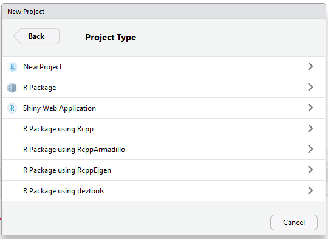
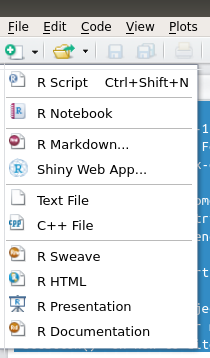
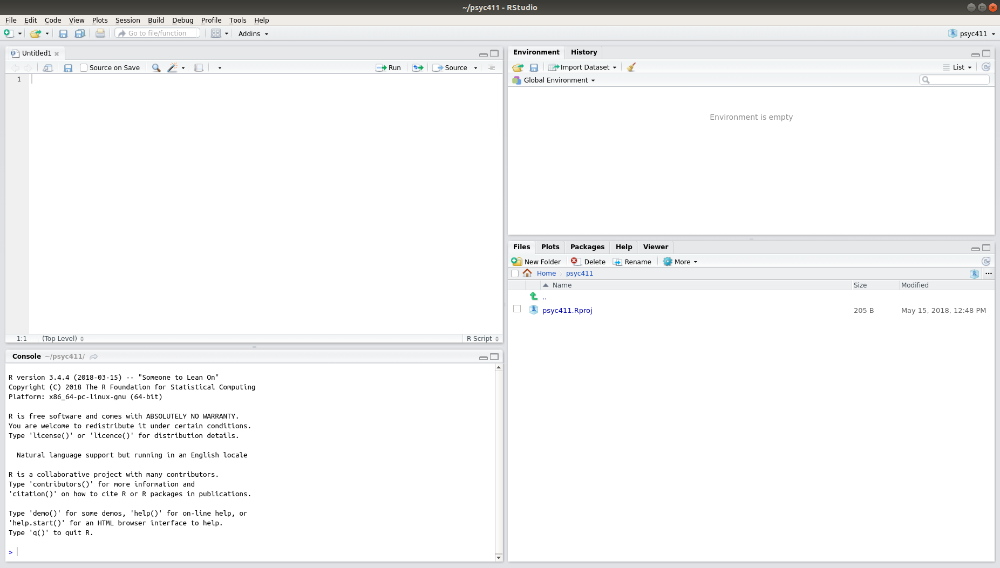

# BeginneRs {#beginners}

](media/leggy.jpg)

### In brief

> A big part of psychology is collecting data about people, visualizing it
> (graphs etc.), and drawing conclusions. Working with data is a core skill for
> researchers, and increasingly important in many professions.

> RStudio, like Excel, is computer software that helps us to do that. RStudio is
> rapidly becoming the standard tool for serious data analysis in psychology and
> other sciences, because it's powerful, relatively easy to use, and free.

> In this course [we'll learn R](#reasons-to-use-r) as we go, building a little
> at a time. This and the next session covers the basics (things you would learn
> as part of an undergraduate statistics course at Plymouth). If some of this is
> familiar, there will be extension exercises to enhance your knowledge.


---

This material was adapted from
[Andy Wills' RminR](https://ajwills72.github.io/rminr/using_rstudio.html).

All content on this site distributed under a
[Creative Commons](https://creativecommons.org/) licence. CC-BY-SA 4.0.

## Getting started with RStudio {#getting-started-rstudio}

Open a web browser (e.g. [Firefox](https://www.mozilla.org/en-US/firefox/new/),
Safari, Chrome, _not_ Edge) and go to an
[RStudio server, like the one at: https://rstudio.plymouth.ac.uk](https://rstudio.plymouth.ac.uk).
Log on, using the username and password you have been given.

If that works, you should see something like this:


We'll go through what it all means in a bit. But, first, we're going to...

#### Create a new project

RStudio uses **_projects_** to help you keep your work organized, and to make
sure you have a record of your analyses. You should start a new project each
time you start a new module in your degree (possibly more frequently, but we'll
come back to that later). Here's how to create a new project:

1. At the top right of RStudio, you will see a little blue cube, with the text
   "Project: (none)". Click on this, and select "New project".


2. Now click "New Directory"


3. Now click "New Project"



4. Next, type in a name for the project that makes sense to you in the
   "Directory name" box. I've typed _psyc411_, but you should pick something
   more meaningful to you (e.g. _beginning-r_). Then click "Create project".


5. Now, create a _R script_. An R script is a record of the analyses you have
   done. You create an R Script by clicking on the white plus sign on a green
   background (see below), and then clicking on "R Script".



If everything worked well, your screen should now look like this:



You should be able to see four parts:

1. The **Script** window - This is the rectangle on the top left. This is where
   you will tell R what to do. It only does what you tell it.

2. The **Console** window - This is the rectangle on the bottom left. This is
   where R prints the answers to your questions.

3. The **Environment** window - This is the rectangle on the top right. It's
   where R keeps a list of the data it knows about. It's empty at the moment,
   because we haven't given R any data yet.

4. The **Files** - This is the rectangle on the bottom right. This is a bit like
   the _File Explorer_ in Windows, or the _Finder_ on a Mac. It shows you what
   files are in your R project.

That's it! You're all set to start learning how to analyse data in R.

<!--


 -->

## Exploring data (in brief) {#exploring-data-brief}

### Before you start...

Before starting this exercise, you should have had a brief introduction to using
RStudio. If not, take a look at the [Using RStudio](getting-started-rstudio)
worksheet.

### Contents

-   [How to use these worksheets](#worksheets-how-to)
-   [Loading a package](#loading-a-package)
-   [Loading data](#loading-data)
-   [Inspecting data](#inspecting-data)
-   [Calculating a mean](#calculating-a-mean)
-   [Dealing with missing data](#missing-data)

### How to use these worksheets. {#worksheets-how-to}

Throughout this worksheet (and others on the course), you'll see the commands
you should type into RStudio inside a grey box, followed by the output you
should expect to see in one or more white boxes. Any differences in the colour
of the text can be ignored.

Each command in this worksheet is followed by one or more _explanation_
sections - those are there to help you understand how the commands work and how
to read the output they produce.

### Loading a package {#loading-a-package}

First, we need to load a package called `tidyverse`. A package is an extension
to R that adds new commands. Nearly everything we'll do in this course uses the
tidyverse package, so pretty much every project starts with this instruction.

**Type (or copy and paste) the command in the grey box into line 1 of the
_Script_ window of RStudio**. Now, with your cursor still on line 1, press
CTRL+ENTER (i.e. press the key marked 'Ctrl' and the RETURN or ENTER key
together).


```r
library(tidyverse)
```

When you do this, line 1 is automatically copied to your _Console_ window and
run. Then, RStudio will print some text to the Console (shown in the white box,
above). This text tells you that the _tidyverse_ package has loaded ("attached")
some other pacakges (e.g. _dplyr_). It also tells you that the _dplyr_ package
changes the way some commands in R work ("conflicts"). That's OK.

If you get an output that includes the word 'error', please see the
[common problems](#common-problems) section.

### Saving your script {#saving-your-script}

You should notice that the name `Untitled1` on the _Script_ window has now gone
red. This is to remind you that your script has changed since the last time you
saved it. So, click on the "Save" icon (the little floppy disk) and save your R
script with some kind of meaningful name, for example `briefguide.R`. The `.R`
indicates that it is an R script.

Re-save your script each time you change something in it; that way, you won't
lose any of your work.

### Loading data {#loading-data}

Now, we're going to load some data on the income of 10,000 people in the United
States of America. I've made up this dataset for teaching purposes, but it's
somewhat similar to large open data sets available on the web, such as
[US Current Population Survey](https://thedataweb.rm.census.gov/ftp/cps_ftp.html).
Here's how you get a copy of this data into RStudio so you can start looking at
it:

1. Download a copy of the data, by clicking
   [here](http://www.willslab.org.uk/cps2.csv) and saving it to the Downloads
   folder of your computer.

2. Go to RStudio in your web browser.

3. Click on the 'Files' tab in RStudio (bottom right rectangle)

4. Click the 'Upload' button.

5. Click 'Browse...'

6. Go to your Downloads folder, and select the file you just saved there.

7. Click "OK".

8. Copy or type the following command into your RStudio script window, and run
   it (i.e. press CTRL+ENTER while your cursor is on that line)


```r
cpsdata <- read_csv("cps2.csv")
```

<!-- TODO check if this saves file in right directory -->

#### Explanation of the command

There are three parts to the command `cpsdata <- read_csv("cps2.csv")`:

1. The first part of the command is `cpsdata`. This gives a name to the data we
   are going to load. We'll use this name to refer to it later, so it's worth
   using a name that is both short and meaningful. I've called it `cpsdata`
   because it's somewhat similar to data from the US Current Population Survey,
   but you can give data pretty much any name you choose (e.g. _fart_).

2. The bit in the middle, `<-`, is an arrow and is typed by pressing `<` and
   then `-`, without a space. This arrow means "put the thing on the right of
   the arrow into the thing on the left of the arrow". In Rstudio

3. The last part of the command is `read_csv("cps2.csv")`. It loads the data
   file into `cpsdata`. The part inside the speech marks, `cps2.csv`, is the
   name of the file you just uploaded to your RStudio project. This command can
   also download data directly from the web, for example
   `read_csv("http://www.willslab.org.uk/cps2.csv")`. This would have been a
   quicker way to do it in this case, but of course not all data is on a web
   page.

#### Explanation of the output

R likes to print things in red sometimes -- this does not mean there's a
problem. If there's a problem, it will actually say 'error'. The output here
tells us that R has loaded the data, which has eight parts (columns, or `cols`).
It gives us the name of the columns (`ID, sex, ...`) and tells us what sort of
data each column contains: `character` means the data is words (e.g. 'female'),
`double` means the data is a number (e.g. '42.78').

If you get an error here, please see [common errors](common-errors.html).

### Inspecting data {#inspecting-data}

Make sure you have just completed the [loading data](#loading-data) worksheet
and have the `cps2` dataset loaded.

---

Next, we'll take a peek at these data. You can do this by clicking on the data
in the _Environment_ tab of RStudio, see [Using RStudio](using_rstudio.html).

We can now see the data set (also known as a _data frame_). We can see that this
data frame has 8 columns and 10000 rows. Each row is one person, and each column
provides some information about them. Below is a description of each of the
columns. Where you see `NA` this means this piece of data is missing for this
person -- quite common in some real datasets.

Here's what each of the columns in the data set contains:

| Column    | Description                         | Values                                              |
| --------- | ----------------------------------- | --------------------------------------------------- |
| ID        | Unique anonymous participant number | 1-10,000                                            |
| sex       | Biological sex of participant       | male, female                                        |
| native    | Participant born in the US?         | foreign, native                                     |
| blind     | Participant blind?                  | yes, no                                             |
| hours     | Number of hours worked per week     | a number                                            |
| job       | Type of job held by participant:    | charity, nopay, private, public                     |
| income    | Annual income in dollars            | a number                                            |
| education | Highest qualification obtained      | grade-school, high-school, bachelor, master, doctor |

### Calculating a mean {#calculating-a-mean}

Make sure you have recently (in this session) completed the
[loading data](#loading-data) worksheet and have the `cps2` dataset loaded.

---

Now we have these data, one question we can ask is "what is the average income
of people in the U.S.?" (or, at least, in this sample). In this first example,
we're going to calculate the _mean_ income.

As you know, you calculate a mean by adding up all the incomes and dividing by
the number of incomes. Our sample has 10,000 participants, so this would be a
long and tedious calculation -- and we'd probably make an error.

It would also be a little bit tedious and error prone in a spreadsheet
application (e.g. Excel, Libreoffice Calc). There are some very famous cases of
these kinds of "Excel errors" in research, e.g.
[genetics](https://genomebiology.biomedcentral.com/articles/10.1186/s13059-016-1044-7),
[economics](https://arstechnica.com/tech-policy/2013/04/microsoft-excel-the-ruiner-of-global-economies/).

In R, we can calculate the mean instantly, and it's harder to make the sorts of
errors that are common in Excel-based analysis.

To calculate mean income in R, we add the following command to our script (line
3), and press CTRL+ENTER:


```r
cpsdata %>%
   summarise(mean(income))
# A tibble: 1 x 1
  `mean(income)`
           <dbl>
1         87293.
```

Your output will tell you the mean income in this sample -- it's the last number
on the bottom right, and it's approximately \$87,000.

If you're happy with the output you've got, move on to the next section. If you
would like a more detailed explanation of this output, see
[more on tibbles](more-on-tibbles.html). We'll cover this later anyway.

If you get an error here, please see [common errors](common-errors.html).

#### Explanation of the command

This command has three components:

1. The bit on the left, `cpsdata`, is our data frame, which we loaded and named
   earlier.

2. The bit in the middle, `%>%`, is called a _pipe_. Its job is to send data
   from one part of your command to another. It is typed by pressing `%` then
   `>` then `%`, without spaces. So `cpsdata %>%` sends our data frame to the
   next part of our command.

3. The bit on the right, `summarise(mean(income))` is itself made up of parts.
   The command `summarise` does as the name might suggest: it summarises a set
   of data (`cpsdata` in this case) into a single number, e.g. a mean. The
   `mean` command indicates that the type of summary we want is a mean (there
   are other summaries, as we will cover later). Finally, `income` is the name
   of the column of `cpsdata` we want to take the mean of -- in this case, the
   income of each individual.

:::{.exercise}

Make sure you are 100% clear about the difference between `<-` and `%>%`. If
you're not, ask for an explanation in class now.

The main clue is to look at the direction of the arrows:

`%>%` sends data from left to right. We call this **_'piping'_**.

`<-` sends results from the right hand side, to a variable named on the left.
This is called **_assignment_**.

---

Watch out that `->` is not the same as `%>%`. The thin arrow is always for
assignment. You won't see if often, because it's normally considered bad manners
to use thin right arrows like this (they get confusing).

:::

### Dealing with missing data {#missing-data}

To calculate the mean number of hours worked per week, we have to deal with the
fact that there is some missing data - we don't know for all 10,000 people how
many hours they work in a week, because they didn't all tell us. To get a mean
of those who did tell us, we tell R to ignore the missing data, like this:


```r
cpsdata %>% summarise(mean(hours, na.rm = TRUE))
# A tibble: 1 x 1
  `mean(hours, na.rm = TRUE)`
                        <dbl>
1                        38.9
```

#### Explanation of the command

`rm` is short for 'remove', but 'ignore' would be a more accurate description,
as this command doesn't delete the `NA` entries in `cpsdata`, it just ignores
them. So `na.rm = TRUE` means "ignore the missing data".

If you get an error here, please see [common errors](common-errors.html).

### Patterns of missing data {#missing-data-patterns}

Sometime we won't only want to ignore missing data. We might also want to count
how how many variables are missing. The `mice` package has a useful command for
doing this.

First, we need to load `mice` like the did `tidyverse` above. Type (or copy and
paste) the command below into your R script and run it:


```r
library(mice)
```

Then we can use the `md.pattern()` function to describe the patterns of missing
data:


```r
cpsdata %>% mice::md.pattern()
```


```
     ID sex native income education blind  job hours      
4483  1   1      1      1         1     1    1     1     0
515   1   1      1      1         1     1    1     0     1
3102  1   1      1      1         1     1    0     0     2
1900  1   1      1      1         1     0    0     0     3
      0   0      0      0         0  1900 5002  5517 12419
```

#### Explanation of the output

`md.pattern()` produces two outputs: a plot, and a table.

In the plot we see

-   The variables in the dataset listed along the top
-   Squares indicating whether a variable is recorded (blue) or missing
    (purple/red)

Each row in the plot is a missing data **_pattern_**. So:

-   In the first row, the pattern is that all variables are recorded
-   The pattern in the second row is that all variables bar `hours` were
    recorded
-   The third pattern is that `job` and `hours` were missing, and so on.

The numbers on the left of the plot indicate **_how many people fit the
pattern_**. So:

-   4483 people had complete data (pattern 1)
-   515 people had complete data except for the `hours` variable (pattern 2)
-   3102 people were missing `hours` and `job` (pattern 3, and so on

This can be really helpful when checking whether data has been imported
properly, or properly reporting missing data from our experiments [see
@macpherson2010revised for current guidelines for clinical trials, which would
also be good practice for experimental research].

The numbers along the bottom of the plot show **_how many missing observations
there were for the variable marked at the top_**. So:

-   There were 5517 missing observations for `hours`, across all participants
-   5002 for `job`, and so on.

The table provides the same information as the plot, but is perhaps harder to
read.

<!--


 -->

## Group differences (briefly)

### Before you start...

Before starting this worksheet, you should have had a brief introduction to
using RStudio -- [Using RStudio](#getting-started-rstudio). You should also have
also completed the worksheet [Exploring Data](#exploring-data). If not, take a
look these earlier worksheets before continuing.

If you have completed those worksheets, then you'll have set up an R project,
and you'll have a script in it that looks something like this:


```r
library(tidyverse)
library(mice)
cpsdata <- read_csv("cps2.csv")
cpsdata %>% summarise(mean(income))
cpsdata %>% summarise(mean(hours, na.rm = TRUE))
```

In this worksheet, we'll add some more commands to this script.

#### Contents

-   [Grouping data](#grouping-data)
-   [Drawing a density plot](#group-density)
-   [Filtering data](#filtering-data)
-   [Exercise](#grouping-data-exercise-1)

### Grouping data {#grouping-data}

One of the most widely discussed issues concerning income is the difference
between what men and women, on average, get paid. Let's have a look at that
difference in our teaching sample of 10,000 US participants.

In order to do this, we need to split our data into two groups -- males and
females. In R, the command `group_by` allows us to do this. In this case, we
want to group the data by biological sex, so the command is `group_by(sex)`. We
_pipe_ (`%>%`) the data in `cpsdata` to the `group_by` command in order to group
it, and then we _pipe_ (`%>%`) it to `summarise` to get a summary for each group
(a mean, in this case). So, the full command is:


```r
cpsdata %>% group_by(sex) %>% summarise(mean(income))
# A tibble: 2 x 2
  sex    `mean(income)`
  <chr>           <dbl>
1 female         82677.
2 male           92137.
```

Copy it into your script and run it (CTRL+ENTER). Women in our made-up sample
get paid, on average, around 9,000 (9k) less than men. Of course, not every male
gets 92k a year in the US, and not every female gets 83k. It seems very likely
that the range of incomes earned by men and women overlap -- meaning that if you
picked one man and one woman at random, there's a reasonable chance that the
woman earns more than the man. We can look at this _variation_ in pay using a
graph.

### Looking at variation using a density plot {#group-density}

The graph we're going to draw is a density plot. If you recall histograms from
school, it's a lot like that. If not, don't worry. A density plot is a curve
that shows how likely a range of incomes are. So, the higher the curve is at a
particular income, the more people who have that income.

We're going to produce what's called a _scaled_ density plot. The highest point
on a scaled density plot is always one. This can make it easier to compare two
groups, particularly if one group has fewer people in it than the other.

So here's the command to do a scaled density plot for incomes, plotting men and
women separately. Copy it into your script and run it (CTRL+ENTER).


```r
cpsdata %>%
   ggplot(aes(income, colour=sex)) +
   geom_density(aes(y=..scaled..))
```


#### Explanation of command

Here's what each part of this command means:

-   `cpsdata` - The data frame containing the data. You created this in the last
    worksheet.

-   `%>%` - A pipe. As in the last worksheet, this pipe carries the data in
    `cpsdata` to the next part of the command, which does something with it.

-   `ggplot()` - This means 'draw me a graph'. All graphs we use in these
    worksheets use the _Grammar for Graphics_ (gg) plotting commands, so they'll
    all include the command `ggplot`.

-   `aes()` - Short for _aesthetics_ (what things look like). It means 'This is
    the sort of graph I want'.

-   `income` - I want a graph of the data in the `income` column of `cpsdata`

-   `color=sex` - I want you to give me two graphs on top of each other, in
    different colours. One colour for men, a different color for women. Use the
    `sex` column of `cpsdata` to work out who is male and who is female.

-   `geom_density()` - I want this graph to be a _density_ plot.

-   `aes(y=..scaled..)` - I want this density plot to be _scaled_ (see above).

#### Discussion of output

Your graph will appear in the bottom-right window, and should look like the one
above. You'll notice that the two lines seem basically on top of each other ...
but they can't be because we know the two groups differ in mean income by over
nine thousand dollars! We have a problem to solve...

### Dealing with extreme data points {#extreme-data}

The problem is one of scale -- there are a small number of people who earn very
high salaries. In fact, both the highest-paid man, and the highest-paid woman in
our sample earn considerably more than one million dollars a year.

#### Filtering data {#filtering-data}

Somehow, we need to deal with the fact that a few people in our sample are very
well paid, which makes the difference between men and women hard to see on our
graph, despite the difference being over nine thousand dollars a year.

One of the easiest ways around this is to exclude these very high salaries from
our graph.

The vast majority of people are paid less than 150k a year. So, let's restrict
our plotting to just those people. We do this using the `filter` command. It's
called _filter_ because it works a bit like the filter paper in a chemistry lab
(or in your coffee machine) -- stopping some things, while letting other things
pass through. We can filter our data by telling R _what data we want to keep_.
Here, we want to keep all people who earn less than £150k, and filter out the
rest. So the filter we need is `filter(income < 150000)`, where `<` means "less
than".

We'll be using this dataset of people with <\$150k incomes a few times, so we're
going to give it a new name, `cpslow` (or any other name you want, e.g.
_angelface_ )

So, what we need to do is _pipe_ (`%>%`) our `cpsdata` data to our
`filter(income < 150000)`, and use an arrow, `<-`, to send this data to our new
_data frame_, `cpslow`. Recall that `<-` sends the thing on its right to the
thing on its left, so the full command is:


```r
cpslow <- cpsdata %>% filter(income < 150000)
```

We can take a look at this new _data frame_ by clicking on it in RStudio's
_Environment_ window. By looking at the ID numbers, you can see that some people
in our original sample have been taken out, because they earned at least 150k.

Now, we can plot these filtered data in the same way as before, by changing the
name of the dataframe from `cpsdata` to `cpslow`.

**So start with the command**
`cpsdata %>% ggplot(aes(income, colour=sex)) + geom_density(aes(y=..scaled..))`,
copy it onto the next line in your script, **make that change, and press
CTRL+RETURN.**

If you've got it right, your graph will look like this:


At first glance, the two distributions of incomes still look similar. For
example, the _modal_ income -- the point where the graph is highest -- is at
quite a low income, and that income is quite similar for both men and women.
However, on closer inspection, you'll also see that the red line (females) is
above the blue line (men) until about 25-50k, and below the blue line from then
on. This means that more women than men earn less than 50k, and more men than
women earn more than 50k.

So, the gender pay gap is visible in this graph. The graph also illustrates that
the difference in this sample is small, relative to the range of incomes. This
doesn't mean that the gender pay gap is less (or more) important than income
inequality. These kinds of questions of importance are moral, philosophical, and
political. Data cannot directly answer these kinds of questions, but they can
provide information to inform the debate.

As we'll see later, this type of graph is also crucial to inform our choice of
statistical models (like regression or Anova): Without having a sense of what
the underlying data look like we can make bad decisions in our later analyses.

### Exercise {#grouping-data-exercise-1 .exercise}

In this exercise, you'll consolidate what you've learned so far.

**The task is to further exmaine this sample of participants who are living in
the US, and earning less than \$150k (`cpslow`).**

Specifically, the question to answer is whether people born in the US earn more.
In order to do this, you should calculate the mean income for each group, and
produce a density plot with one line for each group. Below are the answers you
are aiming for:


```
# A tibble: 2 x 2
  native  `mean(income)`
  <chr>            <dbl>
1 foreign         51423.
2 native          58905.
```


Previously, we calculated the mean salary of men and women.

1. Why might it be a better idea to calculate the median?


<div class='solution'><button>Show answer</button>


Because the data are strongly skewed, the median may be a better summary of the
central tendency (the middle).


</div>


2. Adapt the commands above to calculate the median instead. What is the median
   salary for women: <span class='webex-fitb' id = 'Q719240' ><input class='solveme  nospaces' data-digits=4 size=5  style='width:5em;'  data-answer='["52558"]'/><span class='solvedme'></span></span>, and for men: <span class='webex-fitb' id = 'Q756508' ><input class='solveme  nospaces' data-digits=4 size=5  style='width:5em;'  data-answer='["61746"]'/><span class='solvedme'></span></span>.


<div class='solution'><button>Show answers</button>


```r
cpsdata %>% group_by(sex)%>% summarise(med=median(income))
# A tibble: 2 x 2
  sex       med
  <chr>   <dbl>
1 female 52558.
2 male   61746.
```


</div>


### Extension exercise {.exercise}

If you've some spare time and are looking for something a bit more challenging,
try Exercise 2 on this slightly
[more advanced worksheet](https://ajwills72.github.io/rminr/group-differences.html#ex2).

<!--


 -->

## Undergraduate stats in R

All of the statistics you will have learned at undergraduate level can be
produced in R. Here we cover simple examples of:

-   A t-test
-   A correlation

We'll run these on a example dataset which is built into R, called `mtcars`. We
can look at this data using the glimpse function (which is loaded with
`tidyverse`, so if you get an error make sure that is loaded too):


```r
mtcars %>% glimpse()
Observations: 32
Variables: 11
$ mpg  <dbl> 21.0, 21.0, 22.8, 21.4, 18.7, 18.1, 14.3, 24.4, 22.8, 19.2,…
$ cyl  <dbl> 6, 6, 4, 6, 8, 6, 8, 4, 4, 6, 6, 8, 8, 8, 8, 8, 8, 4, 4, 4,…
$ disp <dbl> 160.0, 160.0, 108.0, 258.0, 360.0, 225.0, 360.0, 146.7, 140…
$ hp   <dbl> 110, 110, 93, 110, 175, 105, 245, 62, 95, 123, 123, 180, 18…
$ drat <dbl> 3.90, 3.90, 3.85, 3.08, 3.15, 2.76, 3.21, 3.69, 3.92, 3.92,…
$ wt   <dbl> 2.620, 2.875, 2.320, 3.215, 3.440, 3.460, 3.570, 3.190, 3.1…
$ qsec <dbl> 16.46, 17.02, 18.61, 19.44, 17.02, 20.22, 15.84, 20.00, 22.…
$ vs   <dbl> 0, 0, 1, 1, 0, 1, 0, 1, 1, 1, 1, 0, 0, 0, 0, 0, 0, 1, 1, 1,…
$ am   <dbl> 1, 1, 1, 0, 0, 0, 0, 0, 0, 0, 0, 0, 0, 0, 0, 0, 0, 1, 1, 1,…
$ gear <dbl> 4, 4, 4, 3, 3, 3, 3, 4, 4, 4, 4, 3, 3, 3, 3, 3, 3, 4, 4, 4,…
$ carb <dbl> 4, 4, 1, 1, 2, 1, 4, 2, 2, 4, 4, 3, 3, 3, 4, 4, 4, 1, 2, 1,…
```

#### Explanation of the `glimpse` output

`glimpse` produces a list of all variables in the dataset, tells us what type
they are, and lists however many obserervations from the dataset that will fit
on a single line.

The type of all variables in `mtcars` is `dbl`. This is short for
'double-precision number'; for now, just know that `dbl` means a _number_.

Other types include :

-   `int` --- short for 'integer' variable, so only contains whole numbers (e.g.
    a participant id number)
-   `chr` --- short for 'character variable', which will contain text (e.g. an
    email address)
-   `fct` --- short for 'factor'. i.e. a categorical variable (e.g. MCQ
    responses)
-   `ord` --- short for 'ordered'. This is variant of categorical variable where
    the categories have a particular order (responses like "Wost" < "Better" <
    "Best" could be stored as an `ord`)

### Two sample t-test

`mtcars` contains a variable called `mpg`, which is the miles per gallon each
car will do, and another called `am` which is encodes whether it was a manual or
automatic transmission (0=automatic, 1=manual).

We can test if `mpg` differs between auto and manual cars with `t.test`:


```r
t.test(mpg ~ am, data=mtcars)

	Welch Two Sample t-test

data:  mpg by am
t = -3.7671, df = 18.332, p-value = 0.001374
alternative hypothesis: true difference in means is not equal to 0
95 percent confidence interval:
 -11.280194  -3.209684
sample estimates:
mean in group 0 mean in group 1 
       17.14737        24.39231 
```

### Explanation

The command contains three parts:

-   `t.test`: Says what we want to do
-   `mpg ~ am`: This is a 'formula', which tells `t.test` which variables to
    analyse.
-   `data=mtcars`: Which dataset we want to use for the analysis

The formula is split into two parts by the [`~` symbol](#tilde). On the left is
our outcome. On the right is the grouping variable, which we hope **predicts**
the outcome.

In the output you can see the test statistic, degrees of freedom and _p_ value.

:::{#tilde .sidenote}

The tilde symbol. Pronounced "tilder".

In R, `~` almost always means **_"is predicted by"_**.

:::

### Correlations

The `mtcars` data also contains variables for weight (`wt`) and power (`hp`,
short for horsepower).

We can select just these columns and save them to a smaller dataframe like this:


```r
carperformance <- mtcars %>% select(mpg, wt, hp)
```

#### Explanation of the commends

On the far left we have the name of the new variable which we will create:
`carperformance`.

We can tell this will be a new variable because the `<-` symbol is just to the
right, pointing at it.

To work out what `carperformance` will contain, we look to the right of the `<-`
There are two parts here, linked with the pipe symbol (`%>%`) which passes data
from one command to the next, from left to right.

First we see the `mtcars` data. Using a pipe we pass this to the `select`
command, which selects the `mpg,`wt`, and`hp` columns.

#### Explanation of the result

When running the command you won't see any output --- but something **has**
happened behind the scenes: A new object was created called `carperformance`
which contained copies of the columns from `mtcars` we selected.

We can see the first few rows of our new smaller dataframe like this:


```r
carperformance %>% head()
                   mpg    wt  hp
Mazda RX4         21.0 2.620 110
Mazda RX4 Wag     21.0 2.875 110
Datsun 710        22.8 2.320  93
Hornet 4 Drive    21.4 3.215 110
Hornet Sportabout 18.7 3.440 175
Valiant           18.1 3.460 105
```

---

To correlate the three columns in this dataset, we can use the `cor` function
and round all the results to 2 decimal places:


```r
carperformance %>% cor() %>% round(2)
      mpg    wt    hp
mpg  1.00 -0.87 -0.78
wt  -0.87  1.00  0.66
hp  -0.78  0.66  1.00
```

<div class='solution'>
<button>Explain those commands...</button>

On the left we have the `carperformance` data.

We pipe this to the `cor` function which calculates the correlation between each pair of columns and returns a special kind of table, called a matrix.

To make the output simpler, we then pass the results to the `round` function, which rounds all the results to 2 decimal places.


</div>

The `cor` function is pretty bare-bones, and doesn't produce output we could
easily use in a report or article. The `apaTables` package helps us with this:


```r
apaTables::apa.cor.table(carperformance, filename = "correlations.doc")


Means, standard deviations, and correlations with confidence intervals
 

  Variable M      SD    1            2         
  1. mpg   20.09  6.03                         
                                               
  2. wt    3.22   0.98  -.87**                 
                        [-.93, -.74]           
                                               
  3. hp    146.69 68.56 -.78**       .66**     
                        [-.89, -.59] [.40, .82]
                                               

Note. M and SD are used to represent mean and standard deviation, respectively.
Values in square brackets indicate the 95% confidence interval.
The confidence interval is a plausible range of population correlations 
that could have caused the sample correlation (Cumming, 2014).
* indicates p < .05. ** indicates p < .01.
 
```

<div class='solution'>
<button>Explain the double colons, `::`, in the code above...</button>

Sometimes we load a whole package, as we did when we wrote `library(tidyverse)` above. This is a good idea when we want to use lots of functions from that package.

When we only want to use one function from a package we can type `nameofpackage::nameoffunction` and this lets us use the function without loading the package.

This can be a good idea if the package or function is less well known, and you want to be explicit about which package it comes from. This can help future-you work out what your code is doing.


</div>

#### Explanation of the result

We used the `apa.cor.table` function within the `apaTables` package to create a
nicely-formatted correlation table, in APA format.

We also specified a `filename`, and `apa.cor.table` created a
[Word document with this name containing the formatted table (click to see the result)](correlations.doc).

:::{.exercise}

Use one of the other [built-in](#builtin) datasets to:

-   Run a correlation between 2 variables.
-   Compute a t-test, using appropriate variables from the data.

Describe the results of the t-test in APA format.

:::
