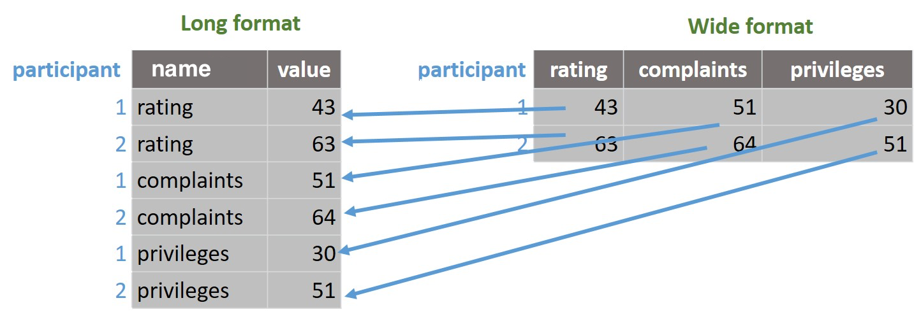

```{r, echo=F, include=F}
knitr::opts_chunk$set(echo = TRUE, collapse=TRUE, cache=TRUE, comment=">", message=FALSE)
library(tidyverse)
library(webex)
library(pander)
theme_set(theme_minimal())
```


```{r include=F}
library(tidyverse)
library(webex)
knitr::opts_chunk$set(cache=T)
```


> Most time in data analysis is spent 'tidying up' data: getting it into a suitable format to get
> started. Data scientists have a particular definition of _tidy_: Tidy datasets are "easy to
> manipulate, model and visualize, and have a specific structure: each variable is a column, each
> observation is a row" [@wickham_tidy_2014].

> It's often not convenient for humans to _enter_ data in a tidy way, so untidy data is probably
> more common than tidy data in the wild. But doing good, reproducible science demands that we
> document each step of our processing in a way that others can check or repeat in future. Tools
> like R make this easier.


# Overview

In previous worksheets (e.g. [here](01-exploring-data.html) and [here](02-plotting.html)) we used various commands in the `tidyverse`, like `filter` and `group_by`. 

If you want to recap these commands you can start to use [the cheatsheet](00-glossary-and-cheatsheet.html), especially
the part on groups and summaries.


Today we will cover three additional techniques which are important when working with real datasets:

1,   Creating new variables/columns
2.   'Pivoting' or reshaping data from long to wide formats (or the reverse)
3.   Joining two sources of data (e.g. two spreadsheets) into a single dataframe


# Before you start

:::{.exercise}

- Make sure you complete the worksheet on [exploring data](01-exploring-data.html) and [plotting](02-plotting.html)
- Create a new R Script file to save your workings
- Remember to load the tidyverse

```{r}
library(tidyverse)
```

:::


# Making new variables

Sometimes we need to create new columns in our dataset. 

For example, let's say we wanted to calculate someone's body mass index (BMI) from their weight and height.

There is a built-in dataset called `women`, which contains heights and weights of 15 women in lbs
and inches:

```{r}
women  %>% glimpse
```

**Explanation of the output** We used `glimpse` in the block above. Glimpse is a bit like head, except it shows you a list of variables, with as many examples of the data as will fit on screen. The `head` command is the other way around — it show columns along the top, and the first few rows of data vertically. Either can be useful to quickly check what is in a dataset, but I often prefer glimpse if there are a lot of variables in a file because all of the column names are shown.

---

To calculate a BMI we first need to convert the heights to from inches to meters, and the weights
from lbs to kilograms.

```{r}
metric_women <- women  %>%
  mutate(
    height_m = height*0.0254,  # approx conversion from inches to m
    weight_kg= weight*0.45     # conversion from lbs to kg
  )
```

**Explanation**: We used the  `mutate` function to covert lbs to kg and inches to m, and saved these two new columns in a new dataset called `metric_women`.

We can see the new columns here:

```{r}
metric_women %>% head(3)
```


---

BMI is calculated as $\dfrac{kg}{m^2}$. We can use `mutate` again to create a new column to store this calculation:

```{r}
metric_women  %>%
  mutate(BMI = weight_kg / height_m^2) %>%
  head(3)
```

**Explanation**: We used `mutate` again to make a new column, `BMI`. This contains women's weight
divided by their squared height (`^2` means _to the power of 2_, or squared, in R-speak).


:::{.exercise}

**#1**

Create a *density* plot of BMI scores in the `women` dataset. It should look like this:

```{r, echo=F}
bmis <- metric_women %>% mutate(BMI = weight_kg / height_m^2)
bmis %>%
 ggplot(aes(BMI)) +
 geom_density()
```

What is the median BMI in the sample? `r fitb(answer=median(bmis$BMI), tol=.1, num=T, calculator=F)`


`r hide("Show hints")`

Hints: 

- You will need to use `mutate` to create a new column containing BMI scores
- When you create a dataset with this new column, either save the result with a new variable name and pipe that to `ggplot`, or pipe the result directly into `ggplot`. Either approach is fine.
- We covered density plots in the [first worksheet](01-exploring-data.html), and they are also in the [cheatsheet](00-glossary-and-cheatsheet.html).


`r unhide()`


:::


# Pivoting (reshaping)

Data is commonly stored in either
[_wide_ or _long_ format](https://www.theanalysisfactor.com/wide-and-long-data/).

If you used SPSS to do a _t_-test or ANOVA during your undergraduate degree, you likely stored and analysed the
data in **wide** format. 

In wide format, each row represents the _observations from a single
participant_. Each measurement for a given participant are stored in separate columns.

This is often called **row per subject** data. An example is the built in `attitude` dataset:

```{r}
attitude %>%
  head()
```

**Explanation**: Each row contains scores for a particular employee on various measures. To find out
more about these data you can type `?attitude` into the console.

---


Let's say we want a single plot of all these variables, something like this:

```{r echo=F, message=F, warning=F}
library(data.table)
attitude %>%
  as.data.table() %>%
  melt() %>%
  mutate(variable=Hmisc::capitalize(as.character(variable))) %>%
  ggplot(aes(variable, value)) +
  geom_boxplot() +
  labs(x="Measure", y="Score")
```


To do this we first need to convert the data to _long_ format. In **long format**, each observation
is saved in its own row, rather than across multiple columns.

It's often called **"row per observation"** data.

---

Pivoting is where you take a long data file (lots of rows, few columns) and make it wider. Or where you take a wide data file (lots of columns, few rows) and make it longer. 


We can convert from wide to long using the `pivot_longer` command. 


](https://i.imgur.com/UBGhu.gif)


---


To see why the command is called 'pivot_longer', imagine trying to reshape just the first two rwos of the attitude dataset:

```{r  echo=F, message=F, warning=F}
attitude %>%
  head(2)
```

If we use `pivot_longer` on this selection, we end up with this:

```{r message=F, warning=F}
attitude %>%
  pivot_longer(everything())
```

**Explanation of the command**: We selected a subset of columns and rows. Then we used `pivot_longer(everything())` to make this into long form data. The `everything()` tells R to merge values from all of the columns into a single new column called `value`, and to keep track of the original variable name in a new column called `name`)


The change works like like this:




---

One problem with this example we don't have a record of which participant was which in the `attitude`
dataset, because the mapping to participants was implicit: *each row was a new participant, and participant number was not recorded in the file*.


We can create an explicit participant identifier by adding a new column. For this we use the `mutate` and `row_number()` commands:

```{r}
attitude_with_person <- attitude %>%
  mutate(person = row_number()) %>%
  head(2)

attitude_with_person
```

Now we have a column called `person` which stores the row nuber.


But this means if we `pivot_longer` again, we will need to tell R *which* columns
we would like to pivot. 

If we don't do this then the `person` column gets melted with everything else
so we lose track of which response belonged to which participant:


```{r}
attitude_with_person %>%
  pivot_longer(everything())
```

**Explanation of the output** Because we didn't tell `pivot_longer` which columns we wanted to pivot, it put all the values into a single new column called `value`. This included our participant identifier, `person` which is not what we wanted.

-------


We can exclude `person` from the pivoting by writing:

```{r}
attitude_with_person %>%
  pivot_longer(-person) %>% 
  head()
```

**Explanation of the command and output**: Here, we still use `pivot_longer` but this time we put `-person` between the parentheses. The minus sign, `-`, means *don't include this variable*, so `-person` ends up meaning  *include all columns except `person`*, which is what we wanted. The output now retains the `person` column, but pivots the other variables. This means we can tell which person provided each datapoint.


:::{.exercise}

**#2**

Use some tidyverse commands you already know, plus `pivot_longer`, to produce this plot using the `attitude` dataset:

```{r echo=F, message=F, warning=F}
attitude %>%
  select(rating, complaints, learning) %>%
  pivot_longer(everything()) %>% 
  mutate(variable=Hmisc::capitalize(as.character(name))) %>%
  ggplot(aes(variable, value)) +
  geom_boxplot() +
  labs(x="Measure", y="Score")
```

```{r, echo=F, include=F, eval=F}
attitude %>%
  pivot_longer(everything()) %>% 
  mutate(variable=Hmisc::capitalize(as.character(name))) %>%
  ggplot(aes(variable, value)) +
  geom_boxplot() +
  labs(x="Measure", y="Score") +
  coord_flip()
ggsave('examples/pivotboxplot.png', width=4, height=2.5, dpi = 200)
```


`r hide("Show hints")`

- Check the [cheatsheet](00-glossary-and-cheatsheet.html) if you are not sure how to add a boxplot layer (hint, it starts with `geom_`, so you might be able to guess or autocomplete it without looking it up)
- You need to select only the three variables shown first
- It's not necessary to creat a person identifier for this plot (although it won't hurt if you do)

`r unhide()`


`r hide("Show more hints")`

You will need to:
- select 3 of the variables from the attitude file
- pivot longer
- pipe the output to ggplot and use geom_boxplot

`r unhide()`


`r hide("Show complete answer")`

```{r}
attitude %>%
  select(rating, complaints, learning) %>%
  pivot_longer(everything()) %>% 
  ggplot(aes(name, value)) +
  geom_boxplot()
```

`r unhide()`


:::


## Pivoting data to make summaries

Imagine we want a table of the mean score for each question in the attitude dataset. 

This would be fiddly if we just tried to use summarise on wide format data. But if we use `pivot_longer`, `group_by` and then `summarise` (in that order) it's possible to take the data and make a table like this with 3 instructions to R:

```{r, echo=F, message=F}
attitude %>%
  pivot_longer(everything()) %>% 
  group_by(Name=name) %>%
  summarise(Mean = mean(value), SD=sd(value))
```

:::{.exercise}

**#3**

Combine the `pivot_longer`, `group_by` and `summarise` commands (in that order) to reproduce the table above.

Hints:

- You want to pivot all of the variables in the attitude dataset this time
- We covered using `summarise` in the [first](01-exploring-data.html) and [second](02-plotting-extensions.html) worksheets. If you want a reminder, the [cheatsheet](00-glossary-and-cheatsheet.html) might be the quickest place to look


:::


## Pivoting wider

Sometimes we have the opposite problem: We have long data, but want it in wide format. For example,
we might want a table where it's easy to compare between different years, like this:


```{r}
gapminder::gapminder %>%
  filter(year > 1990) %>% 
  pivot_wider(id_cols=country, 
              names_from=year, 
              values_from=gdpPercap) %>% 
  head(3) %>% 
  pander::pander("GDP per-capita in 3 countries in 3 different years, from the gapminder dataset.")
```


----


**Instead of making the data longer, now we want to `pivot_wider`.**


As we saw before, the `gapminder` data is a fairly long format. There are multiple rows per-country
corresponding to different years.

Let's say we want to _compare_ GDP in different years. We first need to select the data we want --- country, year and GDP:

```{r, message=F, warning=F}
gapminder1990s <- gapminder::gapminder %>%
  select(country, year, gdpPercap) %>%
  filter(year >= 1990)
```

Then we `pivot_wider`:

```{r}
gapminder1990s %>%
  pivot_wider(names_from = year, values_from = gdpPercap) %>% 
  head()
```

**Explanation of the command and output**: We started with multiple rows per country, corresponding to years. We
used `pivot_wider` with `names_from = year` to create new columns for each year in the data. We used `values_from=gdpPercap` to tell `pivot_longer` to use the GDP numbers to populate the table.
The resulting table helps us compare years within countries, or between countries for a given year.


:::{.exercise}

**#4**

Experiment for yourself with `pivot_longer` and `pivot_wider`:

-   Try using pivot_longer with some different datasets, perhaps `iris` and `mtcars`
- Use the pivoted data with `group_by` to create summary tables


:::


:::{.exercise}

**#5**

If you are on the Clinical Psychology pathways (or at all interested in clinical and applied psychology) read @dawes1989clinical and reflect on whether you agree that quantitative methods are under-used to support decision making in clinical practice? If so, what are the barriers to change?

:::


If you have time now, try the [extension exercises](03-data-wrangling-extensions.html).

