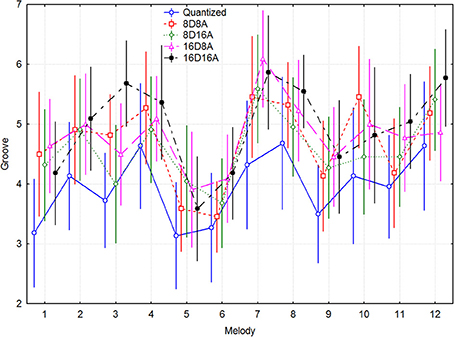
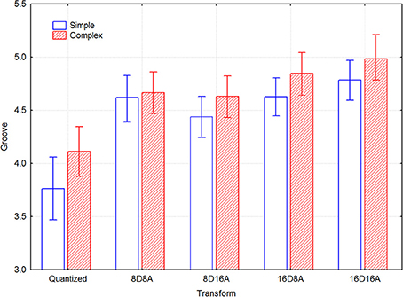

```{r, echo=F, include=F}
knitr::opts_chunk$set(echo = TRUE, collapse=TRUE, cache=TRUE, comment=">", message=FALSE)
library(tidyverse)
library(webex)
library(pander)
theme_set(theme_minimal())
```


# Zenodo


:::{.exercise}

Go to the Zenodo.org website. Find examples of data analysis supplements for psychological papers which
have been shared as Rmarkdown.

If you have trouble finding one, this is a recent example which includes only plots: https://zenodo.org/record/3560306#.X37EXy2ZOCM

This is another which includes both plots and some linear models: https://zenodo.org/record/3897511#.X37EVy2ZOCM

Try and find a few figures or statistics reported in the journal articles these files support. Can you follow enough of the Rmd to work our where they are calculated? (You might not understand _all_ the R code, but this should still be possible).

:::


# Watch a master class

This video shows Hadley Wickham (author of much of the tidyverse) working with a real dataset. It's interesting for a number of reasons, but especially because it shows a range of techniques to explore data in a fluent way, and also because he 'thinks aloud' as he makes data-analytical decisions, so gives you an insight into the strategies and habits of mind that can be useful when working with real data.


<iframe width="662" height="372" src="https://www.youtube.com/embed/go5Au01Jrvs" frameborder="0" allow="accelerometer; autoplay; clipboard-write; encrypted-media; gyroscope; picture-in-picture" allowfullscreen></iframe>


# Reproduce a plot

:::{.exercise}

@sioros2014syncopation present findings from a repeat measures study on syncopation in music. Based on experiment A, the authors present these plots:






These files share the data from the experiments: <https://zenodo.org/record/1221315#.X37O1C2ZOCM>

Try to recreate one or both of the plots, using ggplot. Try to improve them if you can, based on
Tufte's  principles of graphical excellence (see week 11 session on visualisation).


```{r, echo=F, include=F}
expA <- readxl::read_xls('data/Sioros_et_al/ratings/GrooveSynthExptA.XLS')
```

`r hide("Show hints")`

- You will need to use both an x-axis AND a facet to create the pairs of columns shown in the original plot.

- For bar charts, `color=VAR` will only change the outline color of the bar. Use `fill=VAR` instead.
- Without pre-processing the data to change category labels and variable names it 
will be hard to get the plot to match exactly.

- You may also find it difficult to get the categories in the same order as the original plot. You can use the `fct_rev(VARABLENAME)` function to reverse the order of factor variables, or look at the help files for 
`fct_reorder()`.

`r unhide()`


`r hide("Show example plots produced in R")`

In it's simplest form, without any tidying up of labels or formatting and using ggplot defaults, the plot might look something like this:


```{r, echo=F, message=F, warning=F}
expA %>% 
  ggplot(aes(x=factor(songtype), groovy, fill=factor(songtype))) + 
  stat_summary(geom="bar") + 
  facet_wrap(~TransformName)
```


You can add error bars using `stat_summary(geom="errorbar")`, and change the number of columns to aid readability.  

But perhaps try something a bit more data-rich, and which shows the true variability in the data?


```{r, echo=F, message=F, warning=F}
expA %>% 
  mutate(`Song Type`=factor(songtype, levels=c(1,2), labels=c("Simple", "Complex"))) %>% 
  mutate(TransformName=str_replace(TransformName, "none", "Quantized")) %>% 
  ggplot(aes(x=`Song Type`, groovy, color=`Song Type`)) + 
  geom_boxplot() +
  stat_summary(fun.data = mean_cl_normal) + 
  facet_grid(~TransformName, switch="both") + 
  labs(y="Groove", x="Transform", color="Song type") +
  ggtitle("Groove ratings by transform and song-type.") +
  theme(axis.text.x = element_blank())
  guides(color=F)
```
Does the result look as clear/convincing when we plot it this way?

`r unhide()`


:::


