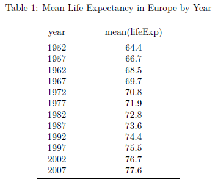
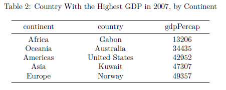
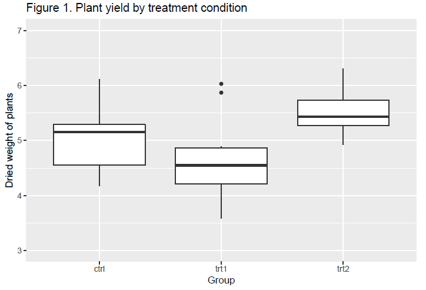

# Assessments

```{r, echo=FALSE, message=FALSE, include=F, warnings=F}
library(knitr)
library(tidyverse)
library(pander)
```

The assessment for PSYC753 includes 3 components:

-   A pass fail assessment which will ensure you have acquired the core skills in handling and
    visualising data.
-   A structured data analysis and visualisation task, requiring short answers (50%)
-   An authentic analysis assignment, where you will replicate the analysis of a published study
    (50%).

**_For submission dates please check the DLE._** Don't rely on this website.

## Core skills test

Details of the core skills test will be released in week 13 via the DLE, and will be due around week
20 (early December).

## Data analysis and visualisation task

This assignment is due on 27th February and counts 50% towards your module grade.

Your task is to answer the questions below.

### Submitting your answers

You should submit exactly 3 files:

1. An rmd file
2. A PDF document, produced by knitting your rmd file.
3. As a separate document, upload a copy of the standard CW coversheet (and complete the feedback
   section).

Within the Rmd file you should:

-   Label each question clearly
-   Where necessary, include comments explaining what specific lines of code do.
-   Intersperse explanatory text with code chunks (don't put everything in the same code chunk).

Your rmd file should "Just Work" when the marker opens and runs it, and produce the same output as
the knitted PDF file you submitted (i.e. there won't be any errors or missing datafiles).

If you work on your own computer at home, you should check your rmd file 'knits' correctly on the
online Rstudio server.

**Responses to frequently asked questions will be posted at this [FAQ link](#FAQ-assessment)**

\

### Questions

The number of marks each question is worth [out of 50] is given below.

#### 1. Data handling [10 marks]

Use `dplyr` functions like `group_by` and `summarise` to recreate the two tables below, from the
`gapminder::gapminder` dataset.

Your tables should look like the ones below once you've knitted your document to a PDF:

<center>

</center>

\

<center>

</center>

\

#### 2. Visualisation and plotting [10 marks]

Recreate the plot below, using the `datasets::PlantGrowth` data:

\

<center>

</center>

\

#### 3. Regression [20 marks]

Use `read_csv` to load the `climate` dataset held at <https://bit.ly/3a1eF7w>. The data are
responses to a survey concerning people's attitudes to climate change.

:::{.tip}

These are the variables:

`sex` 0 = male, 1 = female

`age` age in years

`change` To what extent do you agree or disagree with the statement: I can personally help to reduce
climate change by changing my behaviour. 1 = strongly disagree...5 = strongly agree

`concern` How concerned are you, if at all, about climate change, sometimes referred to as global
warming? 1 = not concerned...4 = very concerned

`nuclear` On a purely emotional level, how do you feel about nuclear power? 1 = very negative...5 =
very positive

`exagerate` To what extent do you agree or disagree with the statement: The seriousness of climate
change is exaggerated. 1 = strongly disagree...5 = strongly agree

`hedonism` How important to you is the gratification of desires, enjoyment in life, and
self-indulgence? 1 = not important...5 = very important

:::

a. Fit a linear model to determine the extent to which `change` is predicted by `concern`. Report
the results in APA format, include an appropriate plot of the data, and explain the results.

b. Add `nuclear`, `exagerate`, and `hedonism` to the model in part a. Report the results from this
multiple regression in APA format and explain the findings.

c. Does the addition of these variables to the model _improve_ the prediction of `change`?

d. Using the model with `concern`, `nuclear`, `exagerate`, and `hedonism` as predictors, derive a
prediction for a person who has scores of concern = 2, nuclear = 2.5, exagerate = 3, and hedonism =
3.5.

\

#### 4. Fitting curves [10 marks]

Again, using the `climate` dataset at <https://bit.ly/3a1eF7w>, is there sufficient evidence for a
linear, quadratic or cubic component of `age` in the prediction of `change`? Explain your answer.

## Authentic analysis assessment {#assessment-authentic-analysis}

This task will be due around week 40.

---

Find an empirical paper for which the authors have freely-shared the dataset but not their analysis
scripts. Ideally this will link to your research interests, or be similar to your project analysis,
but this is not required.

-   A good way of finding a suitable paper would be to look through a journal known for publishing
    papers with open-source datasets, for example PlosOne. Another would be to search Zenodo or a
    similar repository for recently-published datasets, and look for where the articles reporting
    thse data were published.

-   To keep the assignment simple, choose a paper which uses statistical methods taught as part of
    the module, or which can be approximated by them. For example: a multiple regression,
    between-subjects Anova, or repeated measures Anova or mixed model.

-   Some papers report many studies, or many different analyses, and may have technical details with
    which you are not familiar. If this is the case then you do NOT need to deal with the whole
    paper: Simply **focus on one of the primary analyses**. For example, if one of the main study
    hypotheses can be answered by a 2x2 Anova or mixed model, but there are lots of other analyses
    included in the paper, then focus on just this one analysis.

**If you are unsure about the scope of this assignment (e.g. don't know how much of a paper to try
and replicate) then please check with the module leader early in the process.**

To check if a paper will be suitable, you can answer these questions:

1. Are the data available?
2. Is the design between-groups? (answer must be yes)
3. Are measurements at more than 2 timepoints per-participant? (answer should be no; if the paper
   reports "mixed effects" models or repeat-measures Anova it will not be suitable)
4. Is the outcome a continuous variable? (i.e. must not be a binary outcome)

Your task is to:

1. Imagine you were the author of the paper, just prior to collecting data for this study. Complete
   the form on 'aspredicted.org'. You don't actually need to use the aspredicted website for this —
   simply copy the heading structure from the form, and include your answers in your submitted
   manuscript. Comment on whether it is possible and/or straightforward to reconstruct what would
   have been in the pre-registration from what is written in the journal article. Comments can be
   either interspersed with the answers or in a separate block at the end.

2. Using `ggplot`, make at least one plot of the data which illustrate the main findings. Explain
   your design decisions for these plots: what features of the data were you trying to highlight,
   and how? This plot might replicate a plot from the paper closely, but could also use techniques
   learnt in the course to increase the information density or provide some other enhancement. One
   approach to answering this question would be to show several plots representing different
   tradeoffs/options when plotting the data: Your answer would then justify the selection of the
   final plot over the others.

3. Replicate the statistical analysis using methods which are appropriate to the data. Report your
   findings in prose using APA format, but allow yourself additional space for explanation of the
   models/tests run. Compare/contrast your results with the published manuscript as appropriate.
   Document your responses and version of the analysis in an Rmd file with accompanying dataset,
   suitable for upload to Zenodo or OSF.io.

4. Discuss the extent to which the concept of 'researcher degrees of freedom' (Simmons et al 2011;
   Gelman and Loken 2013) should influence our understanding of your chosen study.

### Important notes

-   Don't assume that a published dataset and manuscript can be easily replicated simply because
    they have been shared: **_It may well be the case that it is hard to replicate the findings and
    this is OK (and interesting!) You will not lose marks simply because you cannot replicate the
    published findings._**

-   You do not need to use the _exact_ method used in the original paper in all cases; the point of
    the exercise is to apply methods we have learned in an appropriate way. For example, you may
    wish to apply Bayesian techniques to a dataset previously analysed with frequentist methods;
    this would provide additional opportunity to demonstrate understanding of the material and
    appropriate application of techniques.

-   Your mark will be based on how appropriate the analysis you propose is, and the range of skill
    and understanding you demonstrate in answering the questions.

### Submitting your answers

You should submit 5 files:

1. An Rmd file and
2. A datafile which when 'knitted' together produce
3. An HTML or PDF document.
4. As a separate document, upload a copy of the standard CW coversheet (and complete the feedback
   section).
5. Also include a pdf copy of the study you chose to replicate.

If you need to include more than one datafile that is also OK.

Within the Rmd file you should:

-   Label each question clearly
-   Where necessary, include comments explaining what specific lines of code do.
-   Intersperse explanatory text with code chunks (don't put everything in the same code chunk).

Your Rmd file should "Just Work" when the marker opens and runs it, and produce the same output as
the knitted HTML or PDF file you submitted (i.e. there won't be any errors or missing datafiles).

If you work on your own computer at home, you should check your Rmd file 'knits' correctly on the
online Rstudio server.

See [common problems when trying to knit Rmd files](#common-rmd-problems)

### Marking scheme

All questions will be marked using the standard school grading scale. Questions 1, 2 and 4 will
contribute 60% of the overall mark; question 3 contributes 40%.

### References

Gelman, A., & Loken, E. (2013). The garden of forking paths: Why multiple comparisons can be a
problem, even when there is no “fishing expedition” or “p-hacking” and the research hypothesis was
posited ahead of time. Department of Statistics, Columbia University. Chicago

Simmons, J. P., Nelson, L. D., & Simonsohn, U. (2011). False-positive psychology: Undisclosed
flexibility in data collection and analysis allows presenting anything as significant. Psychological
science, 22(11), 1359-1366. Chicago
