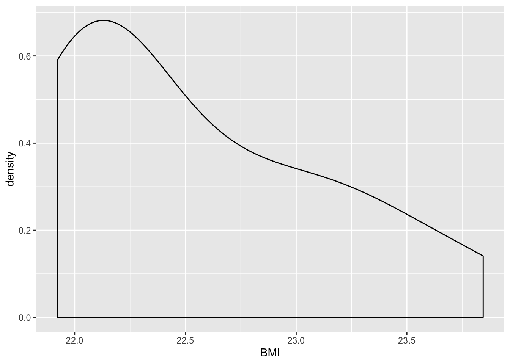
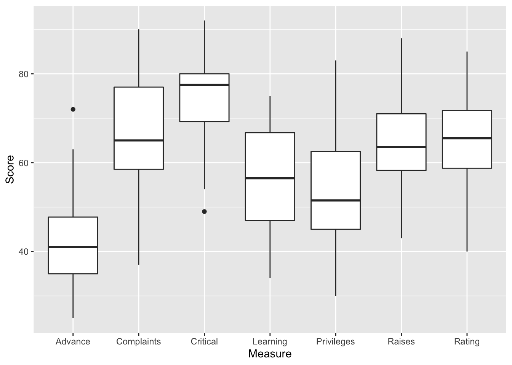
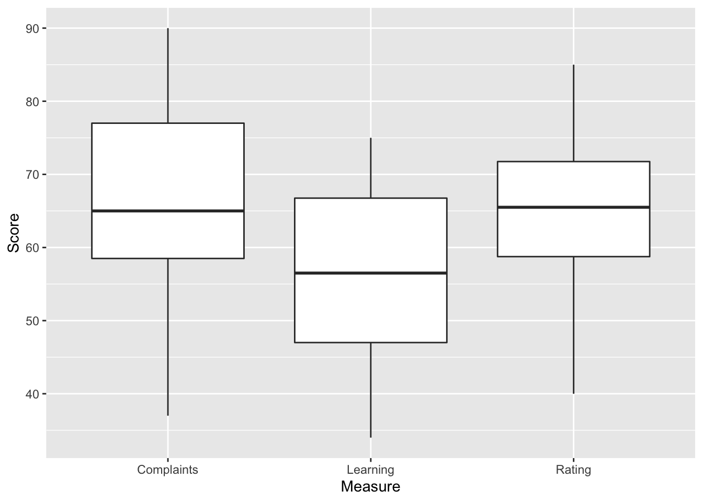
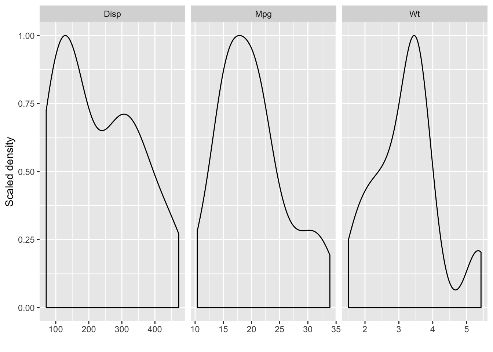
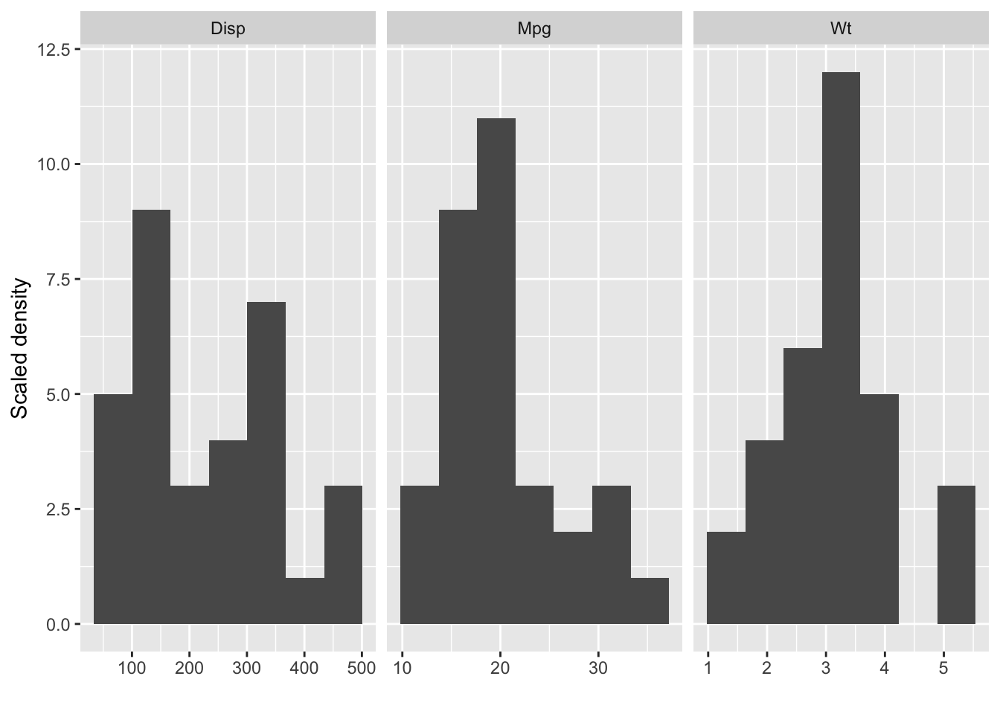
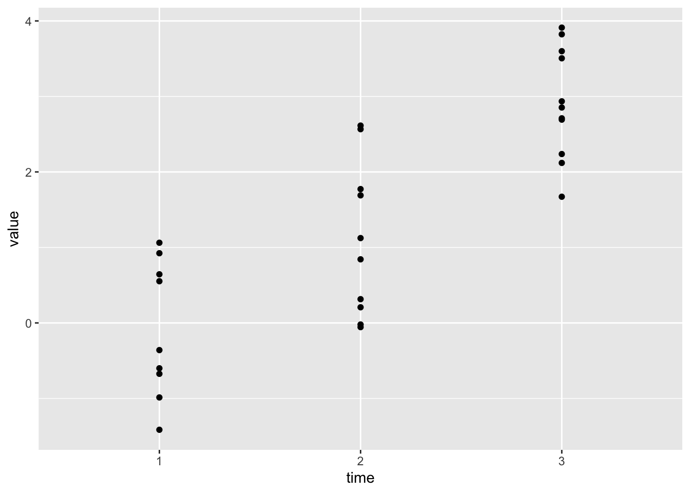

# Data handling {#data-handling}


### In brief

> Most time in data analysis is spent 'tidying up' data: getting it into a suitable format to get
> started. Data scientists have a particular definition of _tidy_: Tidy datasets are "easy to
> manipulate, model and visualize, and have a specific structure: each variable is a column, each
> observation is a row" [@wickham_tidy_2014].

> It's often not convenient for humans to _enter_ data in a tidy way, so untidy data is probably
> more common than tidy data in the wild. But doing good, reproducible science demands that we
> document each step of our processing in a way that others can check or repeat in future. Tools
> like R make this easier.

## Overview

So far we have used various commands in the `tidyverse` to work with several datasets. If you want
to recap these commands you can use the ['cheatsheet' here](#cheatsheet) especially
[this section](#dplyr-cheat) and the part on [groups and summaries](#cheat-group-summary).

Today we will cover two additional techniques which are important when working with real datasets:

-   Creating new variables/columns
-   Reshaping or reformatting data from long to wide (or vice versa)
-   Joining two sources of data (e.g. two spreadsheets) into a single dataframe

---

In the second part of the session we will cover RMarkdown, which is an alternative to R script files
which lets us combine text, graphics and R code and is useful when sharing our work.

## Making new variables

Sometimes we need to create new columns in our dataset. For example, let's say we wanted to
calculate someone's BMI from their weight and height.

There is a built in dataset called `women`, which contains heights and weights of 15 women in lbs
and inches:


```r
women  %>% glimpse
```

```
## Observations: 15
## Variables: 2
## $ height <dbl> 58, 59, 60, 61, 62, 63, 64, 65, 66, 67, 68, 69, 70, 71, 72
## $ weight <dbl> 115, 117, 120, 123, 126, 129, 132, 135, 139, 142, 146, 150, 15…
```

To calculate a BMI we first need to convert the heights to from inches to meters, and the weights
from lbs to kilograms.


```r
metric_women <- women  %>%
  mutate(
    height_m = height*0.0254,  # approx conversion from inches to m
    weight_kg= weight*0.45     # conversion from lbs to kg
  )
```

**Explanation**: We used mutate to covert lbs to kg and inches to m, and saved these two new columns
in the `metric_women` dataset.

We can see the new columns here:


```r
metric_women %>% head(3)
```

```
##   height weight height_m weight_kg
## 1     58    115   1.4732     51.75
## 2     59    117   1.4986     52.65
## 3     60    120   1.5240     54.00
```

BMI is calculated as $kg / m^2$. We can use mutate again for this:


```r
metric_women  %>%
  mutate(BMI = weight_kg / height_m^2) %>%
  head(3)
```

```
##   height weight height_m weight_kg      BMI
## 1     58    115   1.4732     51.75 23.84443
## 2     59    117   1.4986     52.65 23.44374
## 3     60    120   1.5240     54.00 23.25005
```

**Explanation**: We used mutate again to make a new column, `BMI`. This contains womens' weight
divided by their squared height (`^2` means _to the power of 2_ in R-speak).

:::{.exercise}

-   Create a density plot of BMI scores in the `women` dataset. It should look like this:



-   What is the median BMI in the sample? <span class='webex-fitb' id = 'Q300731' ><input class='solveme  nospaces' data-digits=4 size=4  style='width:4em;'  data-answer='["22.3"]'/><span class='solvedme'></span></span>

:::

## Reshaping (melting)

Data is commonly stored in either
[_wide_ or _long_ format](https://www.theanalysisfactor.com/wide-and-long-data/).

If you used SPSS to do a _t_-test or ANOVA during your undergraduate degree, you likely analysed the
data in **wide** format. In wide format, each row represents the _observations from a single
participant_. Each measurement for a given participant are stored in separate columns.

This is often called **row per subject** data. An example is the built in `attitude` dataset:


```r
attitude %>%
  head()
```

```
##   rating complaints privileges learning raises critical advance
## 1     43         51         30       39     61       92      45
## 2     63         64         51       54     63       73      47
## 3     71         70         68       69     76       86      48
## 4     61         63         45       47     54       84      35
## 5     81         78         56       66     71       83      47
## 6     43         55         49       44     54       49      34
```

**Explanation**: Each row contains scores for a particular employee on various measures. To find out
more about these data you can type `?attitude` into the console.

---

Let's say we want a single plot of all these variables, something like this:



To do this we first need to convert the data to _long_ format. In **long format**, each observation
is saved in its own row, rather than across multiple columns.

It's often called **"row per observation"** data.

---

We can convert from wide to long using the `melt` command in the `data.table` package. First we need
to load the `data.table` package:


```r
library(data.table)
```

](https://i.imgur.com/UBGhu.gif)

To see why the command is called 'melt', imagine taking three columns of data fo the first two rows:


```r
attitude %>%
  select(rating, complaints, privileges) %>%
  head(2)
```

```
##   rating complaints privileges
## 1     43         51         30
## 2     63         64         51
```

If we use `melt` on this selection, we end up with this:


```r
attitude %>%
  select(rating, complaints, privileges) %>%
  head(2) %>%
  melt()
```

```
##     variable value
## 1     rating    43
## 2     rating    63
## 3 complaints    51
## 4 complaints    64
## 5 privileges    30
## 6 privileges    51
```

The change works like like this:


In this example we don't have an explicit record of which participant was which in the `attitude`
dataset, because the mapping to participants was implicit: each row was a new participant, but they
were not marked.

We can make this explicit by adding a new column to the data with the `mutate` command:


```r
attitude %>%
  select(rating, complaints, privileges) %>%
  mutate(person = row_number()) %>%
  head(2)
```

```
##   rating complaints privileges person
## 1     43         51         30      1
## 2     63         64         51      2
```

And now, if we repeat the melt, we can specify `id.var="person"`. This tells R which column
identifies the rows:


```r
attitude %>%
  select(rating, complaints, privileges) %>%
  mutate(person = row_number()) %>%
  head(2) %>%
  melt(id.var="person")
```

```
## Warning in melt(., id.var = "person"): The melt generic in data.table has
## been passed a data.frame and will attempt to redirect to the relevant reshape2
## method; please note that reshape2 is deprecated, and this redirection is now
## deprecated as well. To continue using melt methods from reshape2 while both
## libraries are attached, e.g. melt.list, you can prepend the namespace like
## reshape2::melt(.). In the next version, this warning will become an error.
```

```
##   person   variable value
## 1      1     rating    43
## 2      2     rating    63
## 3      1 complaints    51
## 4      2 complaints    64
## 5      1 privileges    30
## 6      2 privileges    51
```

:::{.exercise}

Use the tidyverse commands you know plus `melt` to produce this plot:



:::

:::{.exercise}

For an extension (and only if you have plenty of time), use the `mtcars` data and facetting to
produce these plots:




```
## Warning in melt(.): The melt generic in data.table has been passed a data.frame
## and will attempt to redirect to the relevant reshape2 method; please note that
## reshape2 is deprecated, and this redirection is now deprecated as well. To
## continue using melt methods from reshape2 while both libraries are attached,
## e.g. melt.list, you can prepend the namespace like reshape2::melt(.). In the
## next version, this warning will become an error.
```

```
## No id variables; using all as measure variables
```



As a tip, you will need to:

-   add `scales="free_x"` to the `facet_wrap` function. So, it will read:
    `facet_wrap(~VARNAME, scales="free_x")`
-   for the histogram, replace `geom_density()` with `geom_histogram()`
-   adjust the number of vertical bars in the histogram by adding `bins=7` (or some other number) to
    `geom_histogram()`

:::

### Using melt to make summaries

Imagine we want a table of the mean score on each question in the attitude dataset. This would be
fiddly if we just tried to use summarise before reshaping, but if we use `melt`, `group_by` and then
`summarise` (in that order) it is easy to make a table like this:


```
## Warning in melt(.): The melt generic in data.table has been passed a data.frame
## and will attempt to redirect to the relevant reshape2 method; please note that
## reshape2 is deprecated, and this redirection is now deprecated as well. To
## continue using melt methods from reshape2 while both libraries are attached,
## e.g. melt.list, you can prepend the namespace like reshape2::melt(.). In the
## next version, this warning will become an error.
```


----------------------------
  variable    mean     sd   
------------ ------- -------
   rating     64.63   12.17 

 complaints   66.6    13.31 

 privileges   53.13   12.24 

  learning    56.37   11.74 

   raises     64.63   10.4  

  critical    74.77   9.89  

  advance     42.93   10.29 
----------------------------

:::{.exercise}

Use the `melt`, `group_by` and `summarise` commands (in that order) to reproduce the table above.

:::

## Reshaping wide (casting)

Sometimes we have the opposite problem: We have long data, but want it in wide format. For example,
we might want a table where it's easy to compare between different years, like this:


```
## Warning in data.table::dcast(., country ~ year): The dcast generic in data.table
## has been passed a tbl_df and will attempt to redirect to the reshape2::dcast;
## please note that reshape2 is deprecated, and this redirection is now deprecated
## as well. Please do this redirection yourself like reshape2::dcast(.). In the
## next version, this warning will become an error.
```


------------------------------------------------
        country           1997    2002    2007  
------------------------ ------- ------- -------
        Albania           3193    4604    5937  

        Austria           29096   32418   36126 

        Belgium           27561   30486   33693 

 Bosnia and Herzegovina   4766    6019    7446  

        Bulgaria          5970    7697    10681 

        Croatia           9876    11628   14619 
------------------------------------------------

Table: GDP per-capita in 3 different years from the gaminder dataset.

---

To do this `data.table` has a command called `dcast`. The metaphor here is _casting_ a fishing line
or net --- that is, turning something that was long/vertical into something wide/horizontal.

](media/throwing_fish_net_fail.gif)

---

First make sure the package is loaded:


```r
library(data.table)
```

As we saw before the `gapminder` data is a fairly long format. There are multiple rows per-country
corresponding to different years.

To cast `gapminder` to a wide format to _compare_ years we first need to select the data we want ---
country, year and GDP:


```r
gapminder1990s <- gapminder::gapminder %>%
  select(country, year, gdpPercap) %>%
  filter(year > 1990)
```

Then we add the `dcast` command:


```r
gapminder1990s %>%
  dcast(country~year) %>%
  head()
```

```
## Warning in dcast(., country ~ year): The dcast generic in data.table has been
## passed a tbl_df and will attempt to redirect to the reshape2::dcast; please
## note that reshape2 is deprecated, and this redirection is now deprecated as
## well. Please do this redirection yourself like reshape2::dcast(.). In the next
## version, this warning will become an error.
```

```
## Using 'gdpPercap' as value column. Use 'value.var' to override
```

```
##       country       1992       1997       2002       2007
## 1 Afghanistan   649.3414   635.3414   726.7341   974.5803
## 2     Albania  2497.4379  3193.0546  4604.2117  5937.0295
## 3     Algeria  5023.2166  4797.2951  5288.0404  6223.3675
## 4      Angola  2627.8457  2277.1409  2773.2873  4797.2313
## 5   Argentina  9308.4187 10967.2820  8797.6407 12779.3796
## 6   Australia 23424.7668 26997.9366 30687.7547 34435.3674
```

**Explanation of the output**: We started with multiple rows per country, corresponding to years. We
used `dcast(country~year)` to cast the data into wide format. The result has countries listed
one-per-row; data for each year are shown in a separate column. This helps us compare years within
countries.

**Explanation of the command**: The `country~year` part tells dcast to create a table where
countries make up the rows, and years make up the columns. That is the variables to the left of the
`~` symbol will define the rows in the table, and the variables to the right of the `~` will create
new columns.

:::{.tip}

The squiggly `~` symbol is called a tilde (say "tilder").

-   On a Mac it's the key to the left of the `Z` (you need to press `shift` to type it).

-   On a PC it's normally between the `@` symbol and the `Enter` key.

:::

We can add multiple variables to the left or right of the `~` to create different shape tables.

For example:


```r
gapminder::gapminder %>%
  select(continent, country, year, gdpPercap) %>%
  filter(year > 1990) %>%
  dcast(continent + country ~ year) %>%
  head()
```

```
##   continent      country      1992      1997       2002       2007
## 1    Africa      Algeria 5023.2166 4797.2951  5288.0404  6223.3675
## 2    Africa       Angola 2627.8457 2277.1409  2773.2873  4797.2313
## 3    Africa        Benin 1191.2077 1232.9753  1372.8779  1441.2849
## 4    Africa     Botswana 7954.1116 8647.1423 11003.6051 12569.8518
## 5    Africa Burkina Faso  931.7528  946.2950  1037.6452  1217.0330
## 6    Africa      Burundi  631.6999  463.1151   446.4035   430.0707
```

:::{.exercise}

Experiment for yourself with `dcast`:

-   What happens if we write `dcast(year ~ country)` instead of `dcast(country ~ year)`?
-   Use more than one variable on the left or right of the `~`
-   Experiment with some different datasets

As an extension:

-   Think about how you might use `dcast` with the `group_by` and `summarise` approach we used
    above. Can you create an example where using these techniques together produces a useful table?

:::

## RMarkdown

Markdown is a simple **text format** which can include writing, tables and images (see
http://commonmark.org/help/).

An RMarkdown document mixes R code with Markdown. You can generate images (plots) and tables
directly using R code.

In the language of RStudio, you **'knit'** your RMarkdown document to produce a finished document.
Knitting:

1. runs your code and
2. combines the analyses, graphs, with your explanatory text to
3. make a single pdf or html file.

This knitted file documents your work and can be shared easily with others.

#### Why use Rmarkdown?

Rmarkdown is becoming an important tool in the open science movement. Authors often share details of
their analysis in an Rmarkdown file because journal articles are too constrained to document this
properly.

A recent example from Plymouth is shared here: <https://zenodo.org/record/1120364>. This repository
includes:

-   The datafile in CSV format
-   The Rmarkdown source file
-   The knitted html document
    ([click here to have a look](media/whalley-andrade-data_supplement.html))

The [main assessment for this module](#assessment-authentic-analysis) requires you to make an Rmd
file like this to share a re-analysis of a published paper, so learning how to use Rmd is an
important part of the course.

### Creating a fresh RMarkdown file

The easiest way to create and RMarkdown file is from the `File > New > RMarkdown` menu option:


It should look something like this when you've done it:


**Explanation** We asked RStudio to create a new Rmd file. Rstudio makes the new file from a
template, and this shows off some of the main features of RMarkdown.

---

RMarkdown files have the file extensions `.rmd` and must to be saved before they can be 'knitted'.

:::{.exercise}

1. Create a new Rmd file and save it somewhere in your home directory on the Rstudio server (or the
   same place you saved your other R Script files).

1. Have a look through the example file created in RStudio. Have a guess at what each part does.

1. Press the 'knit' button in the RStudio interface and check the results.

:::

### Working with 'chunks' of R code

To include R code within RMarkdown we write 3 backticks followed by `{r}`.

We then write some R code, and close the chunk with 3 more backticks. This is what it looks like:


<div class='solution'><button>Can't find the backtick on your keyboard?</button>


</div>


:::{.exercise}

As you do this exercise, take care to get the right number of backticks, and your curly brackets
(`{}`) in the right place.

1. Create a new 'chunk' of R code which includes one of the plots you have made so far today. Use
   one of the built in datasets for now.

1. Make sure you add `library(tidyverse)` just above your plot code.

1. Press 'knit' again and check the result.

:::

:::{.tip}

If you are getting errors when adding a code chunk always check you have:

-   3 backticks, then `{r}`, then **start a new line**
-   Your R code comes next
-   Load any packages needed at the top of the first chunk.
-   3 more backticks, **on their own line**. These final 3 backticks **must** start at the beginning
    of the line, have no spaces in front of them, and nothing after them.

If you are still getting errors:

-   Read the error message - it can give a clue
-   Simplify everything (remove R code until it works, then try again)

Using libraries in chunks:

-   Load packages (e.g. `library(tidyverse)`) once at the top of the file.
-   Remember that RStudio knits code from top to bottom (so load packages **before** you use them)
-   R wipes it's memory each time it knits your file, so needs reminding. You only need to load the
    package in one chunk though (don't do it multiple times).

:::

### Working interactively with Rmarkdown

Rather than typing commands in the console, **you should now run code directly from your Rmd code
chunks**.

This makes it much easier to keep track of your work.

See this video for an example:

<iframe src="https://player.vimeo.com/video/225968925" width="640" height="400" frameborder="0" webkitallowfullscreen mozallowfullscreen allowfullscreen></iframe>

:::{.exercise}

1. Put your cursor (pointer) anywhere inside the new chunk you added, containing the R code for your
   plot. The chunk should look something like this:


2.  Press the green 'run' button (a rightward pointing triangle) in the top right corner of the
    chunk. Where does the result appear?

3.  Change the R code in your chunk (e.g. make a different plot). Press 'run' again.

4) Write several lines of R code in your chunk. Put the cursor on one of the lines and press
   `ctrl+enter` or `cmd+enter` if you are on a mac. Does this run all of the code in the chunk, or
   just part of it?

5. Write some code which uses `summarise` inside your code chunk to produce a table

:::


## Final task (to be completed as homework)

:::{.exercise}

Work in your previous groupings.

Use Rmarkdown to present your findings from the Berkley admissions data we covered in the past session. It should:

- Load the data and packages needed
- Use section headings (i.e. use the `#` or `##` to create a 1st or 2nd level heading)
- Include 2 or 3 plots
- Include text describing your conclusions  on the main question (was the admissions system 'fair')

When you are finished, knit the Rmd document to produce an html or PDF output (it's actually a good idea to knit regularly to pick up any errors).

:::


## Extension exercises and reading

-   Read this article on wide/long data formats and the tradeoffs between the two:
    https://www.theanalysisfactor.com/wide-and-long-data/

### Making nicer tables in RMarkdown

The `pander` function in the `pander` library can help make nicer tables when using RMarkdown.

For example, if we take a few rows from the Iris data they look like this:


```r
iris %>% head
```

```
##   Sepal.Length Sepal.Width Petal.Length Petal.Width Species
## 1          5.1         3.5          1.4         0.2  setosa
## 2          4.9         3.0          1.4         0.2  setosa
## 3          4.7         3.2          1.3         0.2  setosa
## 4          4.6         3.1          1.5         0.2  setosa
## 5          5.0         3.6          1.4         0.2  setosa
## 6          5.4         3.9          1.7         0.4  setosa
```

But if we load the `pander` package, and use the `pander` command we get a nice table, like this:


```r
library(pander)
iris %>% head %>% pander
```


-------------------------------------------------------------------
 Sepal.Length   Sepal.Width   Petal.Length   Petal.Width   Species 
-------------- ------------- -------------- ------------- ---------
     5.1            3.5           1.4            0.2       setosa  

     4.9             3            1.4            0.2       setosa  

     4.7            3.2           1.3            0.2       setosa  

     4.6            3.1           1.5            0.2       setosa  

      5             3.6           1.4            0.2       setosa  

     5.4            3.9           1.7            0.4       setosa  
-------------------------------------------------------------------

And we can add a caption to the table like this:


```r
iris %>% head %>% pander(caption="The first 6 rows from the iris dataset")
```


-------------------------------------------------------------------
 Sepal.Length   Sepal.Width   Petal.Length   Petal.Width   Species 
-------------- ------------- -------------- ------------- ---------
     5.1            3.5           1.4            0.2       setosa  

     4.9             3            1.4            0.2       setosa  

     4.7            3.2           1.3            0.2       setosa  

     4.6            3.1           1.5            0.2       setosa  

      5             3.6           1.4            0.2       setosa  

     5.4            3.9           1.7            0.4       setosa  
-------------------------------------------------------------------

Table: The first 6 rows from the iris dataset

:::{.exercise}

Revisit one of the tasks that used [`group_by` + `summarise`](#cheat-group-summary). Use pander to
display the table in a nicer format, and knit your Rmarkdown file to pdf/html to see the results.

:::

### Separating 'untidy' variables into tidy, long-form data:

The code below generates simulated data for 100 individuals at three time points. The format is
similar to the way you might record experimental data in a spreadsheet.


```r
N <- 20
repeatmeasuresdata <- tibble(person = 1:N,
  time_1 = rnorm(N),
  time_2 = rnorm(N, 1),
  time_3 = rnorm(N, 3))

repeatmeasuresdata %>% head
```

```
## # A tibble: 6 x 4
##   person time_1 time_2 time_3
##    <int>  <dbl>  <dbl>  <dbl>
## 1      1 -1.71   1.13   2.57 
## 2      2  2.42   2.07   2.93 
## 3      3  0.120  0.820  3.30 
## 4      4 -0.518 -0.422  0.924
## 5      5 -0.968  2.72   1.94 
## 6      6  1.51   1.75   3.31
```

`repeatmeasuresdata` is in **wide** format. Each row contains data for one participant, and each
participant has three observations.

We can melt the data into long format like so:


```r
repeatmeasuresdata %>%
  melt(id.var = "person") %>%
  arrange(person, variable) %>%
  head(7)
```

```
## Warning in melt(., id.var = "person"): The melt generic in data.table has been
## passed a tbl_df and will attempt to redirect to the relevant reshape2 method;
## please note that reshape2 is deprecated, and this redirection is now deprecated
## as well. To continue using melt methods from reshape2 while both libraries are
## attached, e.g. melt.list, you can prepend the namespace like reshape2::melt(.).
## In the next version, this warning will become an error.
```

```
##   person variable      value
## 1      1   time_1 -1.7063558
## 2      1   time_2  1.1292308
## 3      1   time_3  2.5688266
## 4      2   time_1  2.4211107
## 5      2   time_2  2.0692895
## 6      2   time_3  2.9291219
## 7      3   time_1  0.1196861
```

The problem we have now is that `variable` contains text which describes at which time the
observation was made. We probably want a number for each timepoint, so we can make a plot with time
on the x axis.

The `separate` command separates a single character column (`variable`) into multiple columns.
Rather than have a column with labels of the form 'time_1', it can create two columns, with labels
'time' and '1' in each.


```r
longrepeatmeasuresdata <- repeatmeasuresdata %>%
  melt(id.var = "person") %>%
  separate(variable, into = c("_", "time"))
```

```
## Warning in melt(., id.var = "person"): The melt generic in data.table has been
## passed a tbl_df and will attempt to redirect to the relevant reshape2 method;
## please note that reshape2 is deprecated, and this redirection is now deprecated
## as well. To continue using melt methods from reshape2 while both libraries are
## attached, e.g. melt.list, you can prepend the namespace like reshape2::melt(.).
## In the next version, this warning will become an error.
```

```r
longrepeatmeasuresdata %>% head
```

```
##   person    _ time      value
## 1      1 time    1 -1.7063558
## 2      2 time    1  2.4211107
## 3      3 time    1  0.1196861
## 4      4 time    1 -0.5184175
## 5      5 time    1 -0.9677767
## 6      6 time    1  1.5104134
```

Now the data are in long format, we can plot the points over time:


```r
longrepeatmeasuresdata %>%
  sample_n(30) %>%
  ggplot(aes(x=time, y=value)) +
  geom_point()
```


