# Regression {#regression}


{width=40%}

#### In brief

> Regression is just a fancy term for drawing the 'best-fitting' line through a scatter-plot, and
> summarising how well the line describes the data.

> When using regression in R, the relationship between an **_outcome_** and one or more
> **_predictors_** is described using a **_formula_**. When a model is '**_fitted_**' to a sample it
> becomes tool to make **_predictions_** for future samples. It also allows us to quantify our
> **_uncertainty_** about those predictions.

> **_Coefficients_** are numbers telling us how strong the relationships between predictors and
> outcomes are. But the meaning of coefficients depend on the study **_design_**, and the
> **_assumptions_** were are prepared to make. Causal diagrams can help us choose models and
> interpret our results.

> Multiple regression is a technique which can describe the relationship between **_one outcome_**
> and **_two or more predictors_**. We can also use multiple regression to describe cases where two
> variable **_interact_**. That is, when the effect of one predictor is increased or decreased by
> another. Multiple regression is important because it allows us to make more realistic models and
> better predictions.

> Like any sharp tool, regression should be used carefully. If our statistical model doesn't match
> the underlying network of causes and effects, or if we have used a biased sample, we can be
> misled.

## Session 1

##### Overview

In this session we will revise core concepts for selecting and interpreting linear models. Some of
the material may have been covered in undergraduate courses, but we will emphasise understanding and
mastery of core ideas before we develop these ideas to fit more complex models.

### Fitting lines to data

Regression (and most statistical modelling) is about 'fitting' lines to data. Our first exercise
illustrates most of the key concepts without you needing to touch a computer.

In this activity you will need to:

-   Work in groups
-   Use some example plots
-   Decide how to draw lines on these plots which represent a 'good fit'

### Study habits and academic outcomes

For this activity I've provided some plots from a simulated dataset on study habits and academic
outcomes.

(If you're doing this exercise on your own at home, the example are available here:
[example-plots.pdf](regression-example-plots.pdf).

The data for the example include:

-   MCQ test data (i.e. academic achievement)
-   Responses to a study habits questionnaire (including a question on 'hours spent studying')

In these examples, each plot only contains 10 of the data points from the larger sample (N=300).

:::{.exercise}

Your task is to describe the **_relationship between hours spent working and exam grades_** with
lines (hand) drawn on the plots.

1. In groups, take one of the printed graphs, and a plastic transparency.

1. Put the transparency on top of the plot.

As a group, draw 3 lines on the transparency in different colours:

1. First, draw which you think is the 'best' line. That is, the line that describes the relationship
   between study hours and exam grades the best.

1. Second, discuss the pros and cons of fitting a straight vs. a curved line. If you initially drew
   either a straight line, draw a curved line now in another colour (or vice versa).

1. Finally, draw a **_really_** curvy line with multiple bends to get as close as you can to all the
   data points in your sample scatter plot.

---


<div class="figure">
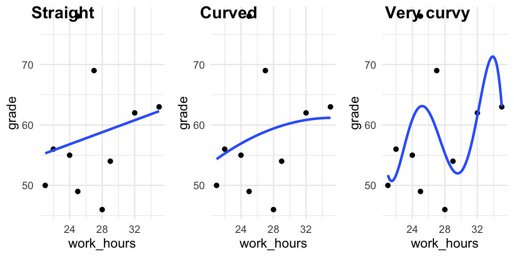
<p class="caption">(\#fig:unnamed-chunk-3)Examples of straight and curved lines fit to the data.</p>
</div>

:::

## How useful are the lines? {#how-useful-are-the-lines}

You can think of the lines we drew in two ways: as **maps** and as **tools**:

1. As a map, they **describe** the data we have, but they are also
2. **tools** which **predict** new data we might collect

In statistical language, the gaps between our line and the data points are called **_residuals_**.

We can distinguish:

1.  Residuals for the data we have now (how well does the line **_describe_** the data).
2.  Residuals for new data we collect after drawing the line (how well does the line **_predict_**).

Another common way to refer to residuals is as the **error** in a model. That is, the line describes
a _model_ (idealised) relationship between variables. And if look at the residuals we have an
estimate how how much _error_ there will be in our predictions when we use the model.

:::{.exercise}

In your group:

-   Discuss how well/badly your lines 'fit' to the sample you have (in general terms)

-   Using a ruler, measure (in mm) the residual for each datapoint on your current graph. Do this
    separately for the straight and curvy lines. If you need to save time, only do this for the
    first 5 data points.

-   Add up the total length of the distances (residuals) for each line. Make a note of this for
    later.

-   Repeat the exercise at least 3 times, swapping your printout with another groups' plot. (Each
    plots shows a different sample).

When you have finished, discuss in your group:

-   Do curved or straight lines have smaller residuals for the _original_ data that were used to
    draw them?

-   Do curved or straight lines have smaller residuals for _new_ data (i.e. after swapping?)

-   What do you think is going on here? What can explain the pattern you see?

---

Only when you have discussed this thoroughly,
[read an explanation of what is going on](#explanation-residuals).

:::

### Congratulations!

You have successfully fit your first linear model! The next step is to formalise the process. We
need a method that:

-   Finds the line with the **_smallest_** residuals
-   Is repeatable
-   Is easy for computers to do (because we're lazy)

For this we can use R!

## Using R for regression

Before we start, the study habits data are stored at this url:
<https://benwhalley.github.io/rmip/data/studyhabitsandgrades.csv>

Previously we have loaded data by:

-   Downloading the csv to our computer
-   Uploading it to RStudio server
-   Opening it using `read_csv`

##### A shortcut {#load-data-from-url}

A quicker way is to combine these 3 steps: By providing `read_csv` with the url, we can open the
data in a single step:


```r
studyhabits <- read_csv('https://benwhalley.github.io/rmip/data/studyhabitsandgrades.csv')
```

**Explanation**: By providing a URL to `read_csv` we can open the data over the web.

We should check the data look OK using `head` or `glimpse`:


```r
studyhabits  %>% head()
studyhabits  %>% glimpse()
```

**Explanation**: `head` shows the first 6 rows of the dataset. `glimpse` provides a list of all the
columns and (if your window is wide enough) will also show the first few datapoints for each.

## The first step is **always** plotting

**Before** we start running analyses, we should always plot the data.

:::{.exercise}

Plot the `studyhabits` data in a few different ways to get a feel for the relationships between the
variables. Specifically,

1. Make a density plot to see the distribution of `grade` scores
1. Add colour to this plot (or use another type of plot) to see how scores differ by gender
1. Use a scatter plot to look at the relationship between `grade` and `work_hours`.
1. Is the relationship between `grade` and `work_hours` the same for men and women?


Interpret your plots:

-   What relationship do we see between revision and grades?
-   Do you estimate this a weak, moderate or strong relationship?

:::

## Automatic line-fitting {#automatic-line-fitting}

To get R to fit a line to these data for us we will use a new function called `lm`. The letters l
and m stand for _**l**inear **m**odel_.

There are lots of ways to use `lm`, but the easiest to _picture_ is to get `ggplot` to do it for us:


```r
studyhabits %>%
  ggplot(aes(work_hours, grade)) +
  geom_point() +
  geom_smooth(method=lm)
```

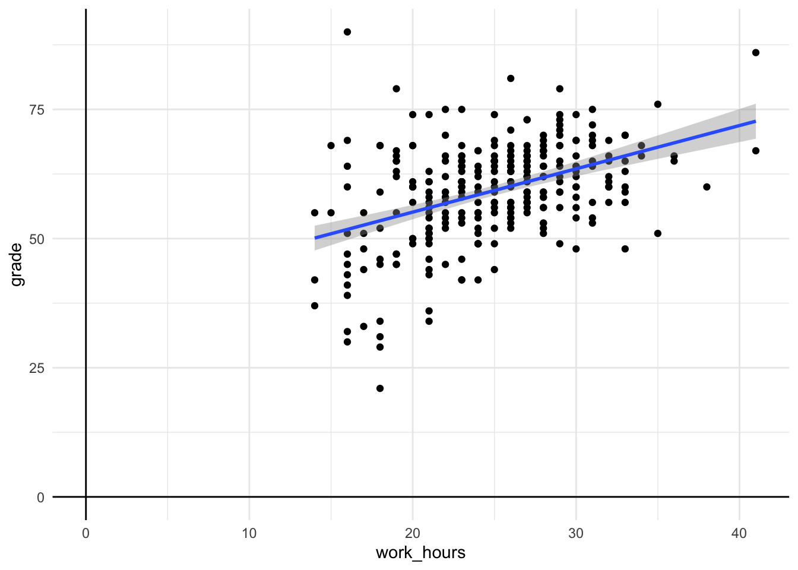

**Explanation of the code**: We used `geom_point` to create a scatterplot. Then we used a plus
symbol (`+`) and added `geom_smooth(method=lm)` to add the fitted line. By default, `geom_smooth`
would try to fit a curvy line through your datapoints, but adding `method=lm` makes it a straight
line.

**Explanation of the resulting plot** The plot above is just like the scatter plots we drew before,
but adds the blue fitted line. The blue line shows the 'line of best fit'. This is the line that
**minimises the residuals** (the gaps between the line and the points). Ignore the shaded area for
now [(explanation here if you are keen)](#explanation-shaded-area-geom-smooth).

### {#plot-relationships .exercise}

Try plotting a line graph like this for yourself, with:

-   The same variables (i.e. reproduce the plot with `work_hours` and `grade`)
-   Different variables (from the `studyhabits` dataset)
-   Without the `method=lm` part (to see a curvy line instead of straight)

Note whether the slope of the line is positive (upward sloping) or negative (downward sloping).

Now, add the `colour=female` inside the part which says `aes(...)`. Before you run it, predict what
will happen.


<div class='solution'><button>show answer</button>


It should plot different lines for men and women. Something like this:

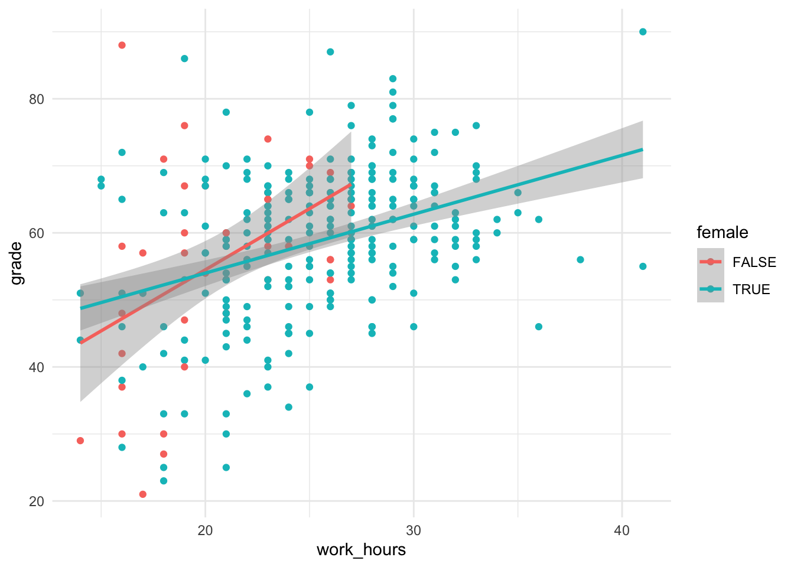


</div>


## Putting numbers to lines {#first-lm}

The plot we made in the previous section is helpful, because we can _see_ the best-fit line.

However also want to have a _single number to say how steep the line is_. That is, _a number to say
how closely related the variables are_.

To do this we can use the `lm` function directly.

:::{.exercise}

Before we start make sure you have loaded the studyhabits dataset:


```r
studyhabits <- read_csv('https://benwhalley.github.io/rmip/data/studyhabitsandgrades.csv')
```

:::

In the next piece of code we fit the model. The first part is known as a model formula. The `~`
symbol (it's called a 'tilde') just means "is predicted by", so you can read this part as saying
"grade is predicted by work hours".


```r
first.model <- lm(grade ~ work_hours, data = studyhabits)
first.model
```

```
## 
## Call:
## lm(formula = grade ~ work_hours, data = studyhabits)
## 
## Coefficients:
## (Intercept)   work_hours  
##     35.5148       0.9229
```

**Explanation of the code**: We used the `lm` function to estimate the relation beteen grades and
work hours.

**Explanation of the output**: The output displays:

-   The 'call' we made (i.e. what function we used, and what inputs we gave, so we can remember what
    we did later on)
-   The 'coefficients'. These are the numbers which represent the line on the graph above.

##### Explanation of the coefficients {#lm-explain-coefs-1}


In this example, we have two coefficients: the `(Intercept)` which is 35.5148 and the
`work_hours` coefficient which is 0.9229.

**The best way to think about the coefficients is in relation to the plot we made**. In this version
of the plot, however, I extended the line so it crosses zero on the x axis:

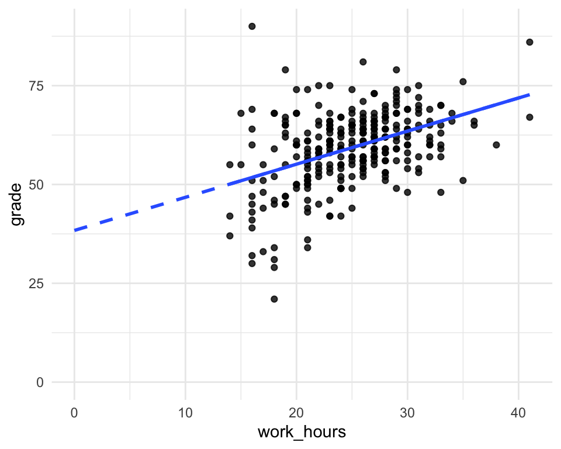

We can interpret the coefficients as points on the plot as follows:

-   The `(Intercept)` is the point (on the y axis) where the blue dotted line crosses zero (on the
    x-axis).
-   The `work_hours` coefficient is how **steep** the slope of the line is. Specifically, is says
    how many `grade` points the line will rise if we increase `work_hours` by 1.

:::{.exercise}

Before you move on:

-   Compare the coefficients from the `lm` output to the plot above. Can you see how they relate? If
    you're not 100% sure, ask now!

:::

## Making predictions (by hand) {#regresion-hand-predictions}

A big advantage of using the coefficients alongside the plot is that we can easily **_make
predictions for future cases_**.

:::{.exercise}

In a pair, do this now:

Let's say we meet someone who works 30 hours per week. One way to predict would be by-eye, using the
line on the plot.

What grade would you expect them to get simply by 'eyeballing' the line?


:::

We can do the same thing using the coefficients from `lm`, because we know that:

<!-- see cfs1 definition above -->

-   If someone worked for 0 hours per week then our prediction would be 36. We know
    this because this is the intercept value (the point on the line when it is at zero on the
    x-axis).
-   For each extra hour we study the `work_hour`coefficient tells us that f, our `grade` will
    increase by 0.9229.

-   So, if we study for 30 hours, our prediction is 36 $+$ 0.9229 $\times$ 30

:::{.exercise}

In pairs again:

-   Make predictions for people who study 5, 20 or 40 hours per week
-   Compare these predictions to the plot above.
-   Which of the predictions (for 5, 20 or 40 study hours) should we be most confident in? Why do
    you think this is?

:::

[If you want to check your predictions, click here](#explanation-first-predictions)

### Making predictions using code {#making-predictions-1}

Rather than making predictions by hand, we save time by using the `predict()` function.

If we run a regression, we can should save the fitted model with a named variable:


```r
first.model <- lm(grade ~ work_hours, data = studyhabits)
```

**Explanation**: As before, we ran a model and saved it to the named variable, `first.model`.

If we feed this model to the predict function, we get a model prediction for each row in the
original dataset:


```r
predict(first.model) %>% head(10)
```

```
##        1        2        3        4        5        6        7        8 
## 59.50978 59.50978 50.28095 65.96997 58.58690 53.97248 65.04708 64.12420 
##        9       10 
## 55.81825 65.96997
```

**Explanation of the output**: We have one prediction (the point on the line) for each row in the
original dataset.

---

We can also use the `augment` function in the `broom` package to do make the predictions, but return
them _with_ the original data. This can make it easier to use:


```r
library(broom)
augment(first.model) %>%
 head()
```

```
## # A tibble: 6 x 9
##   grade work_hours .fitted .se.fit .resid    .hat .sigma .cooksd .std.resid
##   <dbl>      <dbl>   <dbl>   <dbl>  <dbl>   <dbl>  <dbl>   <dbl>      <dbl>
## 1    69         26    59.5   0.639   9.49 0.00351   10.8 1.37e-3      0.882
## 2    54         26    59.5   0.639  -5.51 0.00351   10.8 4.62e-4     -0.512
## 3    37         16    50.3   1.29  -13.3  0.0143    10.8 1.12e-2     -1.24 
## 4    59         33    66.0   1.21   -6.97 0.0125    10.8 2.69e-3     -0.651
## 5    53         25    58.6   0.623  -5.59 0.00334   10.8 4.51e-4     -0.519
## 6    51         20    54.0   0.879  -2.97 0.00664   10.8 2.56e-4     -0.277
```

**Explanation of the output**: `augment` has also made a prediction for each row, but returned it
with the original data (`grade` and `work_hours`) that were used to fit the model. Alongside the
`.fitted` value, and the `.resid` (residual) there are some other columns we can ignore for now.

---

Often though, we don't want a prediction for each row in the original dataset. Rather, we want
predictions for specific values of the predictors.

To do this, we can use the `newdata` argument to `predict` or `augment`.

First, we create a new single-row dataframe which contains the new predictor values we want a
prediction for:


```r
newsamples <- tibble(work_hours=30)
newsamples
```

```
## # A tibble: 1 x 1
##   work_hours
##        <dbl>
## 1         30
```

(note, the `tibble` command just makes a new dataframe for us)

Then we can use this with augment:


```r
augment(first.model, newdata=newsamples)
```

```
## # A tibble: 1 x 3
##   work_hours .fitted .se.fit
##        <dbl>   <dbl>   <dbl>
## 1         30    63.2   0.902
```

**Explanation of the output**: We have a new data frame with predictions for a new sample who worked
30 hours.

### Extension exercises

:::{.exercise}

If you have time, try to answer the following questions based on other datasets built into R.

Using the mtcars data:

-   What do you predict the `mpg` would be for a car with 4 cylinders?
-   What is the difference in `mpg` between a car with 4 and 5 cylinders?
-   Is your prediction for a car with 4 cylinders the same as the _mean_ mpg for cars with 4
    cylinders? Can you explain why/why not?

*   Run a model using `wt` to predict `mpg`
*   Using `augment` with the `newdata` argument, make a ggplot (using `geom_smooth`) showing the
    prediction for all weight values between 1 and 6.

Using the iris dataset:

-   What is your prediction for `Sepal.Length` for specimens which are 2 or 4mm wide?
-   What is your prediction for a specimen which was 8mm wide? How confident are you about this
    prediction?

Using the CPS data saved here <http://www.willslab.org.uk/cps2.csv>, what you

-   Is hours a good predictor of income in this dataset?
-   What is your predicted income for someone who works 40 hours per week?


<div class='solution'><button>Show answers</button>


The numeric answers for each question are shown below:


```r
library(broom)
lm(mpg~cyl, data=mtcars)  %>%
  augment(newdata=tibble(cyl=c(3,4,5,6)))
```

```
## # A tibble: 4 x 3
##     cyl .fitted .se.fit
##   <dbl>   <dbl>   <dbl>
## 1     3    29.3   1.17 
## 2     4    26.4   0.905
## 3     5    23.5   0.684
## 4     6    20.6   0.570
```


```r
lm(Sepal.Length~Sepal.Width, data=iris) %>%
  augment(newdata=tibble(Sepal.Width=c(2,4)))
```

```
## # A tibble: 2 x 3
##   Sepal.Width .fitted .se.fit
##         <dbl>   <dbl>   <dbl>
## 1           2    6.08   0.177
## 2           4    5.63   0.161
```


```r
cps<- read_csv('http://www.willslab.org.uk/cps2.csv')
```

```
## Parsed with column specification:
## cols(
##   ID = col_double(),
##   sex = col_character(),
##   native = col_character(),
##   blind = col_character(),
##   hours = col_double(),
##   job = col_character(),
##   income = col_double(),
##   education = col_character()
## )
```

```r
lm(income~hours, data=cps) %>%
  augment(newdata=tibble(hours=40))
```

```
## # A tibble: 1 x 3
##   hours .fitted .se.fit
##   <dbl>   <dbl>   <dbl>
## 1    40 103410.   2063.
```


</div>


:::

### Summary of today's session

So far we have:

-   Seen that fitting straight lines to data can be a useful technique to:

    -   **Describe** existing data we have and
    -   **Predict** new data we collect

*   We used `lm` to add a fitted line to a ggplot. We used this to make 'eyeball' predictions for
    new data.

*   Then we used `lm` directly, using one variable (i.e. a column in a dataframe) to predict another
    variable.

*   We saw how the coefficients from `lm` can be interpreted in relation to the fitted-line plot.

*   We used the coefficients to make numeric predictions for new data.

If you're not clear on any of these points it would be worth going over today's materials again, and
attend the catchup session before the next workshop.

In the next session we extend our use of `lm`, building more complex models, and using new R
functions to make and visualise predictions from these models.

<!--


 -->

## Thinking about causes {#regression-thinking-causes}

#### In brief

> Scientists develop **theoretical models** which aim to describe the true relationships between
> variables. **Statistical models** are used to link their theories with data. They allow us to make
> **predictions** about future events, and our confidence in these predictions. But accurate
> predictions alone aren't enough: We also want to **_understand_** our data and the process that
> generated it.

> **Causal diagrams** are a useful tool for thinking about causes and effects. For psychological
> phenomena the diagrams can become complicated. But good research simplifies: We focus on small
> parts of a large network of causes and effects to make incremental progress.

> The quality of evidence for different parts of a causal diagram can vary a lot. We are much more
> sure about some links in the network than others. Causal diagrams can represent both our
> **knowledge** and our **hypotheses** explicitly. This is useful as we build statistical models to
> check how well our theories perform in the real world.

### Drawing causal models {#causal-diagrams}

-   [Additional ppt slides drawn from the materials presented on this website are here](slides/causes-slides.pptx)

In this section we step back from learning specific techniques in R and think about _why_ we want to
run statistical models at all.

Our first job, as quantitative researchers, is to try and describe the network of _causes and
effects_ between the phenomena we're interested in. At this point we can also notice any ambiguities
or uncertainties in our thinking.

To represent our model we can use a special type of diagram, called a _directed acyclic graph_.
That's a fancy name for a boxes-and-arrows diagram, with a few special rules (we can come to those
later).

For the moment, make sure you understand the following diagrams.

##### Simple cause and effect

<!-- -->

##### No causation

This diagram says footwear and exam grades AREN'T related AT ALL, because we didn't draw a line
between them.

<!-- -->

##### Causal sequences

And can also describe how variables are related in a particular _causal sequence_. For example, we
might ask:

-   does childhood poverty reduce academic achievement by delaying brain development?
-   does weaker childhood attachment reduce academic performance by reducing the motivation to
    study?

This pattern -- where variables are linked in a series -- is called **'mediation'**:

<!-- -->

##### Correlation (as distinct from causation)

Finally, if you don't know which **direction** the arrow should point --- that is, you don't know
which is the cause and which is the effect --- we can (temporarily) draw an arrowhead at both ends
like this:

<!-- -->

This represents a correlation (see the
[stage 1 notes on correlation and relationships](https://ajwills72.github.io/rminr/corr.html)).

Our hope is that --- as we learn more, by collecting data or running experiments --- we can decide
_which way_ the arrow should point.

---

**An aside: Why does the arrow _have_ to point in a particular direction?**

When we draw a double headed arrow we are essentially expressing our ignorance about about the
relationship. What we probably mean is one of two things:

<!-- -->

Or, perhaps:

<!-- -->

That is, a correlation either implies:

-   An unmapped sequence of reciprocal causes
-   A common cause that is not explicitly in the model yet

---

### {#causes-task-make-a-diagram}

:::{.exercise}

In groups:

1.  Pick one of the topics listed below. Try to think of at least 4 or 5 behaviours or psychological
    constructs to include. Sketch this out with pen and paper.

    -   Effectiveness of psychotherapy
    -   Coping with chronic ill health
    -   Student satisfaction

2.  Discuss how strong you think each of the relationships (lines) are. What kinds of evidence do
    you have (or know of) that make you think the diagram is correct?

3.  If there are some boxes which don't have links between them, discuss if you think there is
    really **no** relationship between these constructs.

4.  Can you find examples of _mediation_ in your diagram? If you can't can you look more closely at
    one of the links and think about whether it is a _direct_ effect, or if something else could
    link these constructs.

:::

<!--


 -->

## 'Effect modification' {#moderation-intro}

Another common question for researchers is whether relationships between variables are _true all the
time_, or if they _vary depending on the context, individual or some other factor_.

In concrete terms, we might ask questions like:

-   does low self esteem hurt academic performance more for women than for men?
-   are older therapists more effective than younger therapists?
-   does social media use cause less anxiety for people with high emotional intelligence (EQ)?

Relations like this can be represented in different ways in the diagram. For the moment, you should
draw it like this:

<!-- -->

The arrow from gender points at the relationship between self esteem and grades. We mean that the
_effect_ of self esteem on grades depends on whether you are a woman.

This pattern is called **_moderation_** or **_effect modification_**. Checking to see if a
relationship is the same for different groups is also called **_stratification_**.

#### {#diagram-task-moderation-followup .exercise}

In groups: Consider your diagram from the previous task:

-   If gender is not already included, add a new box for it.

-   Discuss in groups: could gender _moderate_ one of the other relationships in the diagram? If so,
    draw this in now.

-   Are there other examples in your model where one variable could affect the relationships between
    two others?

## 'Tricky' relationships {#tricky-relationships}


---

#### Using diagrams to think about models {#first-confounding-task .exercise}

(In the previous section we said that to represent a correlation in a causal diagram we use a double
headed arrow like this: $\longleftrightarrow$)

Consider this [scatter plot](cancerplot.pdf):


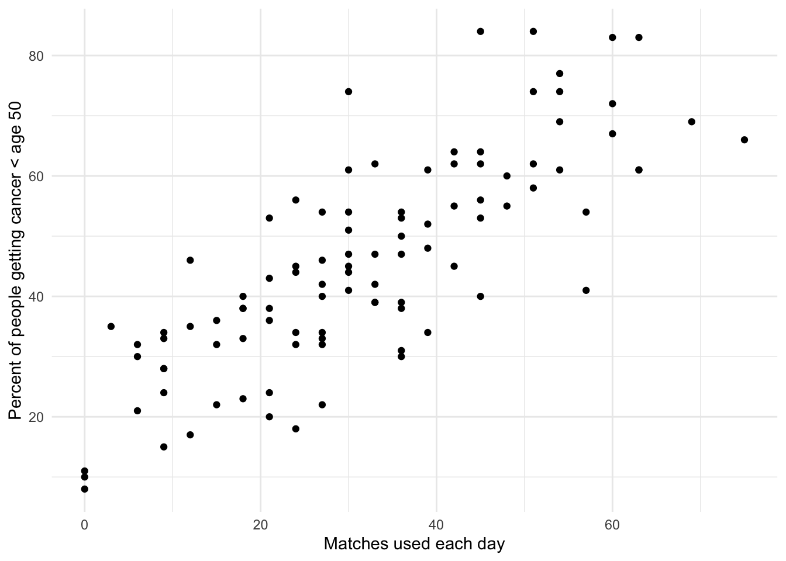

1.  Draw the best causal diagram you can based ONLY on the data in this plot. Your diagram should
    have 2 boxes, and either zero or one arrow.

1.  Do you think the model is a good description of how the world works?

1.  Redraw the diagram to make it **more plausible**, adding at least one extra variable (box) to
    your diagram, and converting any double-headed arrows ($\leftrightarrow$) to single-headed
    arrows.

1.  Discuss in your group what you think is happening here. Have you come across this idea before?

[Read an explanation](#confounding-explanation)

### Correlations, causation and experiments {#correlations-and-experiments}


How can we be sure we haven't missed anything and stop worrying about confounding? There are three
main ways:

1. Use experiments to make confounding _impossible_.

2. Design our studies carefully, and use multiple sources of evidence, to convince ourselves that
   confounding is _improbable_ in this case (see notes on why
   [smoking is a good example of this](#explanation-assumptions-can-help)).

3. Account for _all_ the possible confounders (this is virtually impossible, but sometimes trying
   this is the best we can hope for).

### Accounting for confounders {#second-confounding-task}

:::{.exercise}

In your groups, consider the original causal diagram you drew:

1. Look at each of the boxes which has an arrow pointing away from it. Could you run an experiment
   which _randomises_ people to have higher or lower scores on these variables? If not, why not?

2. Is it possible that you missed any variables when you drew your diagram? Could confounding be
   taking place? If so, update your diagram to make this possibility explicit.

:::

[Read more explanation/discussion on this point](#explanation-experiments-confounding)

## Diagrams and models

Researchers choose statistical models (e.g. t-tests, anova, regression) to test implications from
causal models. These causal models may be implicit in their work (i.e. not drawn out as diagrams)
but are there nonetheless.

For example, if we use a t-test we are implying a model like this:

<!-- -->

In this case we would choose a t-test where 'hungover' is recorded as a binary variable. If
'hungover' was recorded as categorical (e.g. not at all/a little/very) we might use Anova instead
(which is a special type of regression), or if 'hungover' was recorded as continuous score (e.g.
from 1 to 100) we might use regression.

Different types of model are needed to test **moderation** (interactions in Anova or regression, as
we will see in future sessions), and **causal sequences** (mediation analysis, or path analysis;
[more on this here](https://benwhalley.github.io/just-enough-r/mediation.html)).

> These are really 'implementation details' though; the important part is the causal model itself.
> We should choose statistical models which are the most appropriate for our model, and for the data
> we sampled.

### Non-linear relationships

One final point: In some cases you will want to indicate that a line on the graph implies a
non-linear (e.g. curved relationship).

There's no commonly agreed way to represent this in causal diagrams, but I like to mark the arrow
with either a $+$, a $–$, a $\cup$ or a $\cap$.

-   $+$ is a positive linear relationship
-   $–$ is a negative linear relationship
-   $\cap$ is a relationship that starts positive but reverses as the level of the predictor
    increases
-   $\cup$ is a relationship that starts negative but reverses as the level of the predictor
    increases

For example:

<!-- -->

### Application to real examples

These papers present data and make inferences on the links between diet or alcohol consumption and
risk of death:

-   @doll1994mortality
-   @seidelmann2018dietary

:::{.exercise}

Choose one of the papers above and:

-   Draw out a causal diagram of all the variables mentioned in the paper
-   Be sure to add possible confounders or unobserved variables — even if they are not measured or
    considered by the authors.
-   How has drawing out the diagram affected your understanding of the results?

:::

<!--


```r
grVizPng('
digraph mary {
  {node [shape=box];}
  A -> Y
  }
')
```

```
## [1] "media/gv/d39823e20878aa519f32f714ab81fbb9.pdf"
```


```r
grVizPng('
digraph mary {
  {node [shape=box];}
  A -> Y
  B -> Y
  }
')
```

```
## [1] "media/gv/0744efe03f76a0f79352ff916f2090a1.pdf"
```


```r
grVizPng('
digraph mary {
  {node [shape=box];}
  A -> Y
  A -> B
  B -> Y
  }
')
```

```
## [1] "media/gv/a3f3cbd30f518a28e1f24add00e6b924.pdf"
```


```r
grVizPng('
digraph mary {
  {node [shape=box];}
  A -> Y
  A -> B
  B -> Y
  }
')
```

```
## [1] "media/gv/a3f3cbd30f518a28e1f24add00e6b924.pdf"
```


```r
grVizPng('
    digraph {
    A -> M [arrowhead=none];
    M [style=invis fixedsize=true width=0 height=0]
    B -> M
    M -> Y
    A -> B [style=invis];
    A -> Y [style=invis];
        subgraph{rank = same; A;M;Y }

    }
')
```

```
## [1] "media/gv/4d68d0e06b29b370750ac525dbcfa783.pdf"
```


```r
grVizPng('
digraph mary {
  {node [shape=box];}
  A -> Y
  U -> Y [style=dashed]
  U -> A [style=dashed]
  U [style=dashed]
  }
')
```

```
## [1] "media/gv/57b169284e46fa831aec61d4d580f3d7.pdf"
```


```r
grVizPng('
digraph mary {
  {node [shape=box];}
  A -> B -> A
  }
')
```

```
## [1] "media/gv/0cbd1a1f5abb7f96829a09b288c6edf9.pdf"
```


```r
mtcars %>% ggplot(aes(wt, mpg)) + geom_point() + geom_smooth()
```

```
## `geom_smooth()` using method = 'loess' and formula 'y ~ x'
```

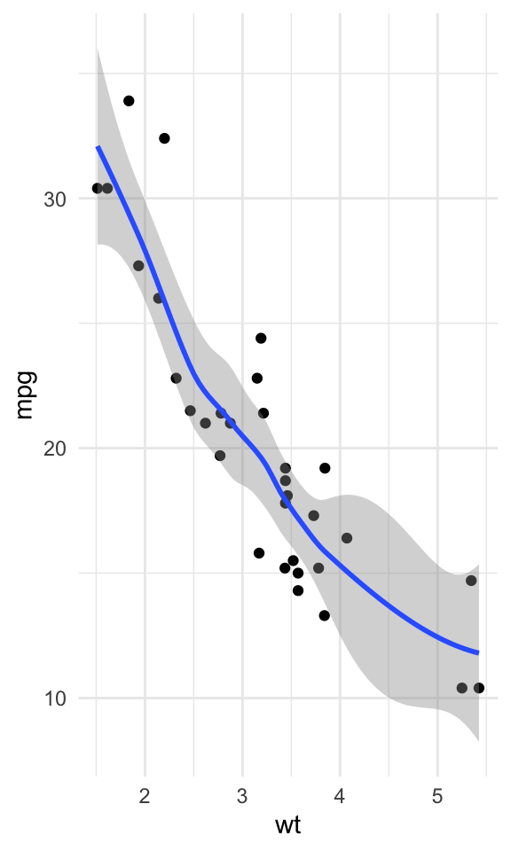


```r
grVizPng('
digraph mary {
  {node [shape=box];}
  wt -> mpg [label=" U "]
  }
')
```

```
## [1] "media/gv/f3b8720ece679f66aa23b624f5674711.pdf"
```


-->

# Multiple regression

#### In brief

> Multiple regression is a technique which can describe the relationship between **_one outcome_**
> and **_two or more predictors_**.

> We can also use multiple regression to describe cases where two variable **_interact_**. That is,
> when the effect of one predictor is increased or decreased by another (this is called moderation,
> as we saw in the session on causal models).

> Multiple regression is important because it allows us to make more realistic models and better
> predictions. But, like any sharp tool, it should be used carefully. If our statistical model
> doesn't match the underlying network of causes and effects, or if we have used a biased sample, we
> can be misled.

> When evaluating our models we can ask two useful questions: First, _how much of the variability in
> the outcome do my predictors explain?_ The $R^2$ statistic answers this. Secondly: _does the model
> make better predictions than just taking the **average** outcome_ (or using a simpler model with
> fewer predictors)? For this we can compute a BayesFactor.

## Why use multiple regression? {#why-multiple-regression}

- [Slides here](slides/multipleregression.pptx)

Think back to our [last session on causes and effects](#regression-thinking-causes). When we drew
causal diagrams of our research question we found cases where there were:

-   Multiple causes of a single outcome, and where
-   One variable might [alter the effect of another](#effect-modification)

We drew diagrams like this for those cases:

<!-- -->

And

<!-- -->

Another way to think about the diagram we say that effect modification is taking place is to draw it
like this:

<!-- -->

We also came across the idea of [confounding](#confounding-explanation). This is where we see a
pattern like this:

<!-- -->

As we discussed, the problem is that if smoking causes us to use matches _and_ it causes cancer then
if we look at correlations of match-use and cancer we might get mislead. This would be an example of
a spurious correlation.

### Some benefits of using multiple regression

There are a number of benefits to using multiple regression:

1. If we think that the relationship between two variables might be changed by another (for example,
   if a relationship between expertise and earnings were different for men and women), we can
   **test** if that is the case. I.e. we can test if moderation is occuring.

2. If we include extra variables (e.g. smoking as well as matches-used) we can reduce the effect of
   confounding, and make better inferences about cause-effect relationships (although this isn't
   guaranteed and we need to be careful).

3. From a practical perspective, including extra variables can also reduce noise in our predictions
   and increase statistical power.

4. Multiple regression can also be used to fit curved lines to data and avoid the assumption that
   all relationships can be described by a straight line (Chris  will cover this later in the course).

---

**For now we are going to focus on the first example.** If you are interested in the second case,
[you can read more here](#explanation-causal-estimates-hard).


:::{.tip}
A warning! You will sometimes see people claim that multiple regression provides a way of
choosing between different possible predictors of an outcome. This is basically untrue;
[see here for why](#explanation-regression-model-selection-really-hard).

:::
<!--


 -->

## Different relationships? {#regression-interaction}

If you have a hypothesis that a relationship might differ for two different groups, **the first
thing you should do is plot the data**.

First let's reload the example dataset on student grades and study habits:


```r
library(tidyverse)
studyhabits <- read_csv('https://benwhalley.github.io/rmip/data/studyhabitsandgrades.csv')
```

```
## Parsed with column specification:
## cols(
##   work_consistently = col_double(),
##   revision_before = col_double(),
##   focus_deadline = col_double(),
##   progress_everyday = col_double(),
##   work_hours = col_double(),
##   msc_student = col_logical(),
##   female = col_logical(),
##   unique_id = col_double(),
##   grade = col_double()
## )
```

We know there is a link (in these data) between study hours and grades because we can see it in the
plot, and we modelled it using `lm` in a previous session:


```r
studyhabits %>%
  ggplot(aes(work_hours, grade)) +
  geom_point() +
  geom_smooth(se=F, method=lm)
```

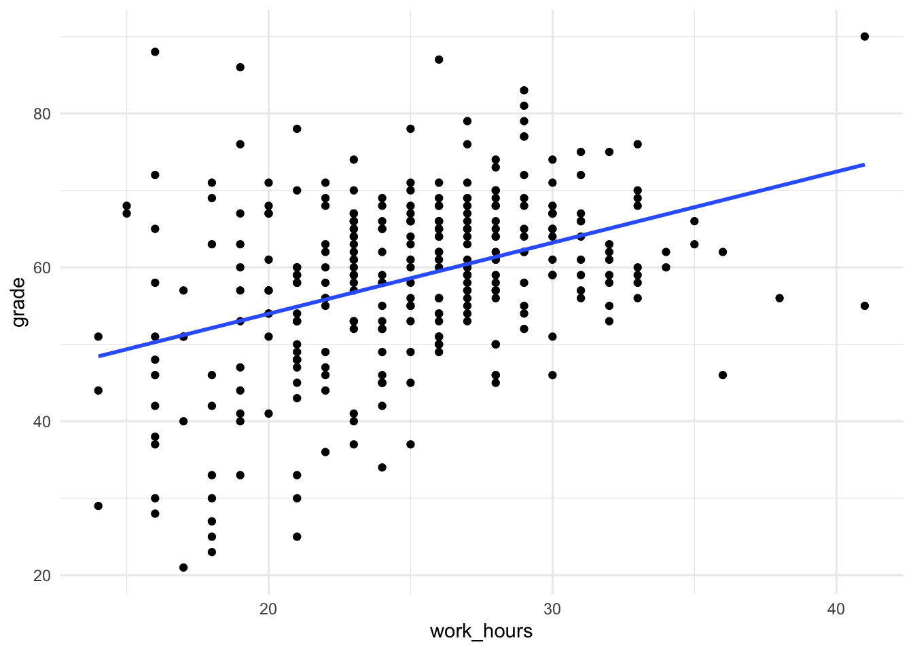

We could also ask, is this relationship the same for men and women? To show the differences, we can
use a coloured plot:

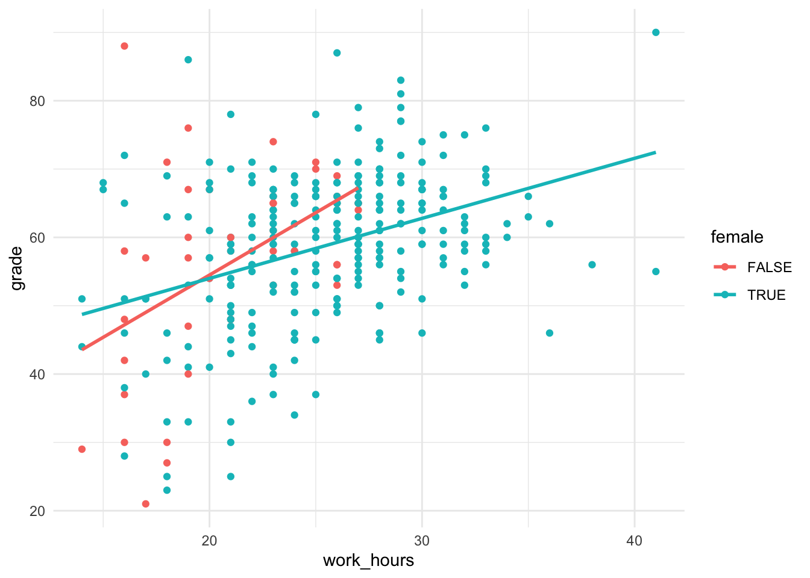

### What is the main pattern in the data? {#task-multiple-regression-overall-pattern}

:::{.exercise}

First load the data and reproduce the coloured plot from above.

Second, agree within your groups:

-   What is the overall pattern of these ([imagined](<(#explain-not-real-data)>)) results?
-   Does extra time spent working benefit men and women equally?

:::

## Using `lm` for multiple regression {#fit-multiple-regression}

If you don't already have it loaded in RStudio, load the example dataset:

<!-- this not run but included to make path appear correct for students -->


```r
studyhabits <- read_csv('https://benwhalley.github.io/rmip/data/studyhabitsandgrades.csv')
```

As [we did for a single predictor regression](#first-lm), we can use `lm` to get numbers to describe the
slopes of the lines.


```r
second.model <- lm(grade ~ work_hours * female, data = studyhabits)
second.model
```

```
## 
## Call:
## lm(formula = grade ~ work_hours * female, data = studyhabits)
## 
## Coefficients:
##           (Intercept)             work_hours             femaleTRUE  
##               18.0266                 1.8232                18.3918  
## work_hours:femaleTRUE  
##               -0.9444
```

#### Explanation of the `lm` code above

This time we have changed the [formula](#explain-formulae) and:

-   Added `female` as a second predictor
-   Used the `*` symbol between them, which allows the slope for `work_hours` to be *different* for
    men and women.

#### Explanation of the `lm` output

The output looks similar, but this time, we have 4 coefficients:


* `(Intercept)` 
* `work_hours` 
* `femaleTRUE` 
* `work_hours:femaleTRUE` 

<!-- end of list -->

#### Interpreting the `lm` coefficients

The coefficients have changed their meaning from model 1. But we can still think of them as either
**points** or **slopes** on the graph with fitted lines. Again, I have extended the lines to the
left to make things easier:

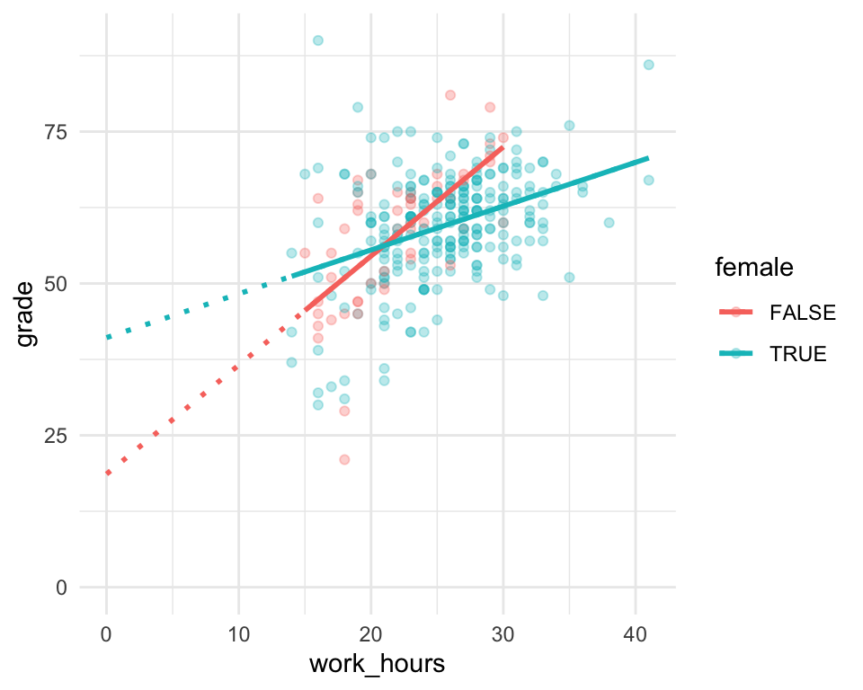

-   `(Intercept)` is the point for men, where `work_hours` = 0 (where the red line crosses zero on
    the x axis).
-   `femaleTRUE` is the difference between men and women, when `work_hours` = 0 (the difference
    between the blue and red lines, at the zero point on the x axis)
-   `work_hours` is the slope (relationship) between `work_hours` and `grade` _for men_ (the
    steepness of the red line)
-   `work_hours:femaleTRUE` is the _difference in slopes_ for work hours, for women. So this is the
    slope for women _minus_ the slope for men (that is, the difference in steepness between the red
    and blue lines. It's NOT the slope of the blue line).

:::{.exercise}


Double check you understand how to interpret the `work_hours:femaleTRUE` coefficient. It's very
common for regression coefficients to represent **differences** in this way. But in this example it
does mean we have to know both `work_hours` (the slope for men) and `work_hours:femaleTRUE` (the
difference in slopes for men and women) to be able to work out the slope for women.

To test your knowledge:

-   What is the slope for women in `second.model` above? <span class='webex-fitb' id = 'Q990204' ><input class='solveme  nospaces calculator' data-digits=4 size=3  style='width:3em;'  data-answer='["0.9",".9"]'/><span class='solvedme'></span></span>


<div class='solution'><button>Show answer</button>


To get the answer we need to add the slope for `work_hours` to the coefficient `work_hours:femaleTRUE`.

- `work_hours` represents the slope for men
- `work_hours:femaleTRUE` represents the difference in slopes between men and women

So the slope for women = $1.8231526 + -0.9443829 = 0.8787697$ (you can round this to 0.9).


</div>


:::


### Linking coefficients with plots

:::{.exercise}

Compare the model output below with the plot:


```
## 
## Call:
## lm(formula = grade ~ work_hours * female, data = studyhabits)
## 
## Coefficients:
##           (Intercept)             work_hours             femaleTRUE  
##               18.0266                 1.8232                18.3918  
## work_hours:femaleTRUE  
##               -0.9444
```

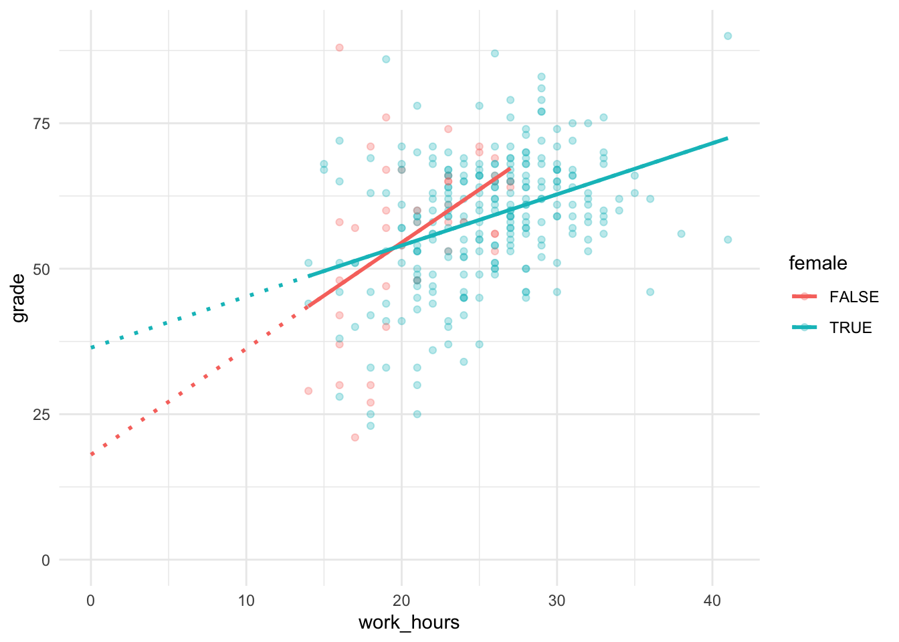

As a group:

1. For each of the 4 coefficients, agree if it represents a point or a slope
1. Find each of the points on the plot (i.e. which coefficient is it)
1. Compare the slope coefficients to the lines on the plot - can you explain which coefficient
   describes which slope?
1. What would happen if the sign of each coefficient was reversed? E.g. if one of the coefficients
   was now a negative number rather than positive? What would this mean for the plot?

:::

### Making predictions

[As before](#making-predictions-1), we can use `augment` from the `broom` package to make
predictions.

The steps are the same:

0. Fit the model we want
1. Load the `broom` package
1. Create a new dataframe with a small number of rows, including only the values of the predictor
   variables we want predictions for
1. Use `augment` with the model and new dataframe

Optionally, we can then plot the results.

---

We have already fit the model we want to use, which was:


```r
second.model$call
```

```
## lm(formula = grade ~ work_hours * female, data = studyhabits)
```

Next we should load the broom package:


```r
library(broom)
```

And make a dataframe (a tibble is a kind of dataframe) with values of the predictor variables that would be of interest, or would provide good exemplars.

For example, lets say we want predictions for men and women, who work either 20 or 40 hours each. We can write this out by hand:


```r
newdatatopredict = tibble(
  female=c(TRUE,TRUE, FALSE,FALSE),
  work_hours=c(20,40, 20,40)
)

newdatatopredict
```

```
## # A tibble: 4 x 2
##   female work_hours
##   <lgl>       <dbl>
## 1 TRUE           20
## 2 TRUE           40
## 3 FALSE          20
## 4 FALSE          40
```

The last step is to pass the model and the new dataframe to `augment`:


```r
second.model.predictions <- augment(second.model, newdata=newdatatopredict)
second.model.predictions
```

```
## # A tibble: 4 x 4
##   female work_hours .fitted .se.fit
##   <lgl>       <dbl>   <dbl>   <dbl>
## 1 TRUE           20    54.0    1.02
## 2 TRUE           40    71.6    2.14
## 3 FALSE          20    54.5    1.73
## 4 FALSE          40    91.0    8.67
```

And we can plot these new predictions using ggplot:


```r
second.model.predictions %>%
  ggplot(aes(work_hours, .fitted, color=female)) +
  geom_point()
```

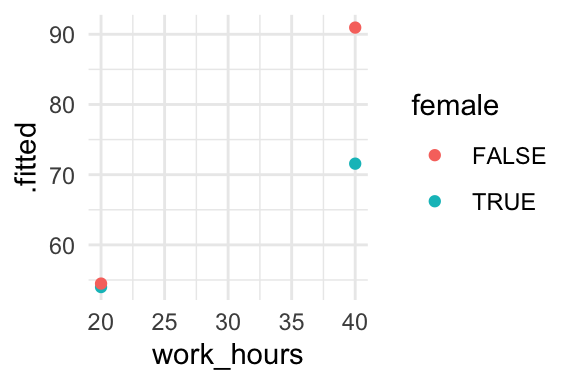

----------------


This basic plot is OK, but we can improve it by:

-   Adding lines to emphasise the difference in slopes for men and women.
-   Adding error bars.
-   Tidying the axis labels.

To add lines to the plot we can use `geom_line()`. We have to add an additional argument called
`group` to the `aes()` section of the plot. This tells `ggplot` which points should be connected by
the lines:


```r
second.model.predictions %>%
  ggplot(aes(work_hours, .fitted, color=female, group=female)) +
  geom_point() +
  geom_line()
```

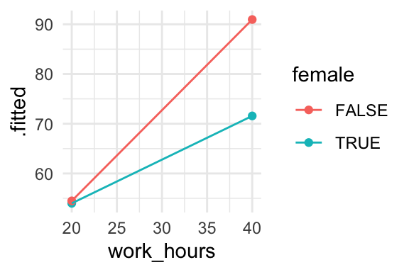

Next we can add error bars. If we look at the datafram that `augment` produced, there is a column
called `.se.fit`. This is short for **standard error of the predicted value**:


```r
second.model.predictions
```

```
## # A tibble: 4 x 4
##   female work_hours .fitted .se.fit
##   <lgl>       <dbl>   <dbl>   <dbl>
## 1 TRUE           20    54.0    1.02
## 2 TRUE           40    71.6    2.14
## 3 FALSE          20    54.5    1.73
## 4 FALSE          40    91.0    8.67
```

We can use a new `geom_` function with this column to add error bars to the plot. The
`geom_errorbar` needs two additional bits of information inside the `aes()` section. These are
`ymin` and `ymax`, which represent the bottom and top of the error bars, respectively:


```r
second.model.predictions %>%
  ggplot(aes(
    x=work_hours,
    y=.fitted,
    ymin =.fitted - .se.fit,
    ymax =.fitted + .se.fit,
    color=female,
    group=female)) +
  geom_point() +
  geom_line() +
  geom_errorbar(width=1)
```

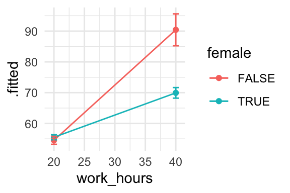

**Explanation of the code**: We added the `geom_errorbar` function to our existing plot. We also
added two new arguments to the `aes()` section: `ymin` and `ymax`. We set the `ymin` value to the
fitted value, **_minus_** the standard error of the fitted value (and the same for `ymax`, except we
added on the SE).

**Explanation of the resulting plot**: The plot now includes error bars which represent the [standard
error](https://en.wikipedia.org/wiki/Standard_error) of the fitted values. We will cover more on intervals, including standard errors, in a later workshop.

### Extension exercises

:::{.exercise}


1. Tidy up the plot above by adding axis labels.

1. In the example above we created a dataframe by hand to tell `augment` what predictions we wanted.
   Now try using [`expand.grid`](#expand-grid) to make the new dataframe instead (we first used
   `expand.grid` in the [first session](#expand-grid)). For example, try making predictions for men
   and women who work 20, 25, 30, 35, or 40 hours per week.

:::

:::{.exercise}

Data from a clinical trial of Functional Imagery Training [@solbrig2019functional, FIT] are
available at <https://zenodo.org/record/1120364/files/blind_data.csv>. In this file, `group`
represents the treatment group (FIT=2, motivational interviewing=1). The `kg1` and `kg3` variables
represent the patients' weights in kilograms before and after treatment, respectively. Load these
data and complete the following tasks:

1. Plot the difference in weight between treatment groups at followup (`kg3`)

2. Create a plot to show whether men or women benefitted most from the treatment (this will require
   some thinking about what goes on the y-axis, and perhaps some pre-processing of the data).

3. Create a plot to show whether older participants benefitted more or less than younger ones (again
   this will require some thinking, and there are quite a number of different plot types which could
   be used, each with different pros and cons).

:::


<!--


```r
fit <- read_csv('https://zenodo.org/record/1120364/files/blind_data.csv')
```

```
## Parsed with column specification:
## cols(
##   kg1 = col_double(),
##   kg2 = col_double(),
##   kg3 = col_double(),
##   cm1 = col_double(),
##   cm2 = col_double(),
##   cm3 = col_double(),
##   group = col_double(),
##   gender = col_character(),
##   age = col_double(),
##   height = col_double(),
##   gqol1 = col_double(),
##   gqol2 = col_double(),
##   ceq_logical = col_double(),
##   ceq_successfull = col_double(),
##   ceq_recommend = col_double()
## )
```

```r
fit %>% glimpse
```

```
## Observations: 121
## Variables: 15
## $ kg1             <dbl> 83.0, 86.2, 69.0, 107.8, 107.0, 99.5, 80.0, 81.0…
## $ kg2             <dbl> NA, NA, NA, 106.7, 105.4, 101.0, 79.0, 80.0, 57.…
## $ kg3             <dbl> NA, NA, NA, 106.0, 105.9, 98.8, 78.0, 80.0, 60.0…
## $ cm1             <dbl> 102.4, 99.0, 87.0, 117.0, 117.0, 110.0, 101.0, 9…
## $ cm2             <dbl> NA, NA, NA, 119.0, 111.0, 110.0, 96.0, 99.0, 76.…
## $ cm3             <dbl> NA, NA, NA, 116.0, 115.0, 109.0, 100.0, 99.0, 90…
## $ group           <dbl> 1, 1, 1, 1, 1, 1, 1, 1, 1, 1, 1, 1, 1, 1, 1, 1, …
## $ gender          <chr> "f", "f", "f", "f", "f", "f", "f", "f", "f", "f"…
## $ age             <dbl> 20, 23, 65, 44, 32, 33, 21, 27, 56, 50, 57, 34, …
## $ height          <dbl> 1.62, 1.66, 1.61, 1.58, 1.70, 1.85, 1.60, 1.63, …
## $ gqol1           <dbl> 60, 55, 77, 70, 60, 40, 60, 40, 60, 60, 60, 60, …
## $ gqol2           <dbl> NA, NA, NA, 70, 65, 65, 70, 60, 62, 60, 70, 75, …
## $ ceq_logical     <dbl> NA, 9, 9, 9, 8, 9, 9, 9, 9, 9, 8, 9, 9, 9, 9, 8,…
## $ ceq_successfull <dbl> NA, 9, 9, 8, 9, 9, 9, 9, 8, 9, 8, 8, 9, 7, 9, 9,…
## $ ceq_recommend   <dbl> NA, 9, 9, 9, 9, 9, 9, 9, 9, 9, 8, 9, 9, 9, 9, 9,…
```

```r
fit %>% ggplot(aes(gender, kg3-kg1, color=factor(group))) + stat_summary()
```

```
## Warning: Removed 9 rows containing non-finite values (stat_summary).
```

```
## No summary function supplied, defaulting to `mean_se()
```

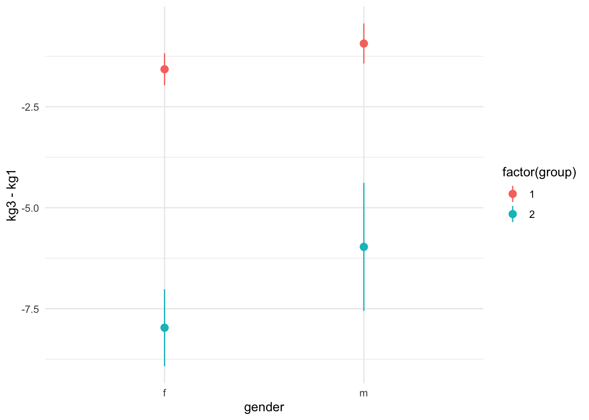

```r
fit %>% ggplot(aes(age>45, kg3-kg1, color=factor(group))) + stat_summary()
```

```
## Warning: Removed 9 rows containing non-finite values (stat_summary).
```

```
## No summary function supplied, defaulting to `mean_se()
```

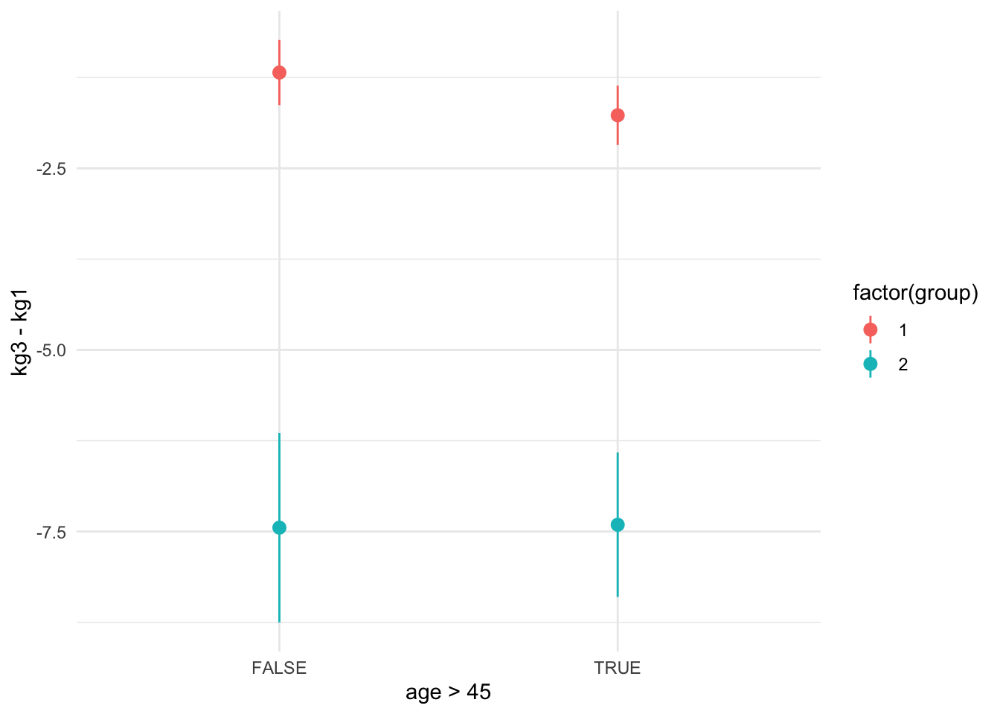

```r
m1 <- lm(kg3 ~ group*gender, data=fit)
augment(m1, newdata=expand.grid(group=c(1,2), gender=c("f", "m"))) %>%
  ggplot(aes(gender, .fitted, ymin=.fitted-.se.fit, ymax=.fitted+.se.fit, colour=factor(group))) +
    geom_point() +
    geom_errorbar(width=.5)
```

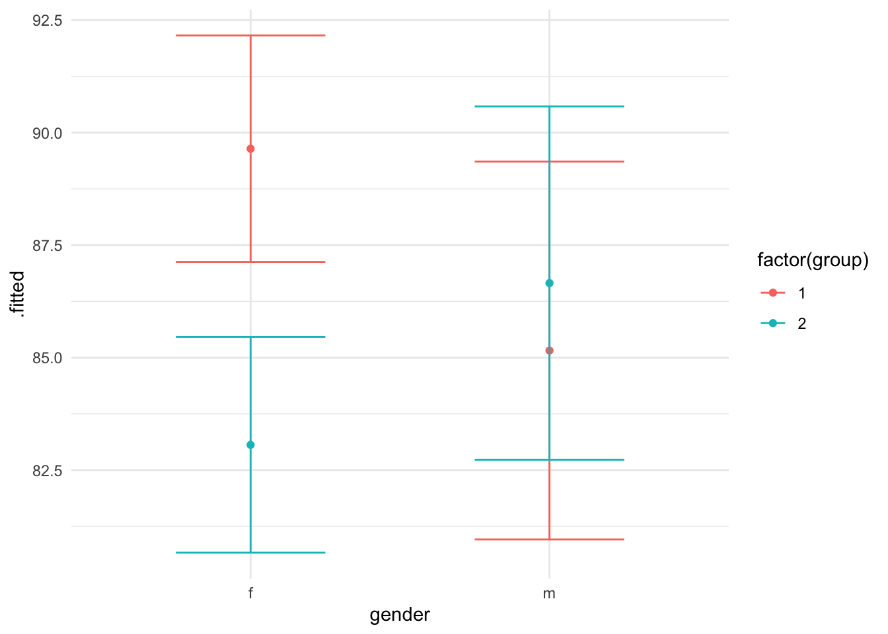

-->
