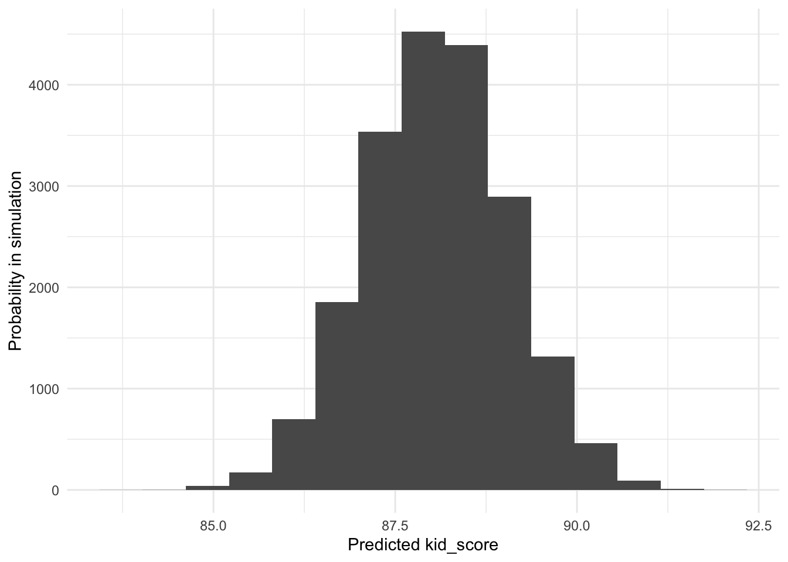
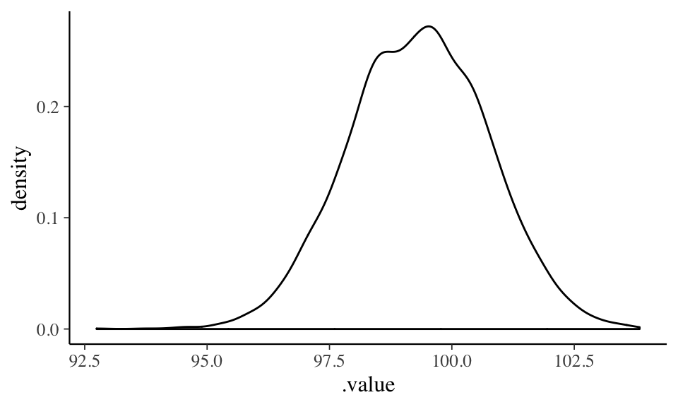
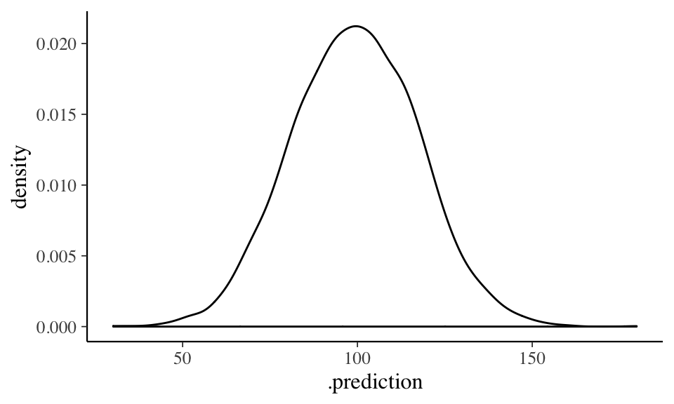
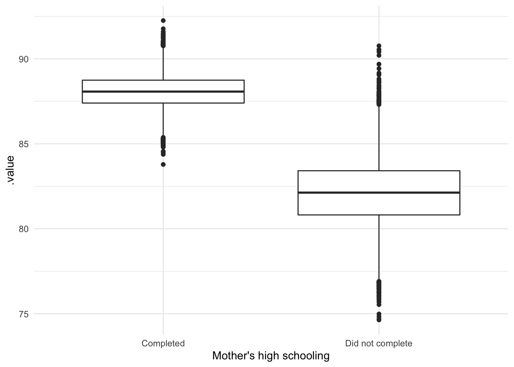
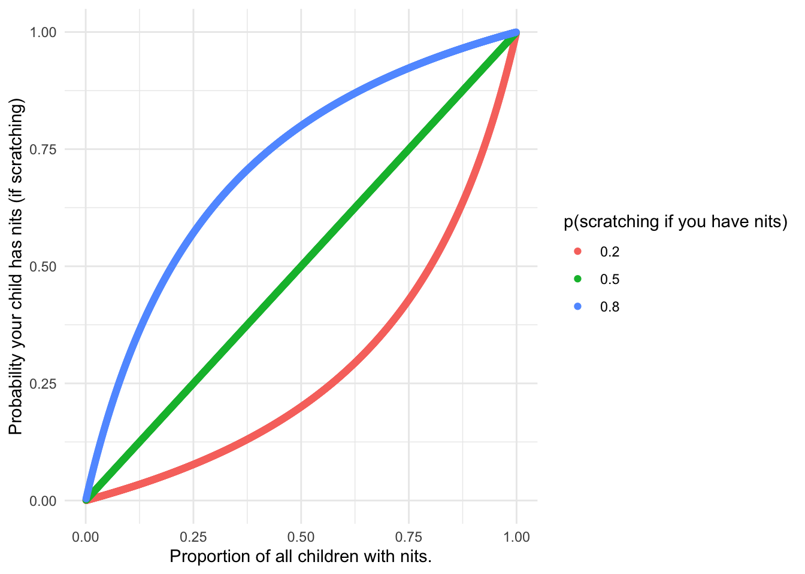

# Uncertainty {#uncertainty}


{width=50%}

> Statistical require us to be explicit about our assumptions and help us make numerical predictions
> for new data. They also let us **quantify our uncertainty** about these predictions. Quantifying
> uncertainty is important for both practical and theoretical purposes. Practically, we might want
> to put 'bounds' on our predictions, allowing policy-makers or individuals to make better
> decisions. Theoretically, we can use estimates of uncertainty to attach probabilities to our
> experimental hypotheses and this forms part of the process of evaluating existing and new theory.

## Overview

-   [Slides from today](slides/uncertainty.pptx)

So far we've seen that regression lines imply **predictions**, and made some predictions of our own.
Statistical models like regression are used to:

-   Making _explicit_ our assumptions
-   Making predictions
-   Quantifying _uncertainty_ about predictions

### Intervals

If we make an verbal estimate then it's common to add quantifying adjectives to indicate our
uncertainty. We might say: "he's _about_ 6 feet tall" or "assistant psychologists earn _roughly_
£21,000 per year".

When using regression we can be specific about what we mean by 'about' or 'roughly': We use
_intervals_ to quantify this uncertainty. The interval represents our uncertainty in terms of
_probabilities_. That is, the probability of 'some event' happening or not happening.

There are a number of different types of interval though and each refers to _the probability of a
different event happening_. The main types of interval are:

-   Confidence intervals (which are related to _p_ values)
-   Prediction intervals
-   Credible intervals

It's important to remember what events these probabilities refer to.

### Confidence intervals {#confidence-intervals}

You might have learnt about _p_ values and confidence intervals during your undergraduate study.
However it's likely you're still not clear on how to interpret them. You are in good company:
despite extensive training in research methods many researchers are also confused, and
[frequently misinterpret p values and confidence intervals in peer reviewed journals](http://www.ejwagenmakers.com/inpress/HoekstraEtAlPBR.pdf).

The confusion arises because:

-   confidence intervals and _p_ values **don't** tell us anything particularly useful but
-   _they sound like they do!_

With very few exceptions the only reasons they are still used are convention, inertia, and ignorance
of the alternatives (which can sometimes be more fiddly to calculate).

#### Confidence intervals: The probability of **_what_**?

As you might guess, confidence intervals (and _p_ values) relate to probabilities.

But they _aren't_ related to the probability of your experimental hypothesis. Instead, they relate
to **_properties of the statistical test procedure itself_**. If that sounds a bit obscure and not
very helpful, you'd be right.

_Your_ hypothesis might be that there is a "experimental participants will have longer reaction
times", or that "there is a positive relationship between mother and child IQ scores".

But confidence intervals _do not_ relate to the probability these relationships are true. Instead,
they relate to the probability the test procedure will mislead you if you used it over many repeats
of the experiments. And that's not the same thing at all.

Despite frequently misinterpreting them, psychologists often use confidence intervals to report
uncertainty. Because of this it is worth learning about and understanding confidence intervals -
even if there are normally better alternatives.

##### Summary

_p_ values are **_not_** the probability your hypothesis is right or wrong. Confidence intervals are
**_not_** the range within which we have 95% confidence the true answer will fall.

If you want to read more about this see this
[additional explanation of confidence intervals](#confidence-intervals-explanation)

---

### Prediction intervals {#prediction-intervals}

In many applications of psychology we want to make predictions _for an individual_. For example,
when a doctor meets a patient with depression they want to be able to give them an idea of their
prognosis if they undergo a new treatment.

Alternatively, a psychiatrist might want to decide whether switching antidepressant medication will
be helpful for a patient or not (this is a prediction about alternative futures).

As we have seen before, we can use data to make predictions. Data from an RCT might let us predict
that, on average, patients taking CBT will report that symptoms reduce by about 3 points on a
standard scale.

But **_nobody is the average_** patient. The hypothetical doctor wants to give an idea of the range
of outcomes that are possible or likely. This is the predictive interval.

Classical prediction intervals are one attempt to define the predictive interval. We can describe
them like this:

> Imagine we replicate our study many times. Each time we run a regression and calculate the
> classical prediction interval. If we then collect a new observation, we would expect it to fall
> within the prediction interval a certain percent of the time.

Like confidence intervals, classical prediction intervals are tricky. Unfortunately---although it
seems like it _should_---we _can't_ say that 95% of all new observations will fall within any single
prediction interval calculated using a single sample.

To calculate the range in which we think 95% of new observations would fall we must use the Bayesian
posterior predictive interval described below.

### Bayesian intervals

Scientists (and humans) aim to collect and use data to update their beliefs to fit the facts. When
we generate hypotheses, we'd often like to make statements about how **_probable_** they are. That
is, we often want to know:

-   $P(hypothesis | data)$ (probability of the hypothesis given the data)

This isn't possible with classical statistics, which instead tells us:

-   $P(data | !hypothesis)$ (probability of the data, if the hypothesis were _not_ true)

:::{.tip}

Giorgio <!--- TODO CHECK--> covered the basics of Bayesian inference in PSYC752, but for a nice
expansion of this, and an example involving bananas and exhaust pipes, see:
[the evidence section of the undergraduate teaching materials](https://ajwills72.github.io/rminr/evidence.html#p-wrong).

:::

There are two types of Bayesian intervals that are analogous to -- but easier to interpret than --
classical confidence/prediction intervals.

-   Credible intervals: The range we are 95% sure the true mean is within.

-   Bayesian predictive intervals: The range we expect 95% of new observations to fall within.


In the following section you'll learn how to calculate all of these different kinds of interval.


<!-- Short introduction recapping material above, and introducing some of the ideas from: http://science.sciencemag.org/content/sci/243/4899/1668.full.pdf -->


## Calculating intervals

At the end of this session, you should be able to:

-   Make predictions with confidence or prediction intervals from a simple linear model.
-   Re-fit the same model and calculate a Bayesian credible interval.
-   Correctly interpret confidence, prediction and credible intervals.

---

To give us an example to work with, let's load some data which records IQ test scores for 434
children along with their mothers' IQ scores, ages, and whether they completed high school.


```r
kidiq <- read_csv("http://bit.ly/arm-kids-iq")
```

```
## Parsed with column specification:
## cols(
##   kid_score = col_double(),
##   mom_hs = col_character(),
##   mom_iq = col_double(),
##   mom_work = col_double(),
##   mom_age = col_double()
## )
```

```r
kidiq %>% glimpse()
```

```
## Observations: 434
## Variables: 5
## $ kid_score <dbl> 65, 98, 85, 83, 115, 98, 69, 106, 102, 95, 91, 58, 84, 78, …
## $ mom_hs    <chr> "Completed", "Completed", "Completed", "Completed", "Comple…
## $ mom_iq    <dbl> 121.118, 89.362, 115.443, 99.450, 92.746, 107.902, 138.893,…
## $ mom_work  <dbl> 4, 4, 4, 3, 4, 1, 4, 3, 1, 1, 1, 4, 4, 4, 2, 1, 3, 3, 4, 3,…
## $ mom_age   <dbl> 27, 25, 27, 25, 27, 18, 20, 23, 24, 19, 23, 24, 27, 26, 24,…
```

As we did in the regression section, we can create a model. Here we predict childrens' scores from mothers' IQ and schooling:


```r
iqmodel <- lm(kid_score ~ mom_iq + mom_hs, data=kidiq)
iqmodel
```

```
## 
## Call:
## lm(formula = kid_score ~ mom_iq + mom_hs, data = kidiq)
## 
## Coefficients:
##            (Intercept)                  mom_iq  mom_hsDid not complete  
##                31.6815                  0.5639                 -5.9501
```

:::{.exercise}

Load the data and run the code for `iqmodel`. Then move on to the next section.

:::

### Confidence intervals

To calculate intervals for a model prediction there are 2 steps:

1. Create a dataframe which contains values of the _predictor variables_, at the levels we want to
   make predictions for (like we did with augment).
2. Make the predictions, and request the type of interval we want.

This code makes a new dataframe containing values of `mom_iq` and `mom_hs` which we'd like a
prediction for; in this case, just one mother who completed high school:


```r
new.mother <- tibble(mom_iq=97, mom_hs="Completed")
```

We make predictions like we have before, but now adding the argument: `interval = "confidence"`:


```r
predict(iqmodel, newdata = new.mother, interval = "confidence")
```

```
##        fit      lwr      upr
## 1 86.38052 84.35293 88.40812
```

The output is the prediction (`fit`) and the lower and upper bounds of the confidence interval. The
95% interval is used by default.

To be clear, **_the confidence interval is range which, if we calculated it 100 times from different samples, we  think the true value would would be within 95% of the time._**

:::{.exercise}

Use the `predict` function with `iqmodel` to answer the following questions:


-   What is the predicted `kid_score` for mothers with IQ = 97 who completed high school?
    <span class='webex-fitb' id = 'Q998668' ><input class='solveme  nospaces calculator' data-tol=1 data-digits=4 size=4  style='width:4em;'  data-answer='["86.4"]'/><span class='solvedme'></span></span>

-   Make a new tibble, and then `predict` values for 3 different mothers, with different scores on
    `mom_iq` and `mom_hs`

-   95% of mothers with IQ = 97 who completed high school will have a child with an IQ < 88.4:
    <select class='solveme' data-answer='["False"]'> <option></option> <option>True</option> <option>False</option></select>

-   Fewer than 2.5% of mothers with IQ = 97 who completed high school will have a child with an IQ >
    88.4 <select class='solveme' data-answer='["False"]'> <option></option> <option>True</option> <option>False</option></select>

<div class='solution'>
<button class='solution-button'>Explain the answers</button>

86 is the prediction from the output shown above.

To create a new tibble and predict scores for different mothers, repeat the code above but changing the values for `mom_iq` or `mom_hs`.

Both the 2nd and 3rd answers are false because the confidence interval is the range within which we think the true average for mothers with IQ = 97 who completed high school would fall, if we repeated the study and calculated the CI many times.

We can't make probability statements about the quality of the predictions we actually made using classical statistics: We can only say how we think the method used to make them will perform, if we repeated it many times.


</div>

:::

### Prediction intervals

Prediction intervals allow us to express uncertainty about future **individuals** we might sample, rather than the average value.

We can repeat the process above to make the classical _prediction_ interval instead. We just change
`interval = "confidence"` to `interval = "prediction"`


```r
predict(iqmodel, newdata = new.mother, interval = "prediction")
```

```
##        fit      lwr      upr
## 1 86.38052 50.67755 122.0835
```

So this is the prediction (`fit`) and the lower and upper bounds of the prediction interval (again,
the 95% interval is used by default).

To be clear, **_this is the range within which we would expect new children to fall if their mother
had IQ-97 and had completed high school, if we repeated our sampling and testing many times_**.

:::{.exercise}


-   Is the prediction itself (the `fit`) the same or different when we request the prediction
    interval (as compared with the confidence interval)?
    <select class='solveme' data-answer='["Same"]'> <option></option> <option>Same</option> <option>Higher</option> <option>Lower</option></select>

-   If we met a mother of IQ = 97 who had completed high school, and we predicted their child would
    have an IQ between 50.7 and 122.1, we would be right 95% of the time :
    <select class='solveme' data-answer='["False"]'> <option></option> <option>True</option> <option>False</option></select>


<div class='solution'><button class='solution-button'>Explain the answers</button>


The prediction is the same, because it's the point on the regression line for these values of
`mom_iq` in both cases, and both models had near-identical parameter estimates.

The second answer is false because the prediction interval says that:

-   if we repeated our sample many times _and_
-   calculated the prediction interval each time _then_
-   the true `kid_score` of the new mother we meet will fall within 95% of these intervals

Like with confidence intervals, can't make statements about the quality of the prediction we made:
We can only say how we think the method used to make the predictions will perform, if repeated many
times.


</div>


:::

### Bayesian intervals

Bayesian analysis requires making explicit our assumptions about what is most likely to happen
_before you analyse the data_. If you have taken statistics courses before, this might seem
counterintuitive but it's actually something humans seem to do all the time in everyday life: For
example,
[our perception of visual stimili is strongly influenced by how probable we think they are](https://www.ncbi.nlm.nih.gov/pubmed/14744217).

We call this our **_prior_**; that is, our prediction _prior_ to seeing the data.

To begin, though, you won't have to do this for yourself. In these examples we use the `rstanarm`
package which tries to look as much like regular linear models as possible, and sets sensible
defaults to make it easy to use Bayesian methods; `rstanarm` works in three steps:

1. It makes some assumptions that small effects are quite likely, but very large effects (e.g. large
   regression coefficients) are much less likely. This is our **_prior_**. We can adjust it if we
   like, but the defaults are sensible.

2. It then runs the model, calculating the most likely parameter values (much like `lm` would).

3. It combines these estimates with our prior assumptions using Bayes rule. The result is the
   posterior probability distribution, or **_posterior_**.

As it works, `rstanarm` repeats steps 2 & 3 many thousands of times as part of a simulation. The
variation between runs of the simulation allow us to quantify how uncertain we are about our
predictions.

---

Doing this is simpler than describing it. First we need to load `rstanarm` and the `tidybayes`
package:


Then we just replace the `lm` function with `stan_glm`. Everything else remains the same apart from
lots of extra output as the model fits, which you can ignore for now:


```r
library(rstanarm) # load this first to make stan_glm available
iqmodel.bayes <- stan_glm(kid_score ~ mom_iq + mom_hs, data=kidiq)
```

The `rstanarm` package is a bit 'chatty' in it's output, but if we just want to see the model
coefficients we can use the `tidy` function in the `broom` package:


```r
library(broom)
tidy(iqmodel.bayes)
```

```
## # A tibble: 3 x 3
##   term                   estimate std.error
##   <chr>                     <dbl>     <dbl>
## 1 (Intercept)              31.7      6.21  
## 2 mom_iq                    0.564    0.0600
## 3 mom_hsDid not complete   -5.96     2.17
```

:::{.exercise}

Try re-running our `iqmodel` using `stan_glm()` in place of `lm()`. Use the formula:
`kid_score ~ mom_iq + mom_hs`.

Use `summary` or `tidy` to see the coefficients and standard errors.

Compare your results with the results using `lm`


<div class='solution'><button class='solution-button'>Why don't my result match my friends' exactly?</button>


Because of the way Bayesian models are fit, results can vary very slightly each time you run them.
There are ways of minimising this variation, but don't be worried about it; trying to estimate
regression coefficients to more than a few decimal places is probably an example of
[false precision](https://en.wikipedia.org/wiki/False_precision).


</div>


:::

#### Bayesian credible intervals

When using `stan_glm`, rather than using `predict` or augment we can use the `add_fitted_samples`
and `add_predicted_samples` functions to calculate Bayesian _credible_ or _predictive_ intervals.

These samples can be for individuals (like [prediction intervals](#prediction-intervals)) or for the
predicted mean (like [confidence intervals](#confidence-intervals)):

We calculate the credible interval in two steps:

1. Make predictions (samples) from the simulation used to fit the model; usually we make many
   thousands of simulated predictions (the computer does it for us).
2. We calculate the 2.5th and 97.5th percentiles of all of the samples to give the interval of
   interest.

The `tidybayes` package makes this almost automatic. First, make sure it's loaded:


```r
library(tidybayes)
```

If we want the **credible interval** for the mean of a sample we use the `add_fitted_draws` to make
our thousands of simulations. Then we use the `mean_qi` function to summarise them. By default it
gives the 95% credible interval:


```r
add_fitted_draws(iqmodel.bayes, newdata=new.mother) %>%
  mean_qi()
```

```
## # A tibble: 1 x 9
## # Groups:   mom_iq, mom_hs [1]
##   mom_iq mom_hs     .row .value .lower .upper .width .point .interval
##    <dbl> <chr>     <int>  <dbl>  <dbl>  <dbl>  <dbl> <chr>  <chr>    
## 1     97 Completed     1   86.4   84.3   88.4   0.95 mean   qi
```

If we want to calculate the Bayesian **prediction interval**, we replace `add_fitted_draws` with
`add_predicted_draws`


```r
add_predicted_draws(iqmodel.bayes, newdata=new.mother) %>%
  mean_qi()
```

```
## # A tibble: 1 x 9
## # Groups:   mom_iq, mom_hs [1]
##   mom_iq mom_hs     .row .prediction .lower .upper .width .point .interval
##    <dbl> <chr>     <int>       <dbl>  <dbl>  <dbl>  <dbl> <chr>  <chr>    
## 1     97 Completed     1        86.4   50.3   122.   0.95 mean   qi
```

:::{.exercise}

Compare the Bayesian credible/prediction intervals with the classical confidence/prediction
intervals. Hopefully they are not too different in this example.

:::


::: {.tip}

How does this all work?

Although interpreting Bayesian models is simpler, fitting them is computationally quite complex. Thankfully various R packages do the heavy lifting for us, but you can [read more about some of the background here](#extra-bayes-explain).

:::


## Summary of key points

The table below shows the links between the different types of intervals we have covered:


----------------------------------------------------------------------
Predict for...   Classical             Bayesian                       
---------------- --------------------- -------------------------------
An individual    Prediction interval   Posterior predictive interval  

The mean         Confidence interval   Credible interval              
----------------------------------------------------------------------

Interpretations for 95% intervals of each type are as follows:

-   Prediction interval: complicated, see above
-   Confidence interval: complicated, see above
-   Posterior predictive interval: the range in which we expect 95% of future observations to fall.
-   Credible interval: the range in which we are 95% sure the mean is.

:::{.exercise}

Use the (new) model formula `kid_score ~ mom_iq + mom_hs + mom_age`, and assume a mother aged 30 with IQ=100, who completed high school.

Calculate:

-   Classical confidence intervals
-   Bayesian credible and posterior predictive intervals.

Try using expand grid to plot a range of predictions,  for mothers of different ages.


<div class='solution'><button class='solution-button'>Tell me how to do it!</button>


For the Classical intervals, use `predict(model, newdata=..., interval="...")`

For the Bayesian intervals you need to use  `add_predicted_samples` or  `add_fitted_samples` to get the simulations, and then use `mean_qi` to get the 95% interval.


</div>


<div class='solution'><button class='solution-button'>I give up, show me exactly how to do it...</button>


Classical:


```r
model <- lm(kid_score ~ mom_iq + mom_hs + mom_age, data=kidiq)
new.mother <- tibble(mom_iq=100, mom_hs="Completed", mom_age=30)

# prediction interval
predict(model, newdata=new.mother, interval="prediction")
```

```
##       fit      lwr      upr
## 1 89.6287 53.62501 125.6324
```

```r
# confidence interval
predict(model, newdata=new.mother, interval="confidence")
```

```
##       fit      lwr     upr
## 1 89.6287 84.72269 94.5347
```

Bayesian:


```r
new.mother = tibble(mom_iq=100, mom_hs="Completed", mom_age=30)

add_predicted_draws(model, newdata=new.mother) %>% mean_qi()
```

```
## # A tibble: 1 x 10
## # Groups:   mom_iq, mom_hs, mom_age [1]
##   mom_iq mom_hs  mom_age  .row .prediction .lower .upper .width .point .interval
##    <dbl> <chr>     <dbl> <int>       <dbl>  <dbl>  <dbl>  <dbl> <chr>  <chr>    
## 1    100 Comple…      30     1        89.9   53.3   126.   0.95 mean   qi
```

```r
add_fitted_draws(model, newdata=new.mother) %>% mean_qi() #
```

```
## # A tibble: 1 x 10
## # Groups:   mom_iq, mom_hs, mom_age [1]
##   mom_iq mom_hs    mom_age  .row .value .lower .upper .width .point .interval
##    <dbl> <chr>       <dbl> <int>  <dbl>  <dbl>  <dbl>  <dbl> <chr>  <chr>    
## 1    100 Completed      30     1   89.6   84.8   94.3   0.95 mean   qi
```


</div>


:::


## Beyond intervals (extension exercises)

One of the nice things about modern Bayesian methods is that we don't have to pick just a single
number to represent our estimate, or a single interval to represent our uncertainty.

As mentioned described in [this additional explanation](#extra-bayes-explain), to fit the model the computer runs a simulation thousands of time. On each run, it can make a prediction.
Because of the way the method works, predictions from the simulation are made _in proportion_ to
their probability.

<!-- TODO ADD link to JustEnoughR explanation). -->

This means that:

1. If we plot the simulation results, we can see what is the most likely _distribution_ of outcomes.

2. By counting different outcomes within the simulation, and doing simple arithmetic, we can
   calculate the _probability_ of different outcomes occurring.

### Visualising the posterior distribution

Many experts in Bayesian methods recommend avoiding single-number summaries rather than trying to
summarise the simulation results as a single value or range (e.g. see
[Gabry et al](https://arxiv.org/abs/1709.01449), although this covers many more advanced topics
too).

In the code above we used `mean_qi` to calculate the mean and percentile intervals of the
predictions from the simulations. But we can also use `ggplot` to look at the _distribution_ of
simulated predictions directly:


```r
add_fitted_draws(iqmodel.bayes, newdata=new.mother) %>%
  ggplot(aes(.value)) +
  geom_histogram(bins=15) +
  ylab("Probability in simulation") +
  xlab("Predicted kid_score")
```



:::{.exercise}

Make new predictions (using `add_fitted_samples`) for the _average_ `kid_score` for a mother with an
IQ of 120 who completed school.

Visualise these predictions using `ggplot`. It should look something like this if you use a density
plot (`geom_density`) instead of a histogram:



Now make predictions for new _individuals_, who have the same IQ and who completed school (i.e. use
the `add_predicted_samples` function). Plot the predictions; they should look something like this:



Are you more certain about the future _average_ prediction, or the future _individual_ prediction?
How is this shown in your plots?

:::

### More predictions

:::{.exercise}

Using `iqmodel.bayes`, predict _average_ IQs for children of different mothers with an IQ of 100,
with or without high school education.

Create a boxplot to compare _average_ outcomes. It should look something like this:



:::

### Being a Bookie

In applied work (or if you really did want to set up a betting shop) we might also want to make
probability statements about particular examples or cases, based on our data.

For example clinicians or policy makers might want to hear statements like:

-   "There's a 65% chance CBT will reduce your depression by more than 10 points."
-   "If you have an IQ of 100, there's a 5% chance your child's IQ will be < 90."

To do this we just **_count_** the number of times each outcome happened within the simulation. For
example:


```r
new.mother = tibble(mom_iq=97, mom_hs="Completed")
add_predicted_draws(iqmodel.bayes, newdata=new.mother) %>%
  summarise(mean(.prediction < 60))
```

```
## # A tibble: 1 x 4
## # Groups:   mom_iq, mom_hs [1]
##   mom_iq mom_hs     .row `mean(.prediction < 60)`
##    <dbl> <chr>     <int>                    <dbl>
## 1     97 Completed     1                   0.0752
```


<div class='solution'><button class='solution-button'>Explain that code in detail...</button>


In the code above, `add_predicted_draw` makes many predictions for `new.mother`... that is a new
mother which an IQ = 100, and who completed high school.

Rather than just one prediction, this makes many (thousands) of predictions for this new mother, one
for each run of the model simulation.

It returns a dataframe, with a `.prediction` column, which is the predicted value in each simulation
run.

We then use `summarise` to count how many times `.prediction < 60`. We do this within the
`mean(...)` function; this converts the `TRUE` and `FALSE` values to `0` and `1` first, so the
average of `c(TRUE, FALSE)` is 0.5.

In short, `mean(pred < 60)` gives us the **_probability_** that `.prediction` was less than 60
across all of the simulation runs.


</div>


So that's about 8% of cases where the `mom_iq` was 97 and `kid_score` is predicted to be less than
60 ([your numbers might vary a little because of the way the software works](#explain-bayes-variation)).

:::{.exercise}

If you were running a bookmaker, what odds should we offer a mother with an IQ of 70 who wants to
wager her child will be highly intelligent and have an IQ > 120?

That is, if the mother is prepared to bet £1, how much would you offer in return?

To make the calculation, use `iqmodel.bayes`, make predictions (`add_predicted_draws`) for a new mother who has an IQ of 70 and who completed high school. What is the probability that her child will have an IQ > 120?

Remember, the odds ([as used in betting shops](https://mybettingsites.co.uk/learn/betting-odds-explained/)) are $p / (1-p)$.


:::

<!--


```r
# Nits!

expand.grid(pnits = seq(.001,.999, .001), pscratchifnits = c(.2,.5,.8)) %>%
  mutate(oddsnits = pnits/(1-pnits),
         oddscratchifnits = (1-pscratchifnits)/pscratchifnits,
         oddsnitsifscratch = oddsnits / oddscratchifnits,
         pnitsifscratch = oddsnitsifscratch/(1+oddsnitsifscratch)
         ) %>%
  ggplot(aes(pnits, pnitsifscratch, color=factor(pscratchifnits), group=pscratchifnits)) + geom_point() +
  scale_color_discrete("p(scratching if you have nits)") +
  xlab("Proportion of all children with nits.") +
  ylab("Probability your child has nits (if scratching)")
```



-->
