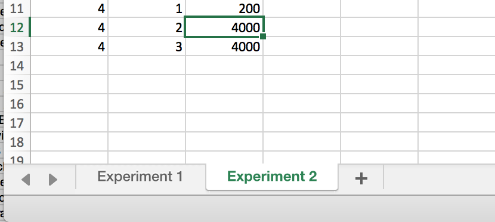

```{r, echo=F, include=F}
knitr::opts_chunk$set(echo = TRUE, collapse=TRUE, cache=TRUE, comment=">", message=FALSE)
library(tidyverse)
library(webex)
library(pander)
theme_set(theme_minimal())
cpsdata <- read_csv("data/cps2.csv")
```


# Missing data {#missing-data}

:::{.exercise}

Make sure you have recently loaded the `cps2` dataset (see above).

:::

To calculate the mean number of hours worked per week, we have to deal with the fact that there is
some missing data - we don't know for all 10,000 people how many hours they work in a week, because
they didn't all tell us.

To get a mean of those who did tell us, we tell R to ignore the missing data, like this:

```{r mean-hours-narm}
cpsdata %>% summarise(mean(hours, na.rm = TRUE))
```

#### Explanation of the command

`rm` is short for 'remove', but 'ignore' would be a more accurate description, as this command
doesn't delete the `NA` entries in `cpsdata`, it just ignores them. So `na.rm = TRUE` means "ignore
the missing data".

If you get an error here, please see [common errors](#common-problems).


### Patterns in missing data {#missing-data-patterns}

Sometime we won't only want to ignore missing data. We might also want to **count** how how many
variables are missing. The `mice` package has a useful command for doing this.

First, we need to load `mice` like the did `tidyverse` above. Type (or copy and paste) the command
below into your R script and run it:

```{r}
library(mice)
```

Then we can use the `md.pattern()` function to describe the patterns of missing data:

```{r}
cpsdata %>% mice::md.pattern()
```

#### Explanation of the output

`md.pattern()` produces two outputs: a plot, and a table.

In the plot we see

-   The variables in the dataset listed along the top
-   Squares indicating whether a variable is recorded (blue) or missing (purple/red)

Each row in the plot is a missing data **_pattern_**. So:

-   In the first row, the pattern is that all variables are recorded
-   The pattern in the second row is that all variables bar `hours` were recorded
-   The third pattern is that `job` and `hours` were missing, and so on.

The numbers on the left of the plot indicate **_how many people fit the pattern_**. So:

-   4483 people had complete data (pattern 1)
-   515 people had complete data except for the `hours` variable (pattern 2)
-   3102 people were missing `hours` and `job` (pattern 3, and so on

This can be really helpful when checking whether data has been imported properly, or properly
reporting missing data from our experiments [see @macpherson2010revised for current guidelines for
clinical trials, which would also be good practice for experimental research].

The numbers along the bottom of the plot show **_how many missing observations there were for the
variable marked at the top_**. So:

-   There were 5517 missing observations for `hours`, across all participants
-   5002 for `job`, and so on.

The table provides the same information as the plot, but is perhaps harder to read.


# Grouped data

If you've some spare time and are looking for something a bit more challenging, try Exercise 2 on
this slightly [more advanced worksheet](https://ajwills72.github.io/rminr/group-differences.html#ex2).


# Reading data from files {#more-reading-data}

So far, we have read data from via the internet In this section we show how to import some other
common types of file.


## Loading CSV data {#loading-data}

In the main session we load the CPS data from a URL.

If these data weren't available online, we might have needed to upload them to the RStudio server first. This video runs through the steps described below:

<iframe src="https://player.vimeo.com/video/361993933" width="640" height="500" frameborder="0" allow="autoplay; fullscreen" allowfullscreen></iframe>


1. Download a copy of the data, by clicking [here](http://www.willslab.org.uk/cps2.csv) and saving
   it to the Downloads folder of your computer.

2. Go to RStudio in your web browser.

3. Click on the 'Files' tab in RStudio (bottom right rectangle)

4. Click the 'Upload' button.

5. Click 'Browse...'

6. Go to your Downloads folder, and select the file you just saved there.

7. Click "OK".

8. Copy or type the following command into your RStudio script window, and run it (i.e. press
   CTRL+ENTER while your cursor is on that line)

```{r, eval=F}
cpsdata <- read_csv("cps2.csv")
```

```{r, include=F, eval=T, echo=F, messages=F}
cpsdata <- read_csv("data/cps2.csv")
```


#### Explanation of the command

There are three parts to the command `cpsdata <- read_csv("cps2.csv")`:

1. The first part of the command is `cpsdata`. This gives a name to the data we are going to load.
   We'll use this name to refer to it later, so it's worth using a name that is both short and
   meaningful.

2. The bit in the middle, `<-`, is an arrow and is typed by pressing `<` and then `-`, without a
   space. This arrow means "put the thing on the right of the arrow into the thing on the left of
   the arrow". In Rstudio

3. The last part of the command is `read_csv("cps2.csv")`. It loads the data file into `cpsdata`.
   The part inside the speech marks, `cps2.csv`, is the name of the file you just uploaded to your
   RStudio project.
   
   
Remember, the file called `cps2.csv` need to be in the SAME FOLDER (directory) as your R script file for this to work.


## Saving a copy of the data

If we had loaded the data from a URL, we might also want to save a copy, in case the website disappears in future. In my code,
I would typically write:

```{r}
# datafromtheweb <- read_csv('http://www.willslab.org.uk/cps2.csv')
# write_csv(datafromtheweb, 'data/cps2.csv')
datafromtheweb <- read_csv('data/cps2.csv')
```

##### Explanation of the code

There are three lines in the code block above:

-   The first two lines start with a `#` (pronounced hash). This means R **won't** run the line of
    code. It is included only as a comment - for your reference in future.
-   However, if we did run these lines manually (by copying the code to the console without the
    `#`), this would download the data from the URL, and then save your own copy in a file in your
    RStudio project directory.
-   The third line reads data from `cps2.csv` to a variable called `datafromtheweb`.

:::{.tip}

In practice, if I was working on data available online, I would run the first two lines on one
occasion (to save my own copy of the data). The third line is the only thing that is run when we
execute the R script, so provided we have saved the data the script will run even when I'm not
online.

:::


### Reading SPSS files

If you have old data stored in SPSS files, they are likely to have a `.sav` file extension. These
can be read with the `haven` package.

For example, this paper in PlosOne provides a number of SAV files for the experiments reported:
<https://journals.plos.org/plosone/article?id=10.1371/journal.pone.0209900#sec039>

```{r echo=F, eval=F}
download.file("https://doi.org/10.1371/journal.pone.0209900.s001", 'journal.pone.0209900.s001.sav')
```

To use these files you should:

-   Download the file you want
-   Save it with a `.sav` extension
-   Upload it to RStudio server (use Firefox --- not Edge or Explorer).
- Make sure this new file is in the same folder as your R script file.

You can then load it like this:

```{r}
library(haven)

datafromspss <- read_spss('journal.pone.0209900.s001.sav')
datafromspss %>% glimpse
```

:::{.tip}

If your SPSS datafile has labels or other special features enabled then you can
[check this guide for details of how to use them](https://cran.r-project.org/web/packages/haven/vignettes/semantics.html).
You probably won't need to though.

:::

#### Task: Reading SPSS data {.exercise}

1. Load one of the other datasets from this paper:
   https://journals.plos.org/plosone/article?id=10.1371/journal.pone.0209900#sec039

Optional extension task:

1. Plot a density graph of one of the variables in one of the datasets. Try adding colour to
   distinguish another categorical variable (e.g. gender).

2. Add some other comments to your code (using `#`) to describe what the code does.

3. Read this forum discussion on how to add good comments to your code:
   <https://www.reddit.com/r/rstats/comments/86cmj1/any_tips_on_best_practices_for_commenting_your/>

### Reading from Excel

There are two types of Excel documents, `.xls` and the newer `.xlsx` formats. You can read both with
the `readxl` package.

One important thing to note about Excel spreadsheets is that **each file can contain multiple
'sheets'**. In R terms, each Excel file can contain multiple dataframes. So we need to specify which
sheet we want to import.

An example of an Excel file is bundled with this worksheet ([simple-excel-example.xlsx](simple-excel-example.xlsx))

To use the example:

- Download the file from here: [simple-excel-example.xlsx](simple-excel-example.xlsx)
-   Download the file to your computer (use Firefox, and definitely not Edge)
-   Upload to RStudio, make sure the file extension is `xslx` or `xls`

Then:

```{r}
library(readxl)

# make sure the filename here matches yours
xldata <- read_excel('simple-excel-example.xlsx')
xldata
```

**Explanation**: `read_excel()` has read in the FIRST sheet (called 'Experiment 1') from the Excel
file. To check this, open the file in Excel and see that there are actually two experiments included
in the single file.

---

If we wanted to load both experiments, we would need to write:

```{r}
expt1 <- read_excel('simple-excel-example.xlsx', sheet="Experiment 1")
expt2 <- read_excel('simple-excel-example.xlsx', sheet="Experiment 2")
```

**Explanation**: On each line we use `read_excel()` to load one of the sheets from the original file. The names of each sheet are shown in the Excel interface like this:




:::{.tip}

The names of the sheets in the code which says `sheet="<SHEETNAME>"` need to match the names of the sheets in Excel exactly.

:::


We can check the second file like this:

```{r}
expt2  %>% glimpse
```

#### Task: Read Excel data {.exercise}

1. Read both experiment 1 and 2 from the file `simple-excel-example.xlsx` (provided with the worksheet)
2. Use the [Environment pane](#rstudio-environment-pane) to check the data against the data in the
   Excel file.

Optional extension tasks:

1. Plot the density of the RT variable in experiment 1.
2. Describe the plot
3. What pre-processing step might we want to use, before plotting (hint: in these experiments, most
   responses should happen within a second).

`r hide("Show answer")`

Depending on the paradigm being used, we might want to filter very long RTs (e.g. over 1000ms):

```{r}
expt2  %>%
  filter(RT < 1000)  %>%
  ggplot(aes(RT)) + geom_density()
```

`r unhide()`


