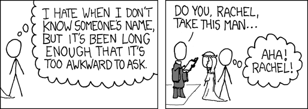

```{r include=F,echo=F}
library(tidyverse)
library(webex)
library(cowplot)
library(DiagrammeR)
source('grvizpng.R')
theme_set(theme_minimal())
knitr::opts_chunk$set(cache=T, message=F, warning=F)

studyhabits <- read_csv('https://benwhalley.github.io/rmip/data/studyhabitsandgrades.csv')
```


> Scientists develop **theoretical models** which aim to describe the true relationships between
> variables. **Statistical models** are used to link their theories with data. They allow us to make
> **predictions** about future events, and our confidence in these predictions. But accurate
> predictions alone aren't enough: We also want to **_understand_** our data and the process that
> generated it.

> **Causal diagrams** are a useful tool for thinking about causes and effects. For psychological
> phenomena the diagrams can become complicated. But good research simplifies: We focus on small
> parts of a large network of causes and effects to make incremental progress.

> The quality of evidence for different parts of a causal diagram can vary a lot. We are much more
> sure about some links in the network than others. Causal diagrams can represent both our
> **knowledge** and our **hypotheses** explicitly. This is useful as we build statistical models to
> check how well our theories perform in the real world.


# Drawing causal models {#causal-diagrams}

-   [Additional ppt slides drawn from the materials presented on this website are here](slides/causes-slides.pptx)

In this section we step back from learning specific techniques in R and think about _why_ we want to
run statistical models at all.

Our first job, as quantitative researchers, is to try and describe the network of _causes and
effects_ between the phenomena we're interested in. At this point we can also notice any ambiguities
or uncertainties in our thinking.

To represent our model we can use a special type of diagram, called a _directed acyclic graph_.
That's a fancy name for a boxes-and-arrows diagram, with a few special rules (we can come to those
later).

For the moment, make sure you understand the following diagrams.

##### Simple cause and effect

```{r, echo=F, cache=T}
grVizPng('
digraph mary {
  {node [shape=box];}
  Cause -> Effect
  }
', height=200) %>% knitr::include_graphics(.)

```

##### No causation

This diagram says footwear and exam grades AREN'T related AT ALL, because we didn't draw a line
between them.

```{r, echo=F}
grVizPng('
digraph mary {
    {node [shape=box];}
    "Choice of footwear"
    "Exam grade"
  }
', height=100, width=500) %>% knitr::include_graphics(.)


```

##### Causal sequences

And can also describe how variables are related in a particular _causal sequence_. For example, we
might ask:

-   does childhood poverty reduce academic achievement by delaying brain development?
-   does weaker childhood attachment reduce academic performance by reducing the motivation to
    study?

This pattern -- where variables are linked in a series -- is called **'mediation'**:

```{r, echo=F}
grVizPng("
digraph mary {
    {node [shape=box];}
    Cause -> Mediator -> Effect
  }
", height=300)%>% knitr::include_graphics(.)
```

##### Correlation (as distinct from causation)

Finally, if you don't know which **direction** the arrow should point --- that is, you don't know
which is the cause and which is the effect --- we can (temporarily) draw an arrowhead at both ends
like this:

```{r, echo=F}
grVizPng("
digraph mary {
    {node [shape=box];}
    Sunshine:s -> Rainbows:s [dir=both]
    {rank=same Sunshine, Rainbows}
  }
", height=100, width=500)%>% knitr::include_graphics(.)

```

This represents a correlation (see the
[stage 1 notes on correlation and relationships](https://ajwills72.github.io/rminr/corr.html)).

Our hope is that --- as we learn more, by collecting data or running experiments --- we can decide
_which way_ the arrow should point.

---

**An aside: Why does the arrow _have_ to point in a particular direction?**

When we draw a double headed arrow we are essentially expressing our ignorance about about the
relationship. What we probably mean is one of two things:

```{r, echo=F}
grVizPng('
digraph {
    {node [shape=box];}
    Sunshine -> Rainbows -> "Sunshine later" -> "Rainbows even later" -> "..."
  }
', height=400)%>% knitr::include_graphics(.)
```

Or, perhaps:

```{r, echo=F}
grVizPng('
digraph {
    Unicorns -> Sunshine
     Unicorns -> Rainbows
   }
', height=200)%>% knitr::include_graphics(.)
```

That is, a correlation either implies:

-   An unmapped sequence of reciprocal causes
-   A common cause that is not explicitly in the model yet

---

### {#causes-task-make-a-diagram}

:::{.exercise}

In groups:

1.  Pick one of the topics listed below. Try to think of at least 4 or 5 behaviours or psychological
    constructs to include. Sketch this out with pen and paper.

    -   Effectiveness of psychotherapy
    -   Coping with chronic ill health
    -   Student satisfaction

2.  Discuss how strong you think each of the relationships (lines) are. What kinds of evidence do
    you have (or know of) that make you think the diagram is correct?

3.  If there are some boxes which don't have links between them, discuss if you think there is
    really **no** relationship between these constructs.

4.  Can you find examples of _mediation_ in your diagram? If you can't can you look more closely at
    one of the links and think about whether it is a _direct_ effect, or if something else could
    link these constructs.

:::

<!--


 -->

## 'Effect modification' {#moderation-intro}

Another common question for researchers is whether relationships between variables are _true all the
time_, or if they _vary depending on the context, individual or some other factor_.

In concrete terms, we might ask questions like:

-   does low self esteem hurt academic performance more for women than for men?
-   are older therapists more effective than younger therapists?
-   does social media use cause less anxiety for people with high emotional intelligence (EQ)?

Relations like this can be represented in different ways in the diagram. For the moment, you should
draw it like this:

```{r, echo=F}
grVizPng('
    digraph {
    A -> M [arrowhead=none];
    M [style=invis fixedsize=true width=0 height=0]
    B -> M
    M -> Y
    A -> B [style=invis];
    A -> Y [style=invis];
        subgraph{rank = same; A;M;Y }

    A [label="Self esteem"]
    B [label=Gender]
    Y [label=Grades]
    }
', height=200)%>% knitr::include_graphics(.)
```

The arrow from gender points at the relationship between self esteem and grades. We mean that the
_effect_ of self esteem on grades depends on whether you are a woman.

This pattern is called **_moderation_** or **_effect modification_**. Checking to see if a
relationship is the same for different groups is also called **_stratification_**.

#### {#diagram-task-moderation-followup .exercise}

In groups: Consider your diagram from the previous task:

-   If gender is not already included, add a new box for it.

-   Discuss in groups: could gender _moderate_ one of the other relationships in the diagram? If so,
    draw this in now.

-   Are there other examples in your model where one variable could affect the relationships between
    two others?

## 'Tricky' relationships {#tricky-relationships}



---

#### Using diagrams to think about models {#first-confounding-task .exercise}

(In the previous section we said that to represent a correlation in a causal diagram we use a double
headed arrow like this: $\longleftrightarrow$)

Consider this [scatter plot](cancerplot.pdf):

```{r, echo=F, include=F}
set.seed(1234)
cancer_data <- tibble(
    cigarettes = rpois(100, 4)*3,
    matches = rpois(100, cigarettes)*3,
    cancer_risk = rbinom(100, 100, .1+cigarettes/max(cigarettes)),
) %>% filter(complete.cases(.))
```

```{r, echo=F, message=F, warning=F}
p <- cancer_data %>%
    ggplot(aes(matches, cancer_risk)) +
    geom_point() +
    xlab("Matches used each day") +
    ylab("Percent of people getting cancer < age 50")
ggsave('cancerplot.pdf')
p
```

1.  Draw the best causal diagram you can based ONLY on the data in this plot. Your diagram should
    have 2 boxes, and either zero or one arrow.

1.  Do you think the model is a good description of how the world works?

1.  Redraw the diagram to make it **more plausible**, adding at least one extra variable (box) to
    your diagram, and converting any double-headed arrows ($\leftrightarrow$) to single-headed
    arrows.

1.  Discuss in your group what you think is happening here. Have you come across this idea before?

[Read an explanation](#confounding-explanation)


### Correlations, causation and experiments {#correlations-and-experiments}


How can we be sure we haven't missed anything and stop worrying about confounding? There are three
main ways:

1. Use experiments to make confounding _impossible_.

2. Design our studies carefully, and use multiple sources of evidence, to convince ourselves that
   confounding is _improbable_ in this case (see notes on why
   [smoking is a good example of this](#explanation-assumptions-can-help)).

3. Account for _all_ the possible confounders (this is virtually impossible, but sometimes trying
   this is the best we can hope for).

### Accounting for confounders {#second-confounding-task}

:::{.exercise}

In your groups, consider the original causal diagram you drew:

1. Look at each of the boxes which has an arrow pointing away from it. Could you run an experiment
   which _randomises_ people to have higher or lower scores on these variables? If not, why not?

2. Is it possible that you missed any variables when you drew your diagram? Could confounding be
   taking place? If so, update your diagram to make this possibility explicit.

:::

[Read more explanation/discussion on this point](#explanation-experiments-confounding)

## Diagrams and models

Researchers choose statistical models (e.g. t-tests, anova, regression) to test implications from
causal models. These causal models may be implicit in their work (i.e. not drawn out as diagrams)
but are there nonetheless.

For example, if we use a t-test we are implying a model like this:

```{r, echo=F}
grVizPng('
    digraph {
    "hungover" -> grumpy [label=" + "]
  }
', height=200)%>% knitr::include_graphics(.)
```

In this case we would choose a t-test where 'hungover' is recorded as a binary variable. If
'hungover' was recorded as categorical (e.g. not at all/a little/very) we might use Anova instead
(which is a special type of regression), or if 'hungover' was recorded as continuous score (e.g.
from 1 to 100) we might use regression.

Different types of model are needed to test **moderation** (interactions in Anova or regression, as
we will see in future sessions), and **causal sequences** (mediation analysis, or path analysis;
[more on this here](https://benwhalley.github.io/just-enough-r/mediation.html)).

> These are really 'implementation details' though; the important part is the causal model itself.
> We should choose statistical models which are the most appropriate for our model, and for the data
> we sampled.

### Non-linear relationships

One final point: In some cases you will want to indicate that a line on the graph implies a
non-linear (e.g. curved relationship).

There's no commonly agreed way to represent this in causal diagrams, but I like to mark the arrow
with either a $+$, a $–$, a $\cup$ or a $\cap$.

-   $+$ is a positive linear relationship
-   $–$ is a negative linear relationship
-   $\cap$ is a relationship that starts positive but reverses as the level of the predictor
    increases
-   $\cup$ is a relationship that starts negative but reverses as the level of the predictor
    increases

For example:

```{r, echo=F}
grVizPng('
    digraph {
    "Studying R" -> happiness [label=" U "]
  }
', height=200)%>% knitr::include_graphics(.)
```

## Causal diagrams for real examples

These papers present data and make inferences on the links between diet or alcohol consumption and
risk of death:

-   @doll1994mortality
-   @seidelmann2018dietary


:::{.exercise}

Choose one of the papers above and:

-   Draw out a causal diagram of all the variables mentioned in the paper
-   Be sure to add possible confounders or unobserved variables — even if they are not measured or
    considered by the authors.
-   How has drawing out the diagram affected your understanding of the results?

:::

<!--


```{r}
grVizPng('
digraph mary {
  {node [shape=box];}
  A -> Y
  }
')
```

```{r}
grVizPng('
digraph mary {
  {node [shape=box];}
  A -> Y
  B -> Y
  }
')
```

```{r}
grVizPng('
digraph mary {
  {node [shape=box];}
  A -> Y
  A -> B
  B -> Y
  }
')
```


```{r}
grVizPng('
digraph mary {
  {node [shape=box];}
  A -> Y
  A -> B
  B -> Y
  }
')
```


```{r}
grVizPng('
    digraph {
    A -> M [arrowhead=none];
    M [style=invis fixedsize=true width=0 height=0]
    B -> M
    M -> Y
    A -> B [style=invis];
    A -> Y [style=invis];
        subgraph{rank = same; A;M;Y }


    }
')
```


```{r}
grVizPng('
digraph mary {
  {node [shape=box];}
  A -> Y
  U -> Y [style=dashed]
  U -> A [style=dashed]
  U [style=dashed]
  }
')
```

```{r}
grVizPng('
digraph mary {
  {node [shape=box];}
  A -> B -> A
  }
')
```


```{r, fig.width=3, height=2}
mtcars %>% ggplot(aes(wt, mpg)) + geom_point() + geom_smooth()
```


```{r}
grVizPng('
digraph mary {
  {node [shape=box];}
  wt -> mpg [label=" U "]
  }
')
```


-->


