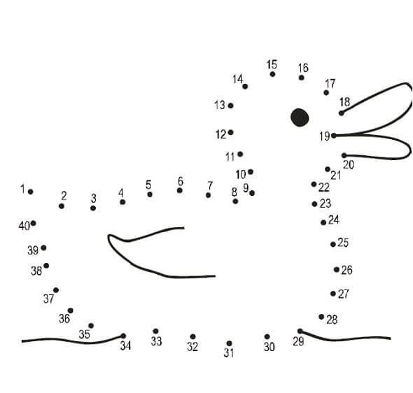

```{r include=F,echo=F}
library(tidyverse)
library(webex)
library(cowplot)
library(DiagrammeR)
source('grvizpng.R')
theme_set(theme_minimal())
knitr::opts_chunk$set(cache=T, message=F, warning=F)

studyhabits <- read_csv('https://benwhalley.github.io/rmip/data/studyhabitsandgrades.csv')
```

{width=40%}


> Regression is just a fancy term for drawing the 'best-fitting' line through a scatter-plot, and
> summarising how well the line describes the data.

> When using regression in R, the relationship between an **_outcome_** and one or more
> **_predictors_** is described using a **_formula_**. When a model is '**_fitted_**' to a sample it
> becomes tool to make **_predictions_** for future samples. It also allows us to quantify our
> **_uncertainty_** about those predictions.

> **_Coefficients_** are numbers telling us how strong the relationships between predictors and
> outcomes are. But the meaning of coefficients depend on the study **_design_**, and the
> **_assumptions_** were are prepared to make. Causal diagrams can help us choose models and
> interpret our results.

> Multiple regression is a technique which can describe the relationship between **_one outcome_**
> and **_two or more predictors_**. We can also use multiple regression to describe cases where two
> variable **_interact_**. That is, when the effect of one predictor is increased or decreased by
> another. Multiple regression is important because it allows us to make more realistic models and
> better predictions.

> Like any sharp tool, regression should be used carefully. If our statistical model doesn't match
> the underlying network of causes and effects, or if we have used a biased sample, we can be
> misled. Some of the material here may have been covered in undergraduate courses, but we will emphasise
> understanding and mastery of core ideas before we develop these ideas to fit more complex models.


# Before you start

:::{.exercise}

- Make sure you complete the previous 3 worksheets, especially the data wrangling and visualisation exercises.
- Create a new R Script file to save your workings
- Remember to load the tidyverse

```{r}
library(tidyverse)
```

:::


# Fitting lines to data

Regression (and most statistical modeling) is about 'fitting' lines to data.

In the workshop activity we used some example plots and drew lines on them to represent a 'good fit'.


You can think of the lines we drew in two ways: as **maps** and as **tools**:

1. As a **map**, the line **summarises** and **describes** the data we have, but lines are also
2. **Tools** which **predict** new data we might collect

In statistical language, the gaps between our line and the data points are called **_residuals_**.

We can distinguish:

1.  Residuals for the data we have now (how well does the line **_describe_** the data).
2.  Residuals for new data we collect after drawing the line (how well does the line **_predict_**).

Another common way to refer to residuals is as the **error** in a model. That is, the line describes
a _model_ (idealised) relationship between variables. And if look at the residuals we have an
estimate how how much _error_ there will be in our predictions when we use the model.

:::{.exercise}

Only when you have discussed this thoroughly,
[read an explanation of what is going on](04-regression-residuals-explanation.html).

:::


# Regression in R

## First step is **always** to plot

**Before** we start running any analyses, we should plot the data.

The study habits data used in this exercises are stored at:
<https://benwhalley.github.io/rmip/data/studyhabitsandgrades.csv>


:::{.exercise}

Plot the `studyhabits` data in a few different ways to get a feel for the relationships between the
variables. Specifically,

1. Make a density plot to see the distribution of `grade` scores
1. Add colour to this plot (or use another type of plot) to see how scores differ by gender
1. Use a scatterplot to look at the relationship between `grade` and `work_hours`.
1. Is the relationship between `grade` and `work_hours` the same for men and women?

```{r, include=F, eval=F}
studyhabits %>% ggplot(aes(grade, color=female)) + geom_density()
studyhabits %>% ggplot(aes(work_hours, grade, color=female)) + geom_point( alpha=.3)
```

Interpret your plots:

-   What relationship do we see between revision and grades?
-   Do you estimate this a weak, moderate or strong relationship?

:::


## Automatic line-fitting {#automatic-line-fitting}

To get R to fit a line to these data we use a new function called `lm`. The letters *l*
and *m* stand for _**l**inear **m**odel_.

There are lots of ways to use `lm`, but the easiest to _picture_ is to get `ggplot` to do it for us:

```{r, eval=F}
studyhabits %>%
  ggplot(aes(work_hours, grade)) +
  geom_point() +
  geom_smooth(method=lm)
```

```{r, echo=F}
# cheat to add lines at zero
studyhabits %>%
  ggplot(aes(work_hours, grade)) +
  geom_point() +
  geom_smooth(method=lm) +
  geom_vline(xintercept=0) +
  geom_hline(yintercept=0)
```

**Explanation of the code**: We used `geom_point` to create a scatterplot. Then we used a plus
symbol (`+`) and added `geom_smooth(method=lm)` to add the fitted line. By default, `geom_smooth`
would try to fit a curvy line through your datapoints, but adding `method=lm` makes it a straight
line.

**Explanation of the resulting plot** The plot above is just like the scatter plots we drew before,
but adds the blue fitted line. The blue line shows the 'line of best fit'. This is the line that
**minimises the residuals** (the gaps between the line and the points). Ignore the shaded area for
now[^seingeomsmoth].


[^seingeomsmoth]: If you use `geom_smoth` with `method=lm` you get a grey shaded area around the
  line. The shaded area shows the **_standard error_** of the line of best fit. This is
  an estimate of how confident we are about the predictions the line makes. This
  video explains it quite well: <https://www.youtube.com/watch?v=1oHe1a3JqHw>.
  When he uses the greek letter $\beta$,  he just means "slope". If you want to hide it, you can add: `se=FALSE`:

  


### {#plot-relationships .exercise}

Try plotting a line graph like this for yourself, with:

-   The same variables (i.e. reproduce the plot with `work_hours` and `grade`)
-   Different variables (from the `studyhabits` dataset)
-   Without the `method=lm` part (to see a curvy line instead of straight)

Note whether the slope of the line is positive (upward sloping) or negative (downward sloping).

Now, add the `colour=female` inside the part which says `aes(...)`. Before you run it, predict what
will happen.

`r hide("show answer")`

It should plot different lines for men and women. Something like this:

```{r, echo=F}
studyhabits %>%
  ggplot(aes(work_hours, grade, colour=female)) +
  geom_point() +
  geom_smooth(method=lm)
```

`r unhide()`

# Lines by numbers {#first-linear-model}

The plot we made in the previous section is helpful, because we can _see_ the best-fit line.

However, a plot with straight line can be described with just two numbers: i) where the line starts, and ii) how steep the slope is.

Sometimes it's convenient to these numbers to summarise the data, rather than using a graphic.

> Put another way: that these numbers describe the relationship between the two variables in the plot.


To do this we can use the `lm` function directly.

:::{.exercise}

Before we start make sure you have loaded the studyhabits dataset:

```{r, eval=F}
studyhabits <- read_csv('https://benwhalley.github.io/rmip/data/studyhabitsandgrades.csv')
```

:::


---


In the next piece of code we fit a regression model. 

The first part is known as a model formula. The `~`
symbol (it's called a 'tilde') just means "is predicted by", so you can read this part as saying
"is grade predicted by work hours?". The `lm` function then gives us the numbers that describe this relationship, so we can answer the question.

```{r}
first.model <- lm(grade ~ work_hours, data = studyhabits)
first.model
```

**Explanation of the code**: We used the `lm` function to estimate the relation beteen grades and
work hours.

**Explanation of the output**: The output displays:

-   The 'call' we made (i.e. what function we used, and what inputs we gave, so we can remember what
    we did later on)
-   The 'coefficients'. These are the numbers which represent the line on the graph above.


```{r, include=F}
cfs1 <- coefficients(first.model) %>% round(., 4)
```


**Explanation of the coefficients** In this example, we have two coefficients: the `(Intercept)` which is `r cfs1[1]` and the `work_hours` coefficient which is `r cfs1[2]`.

**The best way to think about the coefficients is in relation to the plot we made above**. In have duplicated this plot below, and this time have extended the line so it crosses zero on the x axis:

```{r echo=F, fig.width=5, fig.height=4, message=F, warning=F}

source('extend-smooth-lines.R')

studyhabits %>%
  ggplot(aes(work_hours, grade)) +
  geom_point(alpha=.8) +
  geom_smooth(method="lm_left", fullrange=TRUE, se=F, linetype="dashed") +
  geom_smooth(method=lm, se=F) +
  geom_point(aes(x=0,y=0), alpha=0) + 
  geom_point(aes(x=0, y=cfs1[1]), color="red", size=10, shape=1) + 
  geom_vline(xintercept = 0, linetype="dashed") + 
  geom_hline(yintercept = 0, linetype="dashed") 


```

We can interpret the coefficients as points on the plot as follows:

-   The `(Intercept)` is the point (on the y axis) where the blue dotted line crosses zero (on the
    x-axis, circled in red).
-   The `work_hours` coefficient is how **steep** the slope of the blue line is. Specifically, is says
    how many `grade` points the line will rise if we increase `work_hours` by 1.


:::{.exercise}

Before you move on:

Compare the coefficients from the `lm` output to the plot above. Can you see how they relate? If
you're not 100% sure, ask now and get it clear - this is a key thing to understand at this point.

To test your understanding, what would the line look like if the slope coefficient was -1? (that is, minus 1)

:::

# Making predictions (by hand) {#regresion-hand-predictions}

A big advantage of using the coefficients from `lm`, alongside the plot, is that we can easily **_make
predictions for future cases_**.

:::{.exercise}

In a pair, do this now:

Let's say we meet someone who works 30 hours per week. One way to predict would be by-eye, using the
line on the plot.

What grade would you expect them to get simply by 'eyeballing' the line?

```{r echo=F}
studyhabits %>%
  ggplot(aes(work_hours, grade)) +
  geom_point(alpha=.8) +
  geom_smooth(method="lm_left", fullrange=TRUE, se=F, linetype="dashed") +
  geom_smooth(method=lm, se=F) +
  geom_point(aes(x=0,y=0), alpha=0) + 
  scale_y_continuous(breaks=seq(8,88,10)) + 
  scale_x_continuous(breaks=seq(0,40,5)) + labs(x="Work hours per week", y = "Grade")
```

Incidentally, what did I change when drawing this plot (compared to the ones above)? Why do you think this was?


`r hide("See answer")`

I changed the y axis scale to include a break at 38 (the intercept value), and included more 'ticks' to make it easier to make visual estimates.

`r unhide()`

:::


We can do the same thing using the coefficients from `lm`, because we know that:

<!-- see cfs1 definition above -->

-   If someone worked for 0 hours per week then our prediction would be `r round(cfs1[1])`. We know
    this because this is the intercept value (the point on the line when it is at zero on the
    x-axis).
-   For each extra hour we study the `work_hour`coefficient tells us that our `grade` will
    increase by `r cfs1[2]`.

-   So, if we study for 30 hours, our prediction is `r round(cfs1[1])` $+$ `r cfs1[2]` $\times$ 30

:::{.exercise}

In pairs or small groups again:

-   Make predictions for people who study 5, 20 or 40 hours per week
-   Compare these predictions to the plot above.
-   Which of the predictions (for 5, 20 or 40 study hours) should we be most confident in? Why do
    you think this is?


`r hide("Check your predictions")`


```{r, echo=F, include=F}
preds <- predict(first.model, newdata = tibble(work_hours=c(5,20,40)))
sprintf("%.1f, %.1f and %.1f", preds[1],preds[2],preds[3])

```

You should get something like:
`r sprintf("%.1f, %.1f and %.1f", preds[1],preds[2],preds[3])`

Don't worry about rounding errors... within 1 point is fine.

We should be most confident about the prediction for 20 hours, because we have
more data in the sample which is close to that value. Our line was estimated
from data which didn't have many people who worked 5 or 40 hours, so we don't really
know about those extremes.

`r unhide()`


:::


# Making predictions using code {#making-predictions-1}

Rather than making predictions by hand, we save time by using the `predict()` function.

If we run a regression, we should save the fitted model with a named variable:

```{r}
first.model <- lm(grade ~ work_hours, data = studyhabits)
```

**Explanation**: As before, we ran a model and saved it to the named variable, `first.model`.

If we feed this model to the predict function, we get a model prediction for each row in the
original dataset:

```{r}
predict(first.model) %>% head(10)
```

**Explanation of the output**: We have one prediction (the point on the line) for each row in the
original dataset.

---

We can also use the `augment` function in the `broom` package to do make the predictions, but return
them _with_ the original data. This can make it easier to use:

```{r}
library(broom)
augment(first.model) %>%
 head()
```

**Explanation of the output**: The first line loads the `broom` package, which contains the `augment` function we want to use. The `augment` function used in line 2 has also made a prediction for each row, but returned it
with the original data (`grade` and `work_hours`) that were used to fit the model. Alongside the
`.fitted` value, and the `.resid` (residual) there are some other columns we can ignore for now.

---

Often though, we don't want a prediction for each row in the original dataset. Rather, we want
predictions for specific values of the predictors.

To do this, we can use the `newdata` argument to `predict` or `augment`.

First, we create a new single-row dataframe which contains the new predictor values we want a
prediction for:

```{r}
newsamples <- tibble(work_hours=30)
newsamples
```

(Note that the `tibble` command just makes a new dataframe for us.)

Then we can use this with `augment`:

```{r}
augment(first.model, newdata=newsamples)
```

**Explanation of the output**: We have a new data frame with predictions for a new sample who worked
30 hours.


:::{.exercise}

Create a new single-row dataframe to make a prediction (using `augment` or `predict`) for someone who worked 33 hours per week.

:::


# Summary 

So far we have:

-   Seen that fitting straight lines to data can be a useful technique to:

    -   **Describe** existing data we have and
    -   **Predict** new data we collect

*   We used `lm` to add a fitted line to a ggplot. We used this to make 'eyeball' predictions for
    new data.

*   Then we used `lm` directly, using one variable (i.e. a column in a dataframe) to predict another
    variable.

*   We saw how the coefficients from `lm` can be interpreted in relation to the fitted-line plot.

*   We used the coefficients to make numeric predictions for new data.

If you're not clear on any of these points it would be worth going over today's materials again, and
attending the support sessions before the next workshop.

In the next session we extend our use of `lm`, building more complex models, and using new R
functions to make and visualise predictions from these models.

