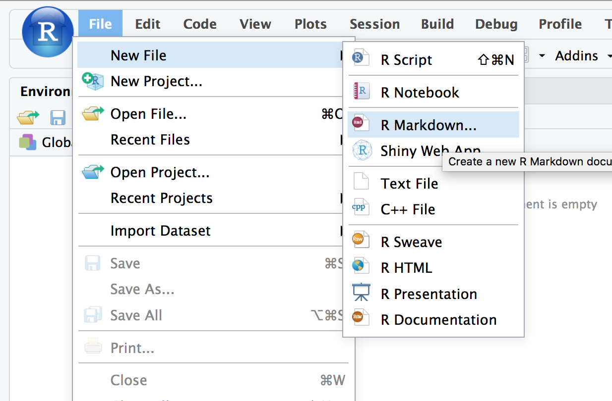
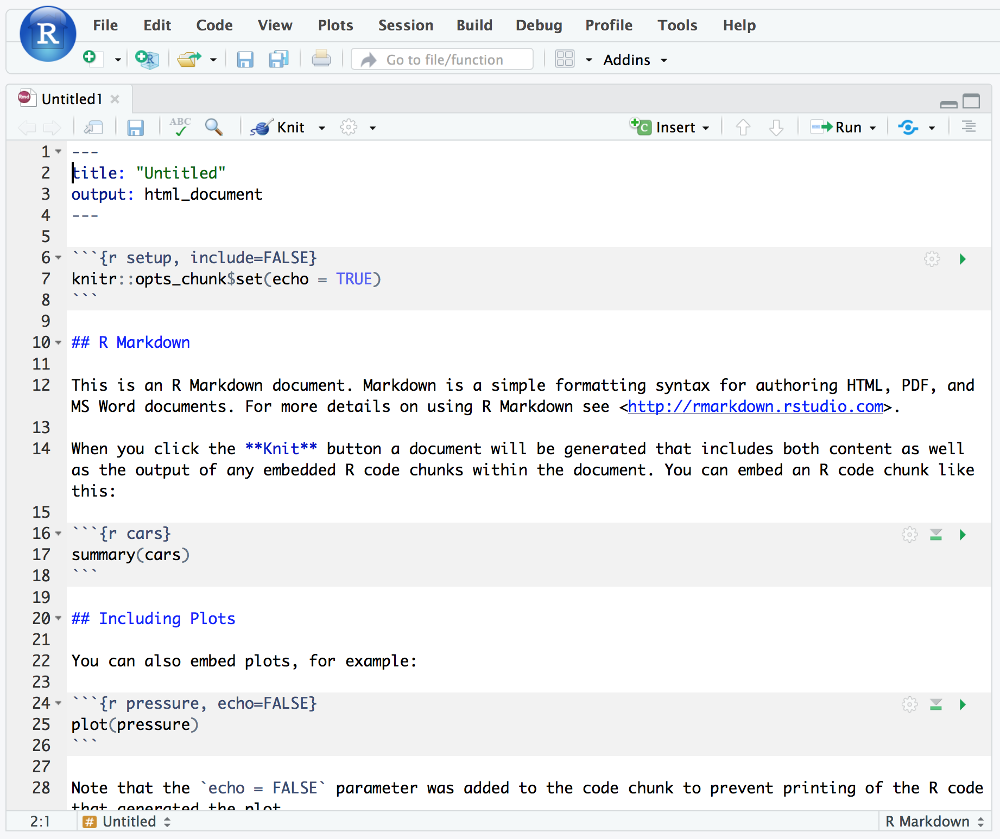
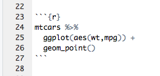

```{r, echo=F, include=F}
knitr::opts_chunk$set(echo = TRUE, collapse=TRUE, cache=TRUE, comment=">", message=FALSE)
library(tidyverse)
library(webex)
library(pander)
theme_set(theme_minimal())
```


> Communicating research findings is an art and a science, but professional
> standards and integrity demands that we are open, honest and sufficiently
> skeptical in our reporting of our own data. In academic publishing there are a
> number of common patterns which can helpful in structuring results sections,
> breaking-down a complex set of findings and easing interpretation.


# Before you start


# RMarkdown

Markdown is a simple **text format** which can include writing, tables and images (see
http://commonmark.org/help/).

An RMarkdown document mixes R code with Markdown. You can generate images (plots) and tables
directly using R code.

In the language of RStudio, you **'knit'** your RMarkdown document to produce a finished document.
Knitting:

1. runs your code and
2. combines the analyses, graphs, with your explanatory text to
3. make a single pdf or html file.

This knitted file documents your work and can be shared easily with others.


#### Why use Rmarkdown?

Rmarkdown is becoming an important tool in the open science movement. Authors often share details of
their analysis in an Rmarkdown file because journal articles are too constrained to document this
properly.

A recent example from Plymouth is shared here: <https://zenodo.org/record/1120364>. This repository
includes:

-   The datafile in CSV format
-   The Rmarkdown source file
-   The knitted html document
    ([click here to have a look](media/whalley-andrade-data_supplement.html))

The [main assessment for this module](#assessment-authentic-analysis) requires you to make an Rmd
file like this to share a re-analysis of a published paper, so learning how to use Rmd is an
important part of the course.


## Creating a fresh RMarkdown file

The easiest way to create and RMarkdown file is from the `File > New > RMarkdown` menu option:



It should look something like this when you've done it:



**Explanation** We asked RStudio to create a new Rmd file. Rstudio makes the new file from a
template, and this shows off some of the main features of RMarkdown.

---

RMarkdown files have the file extensions `.rmd` and must to be saved before they can be 'knitted'.

:::{.exercise}

1. Create a new Rmd file and save it somewhere in your home directory on the Rstudio server (or the
   same place you saved your other R Script files).

1. Have a look through the example file created in RStudio. Have a guess at what each part does.

1. Press the 'knit' button in the RStudio interface and check the results.

:::


## Working with 'chunks' of R code

To include R code within RMarkdown we write 3 backticks followed by `{r}`.

We then write some R code, and close the chunk with 3 more backticks. This is what it looks like:


`r hide("Can't find the backtick on your keyboard?")`


`r unhide()`

:::{.exercise}

As you do this exercise, take care to get the right number of backticks, and your curly brackets
(`{}`) in the right place.

1. Create a new 'chunk' of R code which includes one of the plots you have made so far today. Use
   one of the built in datasets for now.

1. Make sure you add `library(tidyverse)` just above your plot code.

1. Press 'knit' again and check the result.

:::

:::{.tip}

If you are getting errors when adding a code chunk always check you have:

-   3 backticks, then `{r}`, then **start a new line**
-   Your R code comes next
-   Load any packages needed at the top of the first chunk.
-   3 more backticks, **on their own line**. These final 3 backticks **must** start at the beginning
    of the line, have no spaces in front of them, and nothing after them.

If you are still getting errors:

-   Read the error message - it can give a clue
-   Simplify everything (remove R code until it works, then try again)

Using libraries in chunks:

-   Load packages (e.g. `library(tidyverse)`) once at the top of the file.
-   Remember that RStudio knits code from top to bottom (so load packages **before** you use them)
-   R wipes it's memory each time it knits your file, so needs reminding. You only need to load the
    package in one chunk though (don't do it multiple times).

:::


## Working interactively with Rmarkdown

Rather than typing commands in the console, **you should now run code directly from your Rmd code
chunks**.

This makes it much easier to keep track of your work.

See this video for an example:

<iframe src="https://player.vimeo.com/video/225968925" width="640" height="400" frameborder="0" webkitallowfullscreen mozallowfullscreen allowfullscreen></iframe>

:::{.exercise}

1. Put your cursor (pointer) anywhere inside the new chunk you added, containing the R code for your
   plot. The chunk should look something like this:



2.  Press the green 'run' button (a rightward pointing triangle) in the top right corner of the
    chunk. Where does the result appear?

3.  Change the R code in your chunk (e.g. make a different plot). Press 'run' again.

4) Write several lines of R code in your chunk. Put the cursor on one of the lines and press
   `ctrl+enter` or `cmd+enter` if you are on a mac. Does this run all of the code in the chunk, or
   just part of it?

5. Write some code which uses `summarise` inside your code chunk to produce a table

:::


## Make your own RMarkdown document


:::{.exercise}

If you previously completed the plotting task ([in the extensions](02-plotting-extensions.html#real-world-plotting)) using the Berkley admissions data, open your R script for that exercise.

If you did not previously complete that exercise, either do it now and use the RScript, or use your RScript from our second session (on data visualisation).


Create an RMarkdown file to report your analyses of the Berkley data, or to organise the work you did in the data visualization session.

Your RMarkdown file should:

- Load the data and packages needed
- Use section headings (i.e. use the `#` or `##` to create a 1st or 2nd level heading)
- Include 2 or 3 plots
- If you did the Berkley exercise, include text describing your conclusions  on the main question (was the admissions system 'fair')
- If you are reporting results from session 2, include some text reflecting on whether you have become more fluent in R since that session.

When you are finished, knit the Rmd document to produce an html output. It's actually a good idea to knit regularly to pick up any errors — it's easier to fix errors as they arise rather than at the end of your work.

:::


## Making nicer tables in RMarkdown

The `pander` function, which is in the `pander` library (somewhat confusingly) can help make nicer tables when using RMarkdown.

For example, if we take a few rows from the Iris data they look like this:

```{r}
iris %>% head
```


But if we load the `pander` package, and use the `pander` command we get a nice table, like this:

```{r}
library(pander)
iris %>% head %>% pander
```

And we can add a caption to the table like this:

```{r}
iris %>%
  head %>%
  pander(caption="The first 6 rows from the iris dataset")
```

:::{.exercise}

Revisit one of the tasks that used [`group_by` + `summarise`](#cheat-group-summary). Use pander to
display the table in a nicer format, and knit your Rmarkdown file to pdf/html to see the results.

:::


## Hiding code in Knitted Rmarkdown output

Sometimes we don't always want to show all of the detail of our calculations when we are creating reports for non-technical people.

In this instance, you can use 'chunk options' to hide either the code, the output, warning messages or error messages which might occur.

There are also other options which allow you to change the size and shape of plots.

Details of how to use chunk options are here: <https://rmarkdown.rstudio.com/lesson-3.html>

:::{.exercise}

Re-do the exercise above which used `pander` to create a table. Use chunk options to hide the code which created this table.

:::
