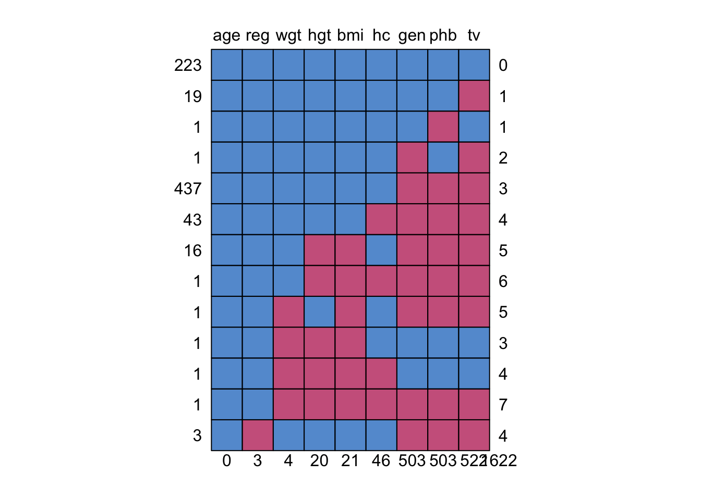
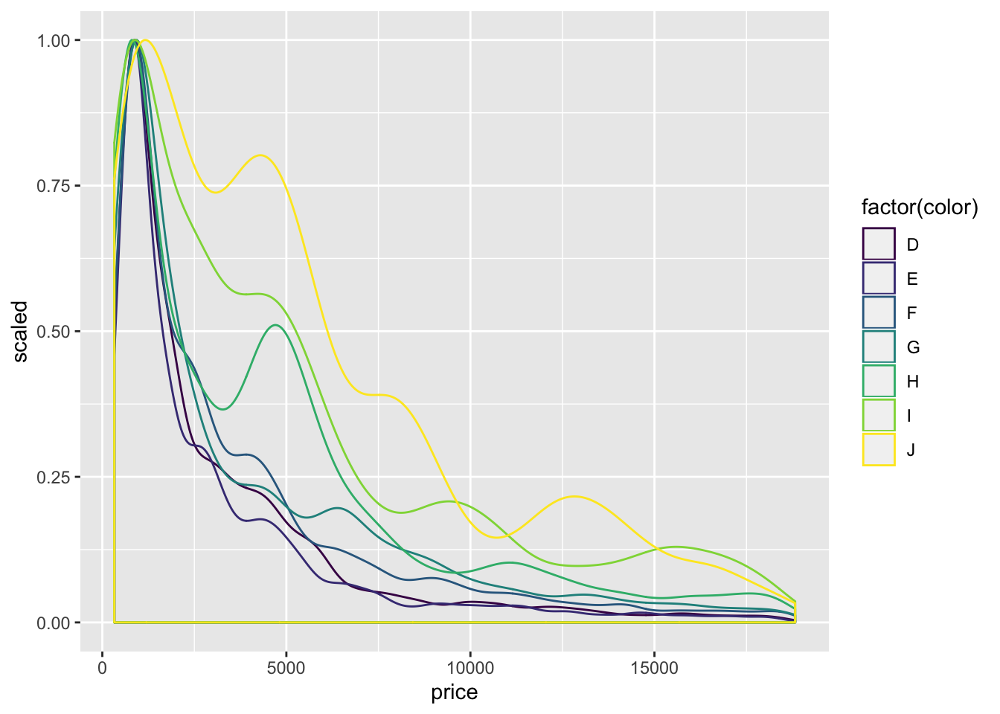
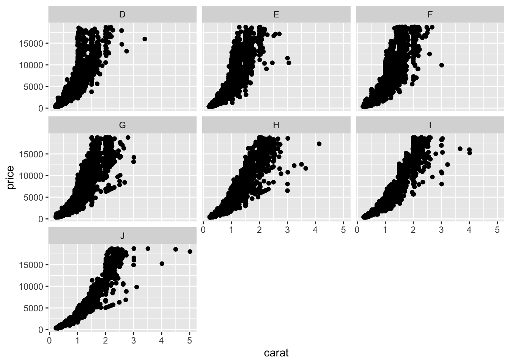
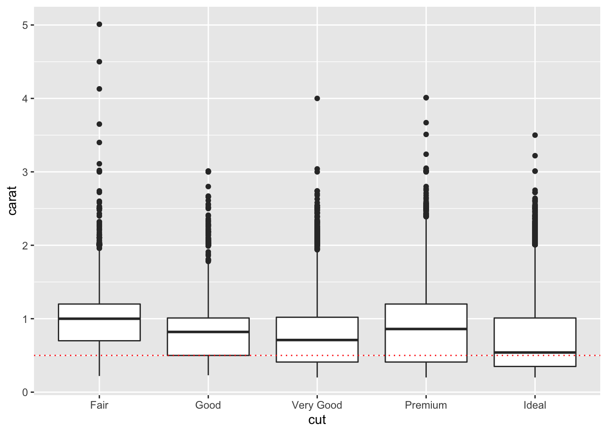
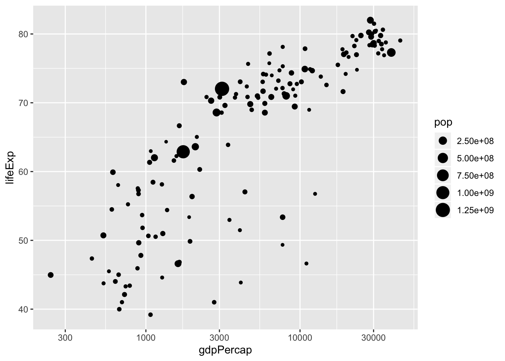

<!--

## Glossary


### Aesthetics and `aes` in ggplot

Aesthetics means how things look. In ggplot the `aes` command creates a mapping between variables in
a dataset and the visual features (aesthetics) of the plot

 -->

## Cheatsheet {#cheatsheet}

This covers everything we have done to-date (or will soon), in abbreviated form. You will need to
load tidyverse for most of these examples:


```r
library(tidyverse)
```

### Basics

Assign a value to a name (variable):


```r
meaningoflife <- 43
```

Simple arithmetic


```r
2+2
```

```
## [1] 4
```

```r
2*2
```

```
## [1] 4
```

```r
2^3 # 2 cubed
```

```
## [1] 8
```

Compare values:


```r
2 == 2  # note the doubled = sign
```

```
## [1] TRUE
```

```r
2 != 4  # 2 is not equal to 4
```

```
## [1] TRUE
```

```r
2 > 2
```

```
## [1] FALSE
```

```r
2 >= 2
```

```
## [1] TRUE
```

### Sequences


```r
1:10
```

```
##  [1]  1  2  3  4  5  6  7  8  9 10
```

```r
seq(1,10)
```

```
##  [1]  1  2  3  4  5  6  7  8  9 10
```

```r
seq(1,100, by=7) # 7 times table
```

```
##  [1]  1  8 15 22 29 36 43 50 57 64 71 78 85 92 99
```

For strings use `c()`


```r
c("Wibble", "Wobble", "Nobble")
```

```
## [1] "Wibble" "Wobble" "Nobble"
```

Combinations of sequences:


```r
expand.grid(
   colour=c("Red", "Green"),
   position=c("Top", "Bottom"))
```

```
##   colour position
## 1    Red      Top
## 2  Green      Top
## 3    Red   Bottom
## 4  Green   Bottom
```

### Randomness

A random sample:


```r
sample(1:20)
```

```
##  [1] 10  2  6 13  4 18  9  1 14 12  8 11  7 15 17 19  3 20  5 16
```

Random-normal numbers:


```r
rnorm(n=20, mean=0, sd=5)
```

```
##  [1] -4.63252036  6.06991270  5.20651893  1.12220817 -9.04403089  8.68813060
##  [7] -6.76442140  4.17164247 -3.79578587 -6.52194782 -1.72375013  5.64443318
## [13]  6.96260218  3.79652093  0.05394649  3.20169825 -3.25847091  0.76543086
## [19]  0.05380241  8.16242436
```

```r
rnorm(20, 0, 5)  # equivalent to line above(but this is a different sample!)
```

```
##  [1]  5.4532519  5.1928740 -6.4425070 -1.9254551 -7.4003830 -0.6003605
##  [7]  1.2078661 -7.3855843 -5.2242546  5.8351966 -0.5899706  7.8005975
## [13]  8.1354821 -3.4853749  1.9306607  6.5902829 -0.5673054  7.7127472
## [19] -4.7053461 -3.7065989
```

Other types of random numbers:


```r
runif(10)
```

```
##  [1] 0.001319438 0.146742771 0.732479485 0.929883373 0.649513251 0.407339471
##  [7] 0.216244302 0.044197892 0.204574604 0.099189176
```

```r
rbinom(10, size=1, prob=.5) # like a coin toss where 1=heads
```

```
##  [1] 0 0 1 1 0 0 0 1 0 0
```

```r
rbinom(10, size=5, prob=.5) # like best of 5 coin tosses
```

```
##  [1] 2 2 2 2 2 4 4 2 2 1
```

### Loading data

CSV:


```r
df <- read_csv('filename.csv') # from a file on your server account
df <- read_csv('<URL>') # direct from the web
```

SPSS:


```r
library(haven)  # load haven first
df_from_spss <- read_spss('filename.sav')
```

Excel (note different sheets are loaded from same file):


```r
expt1 <- read_excel('simple-excel-example.xlsx', sheet="Experiment 1")
expt2 <- read_excel('simple-excel-example.xlsx', sheet="Experiment 2")
```

### 'Looking at' datasets

If a dataset is large we don't want to look at it all at once.

Show the first 3 rows for all variables:


```r
iris %>% head(3)
```

```
##   Sepal.Length Sepal.Width Petal.Length Petal.Width Species
## 1          5.1         3.5          1.4         0.2  setosa
## 2          4.9         3.0          1.4         0.2  setosa
## 3          4.7         3.2          1.3         0.2  setosa
```

Show a list of all the **_columns_** with as many datapoints as fit in the window:


```r
iris %>% glimpse
```

```
## Observations: 150
## Variables: 5
## $ Sepal.Length <dbl> 5.1, 4.9, 4.7, 4.6, 5.0, 5.4, 4.6, 5.0, 4.4, 4.9, 5.4, 4…
## $ Sepal.Width  <dbl> 3.5, 3.0, 3.2, 3.1, 3.6, 3.9, 3.4, 3.4, 2.9, 3.1, 3.7, 3…
## $ Petal.Length <dbl> 1.4, 1.4, 1.3, 1.5, 1.4, 1.7, 1.4, 1.5, 1.4, 1.5, 1.5, 1…
## $ Petal.Width  <dbl> 0.2, 0.2, 0.2, 0.2, 0.2, 0.4, 0.3, 0.2, 0.2, 0.1, 0.2, 0…
## $ Species      <fct> setosa, setosa, setosa, setosa, setosa, setosa, setosa, …
```

Calculate some useful summaries of all variables in the dataset:


```r
library(skimr)
iris %>% skim()
```


Table: (\#tab:unnamed-chunk-17)Data summary

                                      
-------------------------  -----------
Name                       Piped data 
Number of rows             150        
Number of columns          5          
_______________________               
Column type frequency:                
factor                     1          
numeric                    4          
________________________              
Group variables            None       
-------------------------  -----------


**Variable type: factor**

skim_variable    n_missing   complete_rate  ordered    n_unique  top_counts                
--------------  ----------  --------------  --------  ---------  --------------------------
Species                  0               1  FALSE             3  set: 50, ver: 50, vir: 50 


**Variable type: numeric**

skim_variable    n_missing   complete_rate   mean     sd    p0   p25    p50   p75   p100  hist  
--------------  ----------  --------------  -----  -----  ----  ----  -----  ----  -----  ------
Sepal.Length             0               1   5.84   0.83   4.3   5.1   5.80   6.4    7.9  ▆▇▇▅▂ 
Sepal.Width              0               1   3.06   0.44   2.0   2.8   3.00   3.3    4.4  ▁▆▇▂▁ 
Petal.Length             0               1   3.76   1.77   1.0   1.6   4.35   5.1    6.9  ▇▁▆▇▂ 
Petal.Width              0               1   1.20   0.76   0.1   0.3   1.30   1.8    2.5  ▇▁▇▅▃ 

Check for patterns of [missing data](#missing-data):


```r
library(mice)
boys %>% md.pattern()
```



```
##     age reg wgt hgt bmi hc gen phb  tv     
## 223   1   1   1   1   1  1   1   1   1    0
## 19    1   1   1   1   1  1   1   1   0    1
## 1     1   1   1   1   1  1   1   0   1    1
## 1     1   1   1   1   1  1   0   1   0    2
## 437   1   1   1   1   1  1   0   0   0    3
## 43    1   1   1   1   1  0   0   0   0    4
## 16    1   1   1   0   0  1   0   0   0    5
## 1     1   1   1   0   0  0   0   0   0    6
## 1     1   1   0   1   0  1   0   0   0    5
## 1     1   1   0   0   0  1   1   1   1    3
## 1     1   1   0   0   0  0   1   1   1    4
## 1     1   1   0   0   0  0   0   0   0    7
## 3     1   0   1   1   1  1   0   0   0    4
##       0   3   4  20  21 46 503 503 522 1622
```

### Choosing columns and rows {#dplyr-cheat}

#### Selecting columns


```r
mtcars %>% select(mpg, wt) %>% head()
```

```
##                    mpg    wt
## Mazda RX4         21.0 2.620
## Mazda RX4 Wag     21.0 2.875
## Datsun 710        22.8 2.320
## Hornet 4 Drive    21.4 3.215
## Hornet Sportabout 18.7 3.440
## Valiant           18.1 3.460
```

Selecting columns which start with a particular string:


```r
iris %>% select(starts_with('Sepal')) %>% head
```

```
##   Sepal.Length Sepal.Width
## 1          5.1         3.5
## 2          4.9         3.0
## 3          4.7         3.2
## 4          4.6         3.1
## 5          5.0         3.6
## 6          5.4         3.9
```

Selecting columns which match a name:


```r
iris %>% select(matches('Width')) %>% head
```

```
##   Sepal.Width Petal.Width
## 1         3.5         0.2
## 2         3.0         0.2
## 3         3.2         0.2
## 4         3.1         0.2
## 5         3.6         0.2
## 6         3.9         0.4
```

#### Renaming columns


```r
mtcars %>% select(wt) %>% rename(weight=wt) %>% head
```

```
##                   weight
## Mazda RX4          2.620
## Mazda RX4 Wag      2.875
## Datsun 710         2.320
## Hornet 4 Drive     3.215
## Hornet Sportabout  3.440
## Valiant            3.460
```

:::{.tip}

Try to avoid spaces or punctuation in your variable names if possible.

:::

If you do end up with spaces in your column names, you can still access them by putting 'backticks'
around the name.


Our annoying dataframe is like this:


```r
annoying_dataframe  %>% head
```

```
## # A tibble: 3 x 1
##   `What is your favourite colour?`
##   <chr>                           
## 1 Red                             
## 2 Blue                            
## 3 Green
```

Rename the column:


```r
annoying_dataframe %>%
  rename('favourite_colour' = `What is your favourite colour?`) %>%
  head
```

```
## # A tibble: 3 x 1
##   favourite_colour
##   <chr>           
## 1 Red             
## 2 Blue            
## 3 Green
```

#### Filtering rows

Select rows where a variable matches a particular number:


```r
gapminder::gapminder %>% filter(year==2002) %>% head
```

```
## # A tibble: 6 x 6
##   country     continent  year lifeExp      pop gdpPercap
##   <fct>       <fct>     <int>   <dbl>    <int>     <dbl>
## 1 Afghanistan Asia       2002    42.1 25268405      727.
## 2 Albania     Europe     2002    75.7  3508512     4604.
## 3 Algeria     Africa     2002    71.0 31287142     5288.
## 4 Angola      Africa     2002    41.0 10866106     2773.
## 5 Argentina   Americas   2002    74.3 38331121     8798.
## 6 Australia   Oceania    2002    80.4 19546792    30688.
```

Select rows where a variable matches a particular string value (letters/words):


```r
iris %>% filter(Species=="setosa") %>% head
```

```
##   Sepal.Length Sepal.Width Petal.Length Petal.Width Species
## 1          5.1         3.5          1.4         0.2  setosa
## 2          4.9         3.0          1.4         0.2  setosa
## 3          4.7         3.2          1.3         0.2  setosa
## 4          4.6         3.1          1.5         0.2  setosa
## 5          5.0         3.6          1.4         0.2  setosa
## 6          5.4         3.9          1.7         0.4  setosa
```

Select rows meeting (both of) 2 criteria:


```r
mtcars %>% filter(wt > 3 & cyl == 4)
```

```
##    mpg cyl  disp hp drat   wt qsec vs am gear carb
## 1 24.4   4 146.7 62 3.69 3.19 20.0  1  0    4    2
## 2 22.8   4 140.8 95 3.92 3.15 22.9  1  0    4    2
```

Select rows meeting either one criteria OR another:


```r
mtcars %>% filter(wt > 3 | cyl == 4) %>% head
```

```
##    mpg cyl  disp  hp drat    wt  qsec vs am gear carb
## 1 22.8   4 108.0  93 3.85 2.320 18.61  1  1    4    1
## 2 21.4   6 258.0 110 3.08 3.215 19.44  1  0    3    1
## 3 18.7   8 360.0 175 3.15 3.440 17.02  0  0    3    2
## 4 18.1   6 225.0 105 2.76 3.460 20.22  1  0    3    1
## 5 14.3   8 360.0 245 3.21 3.570 15.84  0  0    3    4
## 6 24.4   4 146.7  62 3.69 3.190 20.00  1  0    4    2
```

### Groups and summaries {#cheat-group-summary}

Calculate statistics on a dataset:


```r
iris %>% summarise(mean(Sepal.Length), mean(Sepal.Width))
```

```
##   mean(Sepal.Length) mean(Sepal.Width)
## 1           5.843333          3.057333
```

Give our summary variables specific names (these are bad names, don't do this!):


```r
iris %>% summarise(wibble=mean(Sepal.Length), wobble=mean(Sepal.Width))
```

```
##     wibble   wobble
## 1 5.843333 3.057333
```

Calculate summaries for groups in the a dataset:


```r
iris %>% group_by(Species) %>% summarise(mean(Sepal.Length), sd(Sepal.Length))
```

```
## # A tibble: 3 x 3
##   Species    `mean(Sepal.Length)` `sd(Sepal.Length)`
##   <fct>                     <dbl>              <dbl>
## 1 setosa                     5.01              0.352
## 2 versicolor                 5.94              0.516
## 3 virginica                  6.59              0.636
```

### Plotting

Also see the [section on visualisation](#visualisation).

Density plot with colours:


```r
diamonds  %>%
  ggplot(aes(x=price, y=..scaled.., color=factor(color))) +
  geom_density()
```



Scatterplot, with facets:


```r
diamonds %>%
  ggplot(aes(x=carat, y=price)) +
  geom_point() +
  facet_wrap(~color)
```



Boxplot, with added line:


```r
diamonds %>%
  ggplot(aes(x=cut, y=carat)) +
  geom_boxplot() +
  geom_hline(yintercept=.5, color="red", linetype="dotted")
```



Scatterplot with logarithmic scale on x axis, with point sizes scaled (to country-size `pop`):


```r
gapminder::gapminder %>%
  filter(year==2002) %>%
  ggplot(aes(gdpPercap, lifeExp, size=pop)) +
  geom_point() +
  scale_x_log10()
```


