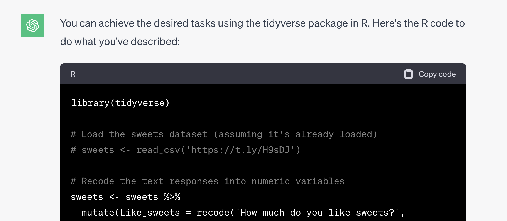

```{r, include=F}
source('_first_chunk.R')
```


> Most time in data analysis is spent 'tidying up' data: getting it into a suitable format to get
> started. Data scientists have a particular definition of _tidy_: Tidy datasets are "easy to
> manipulate, model and visualize, and have a specific structure: each variable is a column, each
> observation is a row" [@wickham_tidy_2014].

> It's often not convenient for humans to _enter_ data in a tidy way, so untidy data is probably
> more common than tidy data in the wild. But doing good, reproducible science demands that we
> document each step of our processing in a way that others can check or repeat in future. Tools
> like R make this easier.


# Overview

In the [lifesavR worksheets](http://benwhalley.github.io/lifesavR/)  we used various commands from the `tidyverse`, like `filter` and `group_by`. 

If you want to recap these commands you could use [the cheatsheet](https://plymouthpsychology.github.io/cheatR/lifesavr_cheatsheet.html), especially
the part on groups and summaries.


---


Today we will cover three additional techniques which are important when working with real datasets:

1. 'Pivoting' or reshaping data from long to wide formats (or the reverse)
2. Adding meaningful labels to categorical variables


# Before you start

:::{.exercise}

Make a new `rmd` file in your datafluency directory, called `data-wrangling.rmd` and record your work in this for the next 2 sessions.

:::


# Selecting columns

The `fuel` data also contains variables for weight and power.

We can select just these columns and save them to a smaller dataframe like this:

```{r}
carperformance <- fuel %>% 
  select(mpg, weight, power) %>% 
  head() 
```

#### Explanation of the commands

- On the far left we have the name of the new variable which we will create: `carperformance`.
- We can tell this will be a new variable because the `<-` symbol is just to the right, pointing at
it.
- To see what `carperformance` contains, look to the right of the `<-`. We pipe the `fuel` data to the `select` command, which selects the`mpg`,`weight`, and`power` columns.

#### Explanation of the result

When running the command you won't see any output --- but a new object was created called `carperformance` which contained copies of the columns from `fuel` we selected.

We can see the first few rows of our new smaller dataframe like this:

```{r, include=T}
carperformance %>% head() 
```


:::{.exercise}

Try selecting columns in a dataset for yourself:

- Use any of the built in datasets, creating a copy with just a subset of 3 of its columns.

:::


# Pivoting longer {#pivotlonger}

Data is commonly stored in either
[_wide_ or _long_ format](https://www.theanalysisfactor.com/wide-and-long-data/).

If you used SPSS to do a _t_-test or ANOVA during your undergraduate degree, you likely stored and analysed the
data in **wide** format. 

In wide format, each row represents the _observations from a single
participant_. Each measurement for a given participant are stored in separate columns. 

This is often called **row per subject** data. An example is the built in `attitude` dataset:

```{r}
attitude %>%
  head()
```

**Explanation**: Each row contains scores for a particular employee on various measures. To find out
more about these data you can type `?attitude` into the console.

---


Let's say we want a single plot of all these variables, something like this:

```{r echo=F, message=F, warning=F}
attitude %>%
  pivot_longer(everything()) %>% 
  mutate(name=Hmisc::capitalize(as.character(name))) %>%
  ggplot(aes(name, value)) +
  geom_boxplot() +
  labs(x="Measure", y="Score")
```


To do this we first need to convert the data to _long_ format. In **long format**, each observation
is saved in its own row, rather than across multiple columns.

It's often called **"row per observation"** data.


### Using `pivot_longer()`

> Pivoting is where you take a long data file (lots of rows, few columns) and make it wider. Or where you take a wide data file (lots of columns, few rows) and make it longer. 


`r embed_youtube("rbuskzmCPd0")`

We can convert from wide to long using the `pivot_longer()` function, as shown in the video:

To see why the function is called 'pivot_**longer**', imagine trying to reshape just the first two rows of the attitude dataset:

```{r  echo=F, message=F, warning=F}
attitude %>%
  head(2) 
```

If we use `pivot_longer` on this selection, we end up with this:

```{r message=FALSE, warning=FALSE}
attitude %>%
  head(2) %>% 
  pivot_longer(everything()) 
```

**Explanation of the command**: 
- We selected a subset of columns and rows. 
- Then we used `pivot_longer(everything())` to make this into long form data.
- The `everything()` part tells R to merge values from all of the columns into a single new column called `value`, and to keep track of the original variable name in a new column called `name`.


The change works like like this:


---

You might have spotted a problem though: We don't have a record of which participant was which in the `attitude`
dataset.

This is because the mapping to participants was implicit: **each row was a different participant, but participant number was not actually recorded in the file**.


We can create an explicit participant identifier by adding a new column. For this we use the `mutate` and `row_number()` functions:

```{r}
attitude_with_person <- attitude %>%
  mutate(person = row_number()) %>%
  head(2) 

attitude_with_person %>% 
  pander()
```

Now we have a column called `person` which stores the row number.

**But** this means if we `pivot_longer()` again, we will need to tell R *which* columns
we would like to pivot. 

If we don't do this then the `person` column gets melted with everything else
so we lose track of which response belonged to which participant, like this:


```{r}
attitude_with_person %>%
  pivot_longer(everything()) %>% 
  pander()
```

**Explanation of the output** Because we didn't tell `pivot_longer` which columns we wanted to pivot, it put all the values into a single new column called `value`. This included our participant identifier, `person` which is not what we wanted.

-------


We can exclude `person` from the pivoting by writing:

```{r}
attitude_with_person %>%
  pivot_longer(-person) %>% 
  head() %>% 
  pander()
```

**Explanation of the command and output**:

- Here, we still use `pivot_longer` but this time we put `-person` between the parentheses. 
- The minus sign, `-`, means *don't include this variable*, so `-person` ends up meaning  *include all columns except `person`*, which is what we wanted. 
- The output now retains the `person` column, but pivots the other variables. 
- This means we can tell which person provided each datapoint.


:::{.exercise}

Use some tidyverse commands you already know (e.g. `select`), plus `pivot_longer`, to produce this plot using the `attitude` dataset:

```{r echo=F, message=F, warning=F}
attitude %>%
  select(rating, complaints, learning) %>%
  pivot_longer(everything()) %>% 
  mutate(variable=Hmisc::capitalize(as.character(name))) %>%
  ggplot(aes(variable, value)) +
  geom_boxplot() +
  labs(x="Measure", y="Score")
```


`r hide("Show hints")`

- Check the [cheatsheet](https://plymouthpsychology.github.io/cheatR/complete-cheat.html) if you get stuck
- You need to select only the three variables shown
- It's not necessary to create a person identifier for this plot (although it won't hurt if you do)

`r unhide()`


`r hide("Show complete answer")`

```{r}
attitude %>%
  select(rating, complaints, learning) %>%
  pivot_longer(everything()) %>% 
  ggplot(aes(name, value)) +
  geom_boxplot()
```

`r unhide()`


:::


# Pivoting to make summary tables

Imagine we want a table of the mean score for each question in the attitude dataset. 

This would be fiddly if we just tried to use `summarise` on wide format data. But if we use `pivot_longer`, `group_by` and then `summarise` (in that order) it's possible to take the data and make a table like this with 3 instructions to R:

```{r, echo=F, message=F}
attitude %>%
  pivot_longer(everything()) %>% 
  group_by(Name=name) %>%
  summarise(Mean = mean(value), SD=sd(value)) %>% 
  pander()
```

:::{.exercise}


Combine the `pivot_longer`, `group_by` and `summarise` commands (in that order) to reproduce the table above.


`r hide("Show hints")`

- You want to pivot *all* of the variables in the `attitude` dataset this time
- We covered using `summarise` in the [third `lifesavR` session here](https://benwhalley.github.io/lifesavR/session-3.html#groupby). 

`r unhide()`

:::


:::{.exercise}

We might also want to produce summary statistics per-participant.

Using the commands shown above (and remembering to make 
a new column to store the participant number with `row_number()`), reproduce this table:

```{r, echo=F}
attitude %>% 
  mutate(person = row_number()) %>% 
  filter(person < 6) %>% 
  pivot_longer(-person) %>% 
  group_by(person) %>% 
  summarise(mean(value)) %>% 
  pander()
```


`r hide("Show some hints")`

To make the table you will need to use the following functions, in roughly this order:

- mutate
- filter
- pivot_longer
- group_by
- summarise
- pander

`r unhide()`


`r hide("Show the code")`

```{r, eval=F, echo=T}
attitude %>% 
  mutate(person = row_number()) %>% 
  filter(person < 6) %>% 
  pivot_longer(-person) %>% 
  group_by(person) %>% 
  summarise(mean(value)) %>% 
  pander()
```


`r unhide()`


:::


# Pivoting wider

Sometimes we have the opposite problem: We have long data, but want it in wide format. For example,
we might want a table where it's easy to compare between different years, like this:


```{r}
development %>%
  filter(year > 1990) %>% 
  pivot_wider(id_cols=country, 
              names_from=year, 
              values_from=gdp_per_capita) %>% 
  head(3) %>% 
  pander::pander("GDP per-capita in 3 countries in 4 different years, from the development dataset.")
```


----


**Instead of making the data longer, now we want to `pivot_wider`.**


The `development` data is a fairly long format. There are multiple rows per-country
corresponding to different years.

We want to _compare_ GDP in different _years_. 

We first need to select the data we want --- `country`, `year` and `GDP`, for the years after 1990:

```{r, message=F}
development1990s <- development %>%
  select(country, year, gdp_per_capita) %>%
  filter(year >= 1990)
```


Then we can `pivot_wider()`:

```{r}
development1990s %>%
  pivot_wider(
    names_from = year, 
    values_from = gdp_per_capita
  ) %>% 
  head() %>% 
  pander()
```

**Explanation of the command and output**: 

- We started with multiple rows per country, corresponding to years. 
- We used `pivot_wider` with `names_from = year` to create new columns for each year in the data. 
- We used `values_from=gdp_per_capita` to tell `pivot_longer` to use the GDP numbers to populate the table.
- The resulting table helps us compare years within countries, or between countries, for a given year.


:::{.exercise}

Use the `funimagery` dataset in `psydata` and perform the following:

- use `select` to make a dataset with `intervention` and each of the `kg1` to `kg3` columns
- Use `pivot_longer`, `group_by` and `summarise` to calculate the average weight of participants at each timepoint
- Adapt the `group_by` function to calculate the mean at each timepoint *for each group separately*
- Add `pivot_wider` to the end of your code to create a separate column for each group. 


When you finish your data should look like this:

```{r, echo=F, include=T}
funimagery %>% 
  select(intervention, kg1, kg2, kg3) %>% 
  pivot_longer(-intervention) %>% 
  group_by(name, intervention) %>% 
  summarise(M=mean(value)) %>% 
  pivot_wider(names_from=intervention, values_from=M) %>% 
  pander()
```


`r hide("Show the code")`

```{r, echo=T, eval=F}
funimagery %>% 
  select(intervention, kg1, kg2, kg3) %>% 
  pivot_longer(-intervention) %>% 
  group_by(name, intervention) %>% 
  summarise(M=mean(value)) %>% 
  pivot_wider(names_from=intervention, values_from=M) %>% 
  pander()
```


`r unhide()`


:::


# Separating variables

Sometimes we need to separate 'untidy' variables into tidy, long-form data.

`r embed_youtube('NRaKlYGaXEs')`

The code below generates simulated data for 100 individuals at three time points. The format is
similar to the way you might record experimental data in a spreadsheet.

```{r}
set.seed(1234)
N <- 100
repeatmeasuresdata <- tibble(person = 1:N,
                              time_1 = rnorm(N),
                              time_2 = rnorm(N, 1),
                              time_3 = rnorm(N, 3))

repeatmeasuresdata %>% head(8) %>% 
  pander()
```


This variable, `repeatmeasuresdata`, is in **wide** format. Each row contains data for one participant, and each participant has three observations.

As [we saw previously](data-wrangling1.html#pivotlonger), we can *pivot* --- i.e., reshape --- the data into longer format like so:

```{r}
repeatmeasuresdata %>%
  pivot_longer(starts_with("time")) %>%
  arrange(person, name) %>%
  head(8) %>% 
  pander()
```

The problem we have now is that `name` contains text which describes at which time the
observation was made. We probably want to store a *number* for each time-point, so we can make a plot with time
on the x axis.

The `separate` command separates a single character column (`name`) into multiple columns.
Rather than have a column with labels of the form 'time_1', it can create two columns, with labels
'time' and '1' in each.

```{r}
# convert to long form; extract the `time` as a new numeric column
longrepeatmeasuresdata <- repeatmeasuresdata %>%
  pivot_longer(starts_with("time")) %>%
  separate(name, into = c("variable", "time"))

longrepeatmeasuresdata %>% head %>% 
  pander()
```


Now the data are in long format, we can plot the points over time:

```{r}
longrepeatmeasuresdata %>%
  sample_n(30) %>%
  ggplot(aes(x=time, y=value)) +
  geom_point()
```


### How does R know where to split the text?


In the example above, `separate` split data like `"time_1"`, `"time_2"` etc into two columns: `variable` and `time`.

Q: How did it know to use the underscore (`_`) to split the data?

A: The default is to split on anything which is not a letter or number. So `_` or a space, or `,` would all work.


Sometimes though we need to tell R explicitly what to use to sepatate the values.

If we had a column of email addresses we could split `ben.whalley@plymouth.ac.uk` into the username (e.g. `ben.whalley`) and domain name (`plymouth.ac.uk`) using the `@` symbol.

To do this we just write `sep="@"` when we use separate.


:::{.exercise}

The `messy_exp` dataset in `psydata` contains simulated RT data on 100 participants in 2 conditions (A and B) at three time points (1, 2, and 3).

- Use the `separate()` function to split up the `condition` variable in this dataset and draw the following plot:

```{r, echo=F}
messy_exp %>% 
  separate(condition, into=c("participant", "condition", "time")) %>% 
  ggplot(aes(time, rt, color=condition)) + 
  geom_boxplot(width=.5) + 
  labs(x="Time", y="Reaction time (ms)", color="Condition")
```
`r hide("Show the code")`

```{r, echo=T, eval=F}
messy_exp %>% 
  separate(condition, into=c("participant", "condition", "time")) %>% 
  ggplot(aes(time, rt, color=condition)) + 
  geom_boxplot(width=.5) + 
  labs(x="Time", y="Reaction time (ms)", color="Condition")
```

`r unhide()`

:::


:::{.exercise}


1. This file contains sample contact and address data for 100 people: <https://letterhub.com/wp-content/uploads/2018/03/100-contacts.csv>


  - Read the data into R (you can either use the URL above directly inside the `read_csv()` function, or download then re-upload the data to the server to do this)

  - Use the `separate` function to make a new variable which contains the *domain name* of these contacts' email address (e.g. yahoo.com, hotmail.com)

> Note, you will need to use `sep="@"` to split the email addresses at the `@` symbol

2. Use the `distinct` and/or `count` functions on the new variable you create containing the domain name. Look them up in the help file if you don't know which to use to answer these questions:

  - How many people had a Gmail account?
  - Which domains had more than 10 users?


`r hide("Show workings")`

```{r}
# read the data directly from the URL
contacts <- read_csv('https://letterhub.com/wp-content/uploads/2018/03/100-contacts.csv') %>% 
  separate(email, into=c("user", "domain"), sep ="@")  # uses the @ symbol as a separator
```

```{r}
# how many _different_ domains are there?
contacts %>% 
  distinct(domain) %>% 
  count() %>% 
  pander()
```

```{r}
# how many people use gmail
contacts %>% 
  count(domain) %>% 
  filter(domain=="gmail.com") %>% 
  pander()
```

```{r}
# which domains had more than 10 users?
contacts %>% 
  count(domain) %>% 
  filter(n > 10) %>% 
  pander()
```

`r unhide()`


:::


# Questionnaire data


```{r, echo=T, eval=F, include=F}
# import an excel file using rio
library(rio)
sweets <- import('data/sweets.xlsx')
sweets %>% write_csv('data/sweets.csv')
```

The file `sweets.csv` contains a small number of example rows of data exported from an online survey.

The file is at: <https://is.gd/axenun>


<!-- https://gist.githubusercontent.com/benwhalley/620fd04c6671cfb9d64d2b7e7ed18ba2/raw/f9e32801758cb07985fd9ef0e020ff89d4f8a1b3/sweets.csv -->


We can look at the first few rows of the data, using the `glimpse` command:


```{r}
sweets <- read_csv('https://is.gd/axenun')
sweets %>% glimpse()
```


:::{.exercise}


- Import the sweets data as shown above from: <https://is.gd/axenun>

- Save it to a new variable called `sweets`

:::


## Tidying questionnaires

When we look at the imported data it's useful to note:

1. There are extra columns we don't need (at least for now).

2. Some of our variable names are very long and annoying to type (for example
   `How much do you like sweets?` is the name of one of our columns).

3. Our responses are in **text** format, rather than as numbers. For example,
   the data say `"I don't like them"` or `"I'm neutral"` rather than numbers
   from a 1-5 scale.


We need to sort each of these problems to make things more manageable for our
analysis.


## Selecting and renaming 

> Remember, R makes using columns with spaces or other special characters very hard. We want to avoid this.

### Selecting 

To use columns with spaces in we must 'escape' the spaces and **let R know they are part of the name** rather than a gap between two different names.

This video shows how (or read below):

`r embed_youtube('aIMgsj5hTVA')`


To escape spaces and use columns with long names we use the backtick character (the
backwards facing apostrophe) to *wrap* the column name.  

**In general, if your columns contain spaces or other odd characters like hyphens or question marks then you will need to wrap them in backticks.**


### Renaming  {#renaming}

Some of the imported variable names in the `sweets` data are long and awkward to use.

Most researchers would rename these variables, to make them more usable in R code.

You can rename variables like this:

```{r, eval=F}
datasetname %>% 
  rename(NEW_COLUMN_NAME = OLD_COLUMN_NAME)
```

So for this example:

```{r}
sweets %>%
  rename(
    like_sweets = `How much do you like sweets?`,
    like_chocolate = `How much do you like chocolate`,
  )
```

**Explanation of the code**: We used `rename` to change the names of our
variables. We needed to wrap the long names of the questions in 'backtick'
symbols to make sure R understood it was a single column name.

You should create a new variable to save the renamed dataset (with a descriptive name for use later on):

```{r}
# create a new variable containing the renamed dataset
sweets.renamed <- sweets %>%
  rename(
    like_sweets = `How much do you like sweets?`,
)
```


:::{.exercise}

1. Create a copy of the sweets data in which you have selected only the two columns with long names.

1. Create a second copy of the data where you have renamed the columns with long names to something short, and without spaces.

:::


### Renaming with the `janitor` package


A good alternative to renaming variables manually is to use the `clean_names` function in 
the `janitor` package.

```{r}
sweets %>% 
  janitor::clean_names() %>% 
  glimpse
```

**Explanation of the code and result**. I used the `clean_names` function within the `janitor` package without using `library`. I did this by typing `janitor::` and then the name of the function. In the result `clean_names` has made a new dataset:

- Removed all special characters
- Made everything lower case (easier for R to autocomplete)
- Replaced spaces with underscores
- Made column names unique (this isn't always the case with imported data, but is important for R)


I typically use this function when importing any new data because it makes the naming and access of columns much more consistent and easier to remember. 
 


# Recoding text {#using-recode}

We noticed above that our responses were stored as text labels like
`"I don't like them"` rather than on a numeric scale. This makes it hard to use in
an analysis.

**We need to _recode_ the text variables into numeric versions.**

### How to do it

First we must tell R what number we want to use for each text label. That is, we
create a **_mapping of numbers to labels_**.

This takes a few steps:

1. Check **exactly** what the text values are which need to be mapped. 
2. Make a **mapping variable** which assigns each text value a number value
3. Use the `recode` function with `mutate` to create a new, numeric column


This video walks you through the steps below:


`r embed_youtube('vaGrKPIHN4Q')`


### Step 1: Check EXACTLY what text labels we have

To check which labels we need to recode, I select the column in question and use the `unique()` function.

```{r}
# check exactly what text values are in the dataset?
sweets %>% 
  select(`How much do you like sweets?`) %>% 
  unique() 
```

:::{.exercise}

Do the same to find out the possible values of the `How much do you like chocolate` column.

`r hide("Show answer")`

```{r}
sweets %>% 
  select(`How much do you like chocolate`) %>% 
  distinct() %>% 
  pander()
```

`r unhide()`

:::


### Step 2: Make a mapping variable

We do this by creating what R calles a **named vector**, which is a special kind of list.

To make a named vector we use the the `c()` function. The letter `c`
here just stands for 'combine' --- i.e. 'combine these things into a list'.

This is a simple example:


```{r}
mapping.list <- c("No" = 0, "Yes" = 1)
```


We could then use this mapping to recode a column of data which contained the words "No" or "Yes


<br>


*A useful trick* when creating your own mappings is to use R to do the formatting for you (see the video above for a demo).

Re-using the code from the previous step, we use `unique()` to show us the *unique values* for the question about sweets.

We then pipe the result to the `paste()` and `cat()` functions, like this:

```{r}
# the hack we use as a short-cut to creating a mapping variable
sweets %>% 
  select(`How much do you like sweets?`) %>% 
  unique() %>% 
  paste() %>% cat()
```

**Explanation of the output**: Using `paste` and `cat` is a bit of a hack. When we run this code we see the output `c("I don't like them", "I'm neutral", "I like them")`. This is a list of the values in the `sweets` data for this question, formatted in a way that will be useful to us in the next step.


We then copy and paste this output into a NEW code block, and EDIT it to assign our mappings:

```{r}
preference.mappings <- c("I don't like them" = -1, "I'm neutral" = 0, "I like them" = 1)
```

**Explanation of the code**: We used the previous output to create a mapping. By adding the parts which read `= -1` and `= 0` etc, we have told R what value we want to assign for each label.


:::{.tip}

Q: How do you know what number values to assign?

A: It doesn't matter, provided:

- The intervals between each options are the same and 
- Each text value has a different number

So, if we had a Likert-scale ranging from "Completely agree" to "Completely disagree" in 7 increments, we could score this from `0 - 6` or `1 - 7`, or `-3 - 3`. These would all be fine.


:::


### Step 3: Use the mapping variable to recode the column

We can use our new mapping with the `mutate` and `recode` functions to make a **new column**, containing numbers rather than text:

```{r}
sweets.recoded <-  sweets %>% 
    rename(
      like_sweets = `How much do you like sweets?`,
      like_chocolate = `How much do you like chocolate`,
    ) %>% 
    # use recode to convert text response using preference.mappings
    mutate(
        like_sweets_numeric =
            recode(like_sweets, !!!preference.mappings)
    )
```

We can see this new column if we use `glimpse`:

```{r}
sweets.recoded %>% glimpse()
```


**Explanation of the code**: 

- The start of the first line is `sweets.recoded <-` which means make a new variable called `sweets.recoded`.
- Then we use `mutate` to create a **new** column called `like_sweets_numeric`. 
- We make this column using `recode` on the question about liking sweets. 
- We use the `preference.mappings` mapping to specify what numeric score to give each of the text values.

**Watch out for the exclamation marks`!!!`**: In the code above there are
three exclamation marks, `!!!`, before the mapping; make sure you do the same.


`r hide('Optional: Explain the 3 exclamation marks')`


### Three exclamation marks: `!!!` {#explain-exclamationmarks}

*Understanding this isn't necessary to get on with the course. Only read
this if you are interested!*

In the code above when we used `recode` we used three exclamation marks just
before our list.

We defined the mapping:

```{r, eval=F}
likert.responses <- c(
            "I hate them" = 1,
            "I don't like them" = 2,
            "I'm neutral" = 3,
            "I like them" = 4,
            "I can't live without them" = 5)

```

And then used it with `recode`, with the three exclamation marks.

```{r, eval=F}
liking_of_sweets_data %>%
    mutate(like_sweets_numeric = recode(like_sweets_text, !!!likert.responses)) %>% 
  pander()
```

The reason for this is that `recode` actually expects us to specify the mapping
for it like this:

```{r, eval=F}
liking_of_sweets_data %>%
    mutate(like_sweets_numeric = recode(like_sweets_text,
        "I hate them" = 1,
        "I don't like them" = 2 ...))
```

But this means we have to repeat the mapping for each of the questions. Because
all the questions use the same mapping this gets repetitive, and can lead to
errors.

The three exclamation marks `!!!` _unpacks_ the list for us. So writing
`!!!likert.responses` saves us the bother of writing it out in full each time.


`r unhide()`


### Summary/video explanation

This is one of the trickiest bits of R code we use. I've included an annotated video of just these steps as a reference below:

`r embed_youtube('DCeAlHUZsF0')`


:::{.exercise}

- Use this three-step process to create a recoded version of the `like_chocolate` variable.

- Remember to watch the video at the start of this section, or the short version in the green box above, if anything is unclear.

:::


<!-- # Reverse coding -->

<!-- Watch out for "reverse coded" items. Imagine a questionnaire that includes two items: -->

<!-- - "I really love sweets" -->
<!-- - "I really hate sweets" -->

<!-- Participants respond on a scale of "Agree", "Disagree", and "Neutral". -->


<!-- Using the same mapping to both these questions would not be appropriate. Instead, we should use -->
<!-- two separate mappings for the different questions to ensure the ***direction*** of the  -->
<!-- coding has the same meaning: -->


<!-- ```{r} -->
<!-- # mapping for items like "I really love sweets" -->
<!-- agree.disagree.responses <- c( -->
<!--             "Agree" = 3, -->
<!--             "Neutral" = 2, -->
<!--             "Disagree" = 1) -->
<!-- ``` -->


<!-- ```{r} -->
<!-- # reversed mapping for items like "I really hate sweets" -->
<!-- agree.disagree.responses.REVERSED <- c( -->
<!--             "Agree" = 1, -->
<!--             "Neutral" = 2, -->
<!--             "Disagree" = 3) -->
<!-- ``` -->


<!-- Coded in this way, scores for the questions _could_ be added or averaged to provide a summary score. -->


<!-- ## Multiple new columns -->

<!-- You can create multiple new columns at once using mutate, to recode each of our -->
<!-- variables: -->

<!-- ```{r} -->
<!-- sweets.recoded  <- sweets.renamed %>% -->
<!--     # create two columns at once using mutate -->
<!--     mutate( -->
<!--         like_sweets_numeric = recode(like_sweets, !!!preference.mappings), -->
<!--         like_chocolate_numeric = recode(like_chocolate, !!!preference.mappings) -->
<!--     ) -->
<!-- ``` -->

<!-- **Explanation of the code**: We combined the two examples above to create 3 new -->
<!-- columns with recoded (numeric) values. We saved this to the variable called -->
<!-- `sweets.recoded`. -->


# Combining scores {#summary-score-of-questionnaire}

Often questionnaires are designed to make repeated measurements of the same phenomena, which can then be summed or averaged to 
create a more reliable measure.

We've already seen how  `mutate()` creates a new column. We can use this again to create the *sum* of
responses to both questions:


```{r, include=F, echo=F}
# included because we commented out stuff above
sweets.recoded  <- sweets.recoded %>%
    # create two columns at once using mutate
    mutate(
        like_sweets_numeric = recode(like_sweets, !!!preference.mappings),
        like_chocolate_numeric = recode(like_chocolate, !!!preference.mappings)
    )
```


```{r}
sweets.recoded %>%
  # mutate to create column containing sum of both recoded questions
  mutate(liking = like_sweets_numeric + like_chocolate_numeric) %>%
  # select the new variable we created
  select(ID, liking) %>% 
  pander()
```


**Explanation of the code**: 

- We added both the questions which asked about 'liking' together. This created a new column containing the combined score, called `liking`. 
- In the third line we selected only the `ID` column, plus the new column we made.


# Using ChatGPT to automate things

In the sections above I explained how to tidy up a simple dataset. However
it turns out many of these tasks are easily solved using ChatGPT.

You now have a choice you didn't have a few years ago:

1. Learn how to do these steps by hand (and sometimes use ChatGPT to automate the work)
2. Learn just enough to be able to get ChatGPT to write code for you (and hope it's correct)

I would recommend option 1 (at least until LLMs make improvements in code generation) because it will likely be faster, more accurate and will promote your understanding.

But as a guide, here's how I might solve this problem with ChatGPT as an assistant.


#### Step 1. Show ChatGPT the data

I use these command to output some information about the data, in a format that's easy to copy into ChatGPT.

```{r, eval=F}
sweets <- read_csv('https://is.gd/axenun')

# lists the column names
sweets %>% names()

sweets %>% glimpse()

# list the unique values in response to this question
sweets %>% count(`How much do you like sweets?`) %>% 
  pander()
```


#### Step 2: Ask GPT to recode it for us

This link shows how I asked ChatGPT to recode the `sweets` data:

https://chat.openai.com/share/325b1f77-c68c-417a-8e75-76b05a6b9633

<br><br>

Note that I:

- told it the names of the columns
- showed it a sample of the data (pasted in the output of `glimpse`)
- explicitly listed the values in the columns I wanted to recode (pasted in output of `count`)
- directly asked for R code
- gave instructions to use the tidyverse (this makes the output more consistent with what you have learned)


#### Step 3: Debug and validate the R code GPT provides




In this example, ChatGPT provided the following code:


```{r, eval=F}
library(tidyverse)

# Load the sweets dataset (assuming it's already loaded)
sweets <- read_csv('https://is.gd/axenun')

# Recode the text responses into numeric variables
sweets <- sweets %>%
  mutate(Like_sweets = recode(`How much do you like sweets?`,
    "I don't like them" = 0,
    "I like them" = 1,
    "I'm neutral" = 2
  )) %>%
  mutate(Like_chocolate = recode(`How much do you like chocolate`,
    "I don't like them" = 0,
    "I like them" = 1,
    "I'm neutral" = 2
  )) %>%
  select(-`How much do you like sweets?`, -`How much do you like chocolate`)

# Rename variables with spaces to use underscores and be shorter
sweets <- sweets %>%
  rename(
    ID = `ID`,
    Start_time = `Start time`,
    Gender = `Gender`
  )

# Remove timestamp and email columns
sweets <- sweets %>%
  select(-`Start_time`, -`Email`)

# Check the modified dataset
glimpse(sweets)

```


Amazingly, this actually works! 

However it's worth saying that it *often* doesn't work on first try, and it is dependent on writing a good prompt to the model, and giving it plenty of information about the data and what you want to achieve.

Some tips:

- Think first. Be clear about what you want to achieve.
- Explain in detail what the data are like and show examples.
- Give explicit instructions.
- If code doesn't work, ask for explanations or corrections.
- Break tasks down into smaller steps (ask for less and build up your script).
- Paste in the code you already have and ask for a completion with one extra step (e.g. something you don't know how to do).
- If you can afford it, use ChatGPT 4 or try new R-specific LLMs as they are (inevitably) released.


Where there are bugs in ChatGPT's code, you can

- fix these bugs by hand, or
- run the code, report the errors to ChatGPT and ask it to fix them for you.

The second option has some risks (ChatGPT's code _might_ delete your data, although it's unlikely), and is probably slower. In this instance it took me quite a while to get ChatGPT to fix the simple errors, and this required understanding the code to some degree anyway.

As I recommend in the lectures, knowing how to use R well enough to fix the small errors introduced is likely to be more
productive in the long run. Think of LLMs as your assustant rather than your replacement.


# Consolidation activity

:::{.exercise}

Use this example dataset: <https://is.gd/ayinof>

- Read in the data.
- Rename the long column names to something short, and without spaces
- Recode at least three of the columns with data about sleep quality to be numeric
- Save the result of this work in a new variable called `sleep.tidy`
- Pivot the recoded variables and make a boxplot of responses to these questions
- Create a summary score called `sleep_quality` which is the sum of these recoded questions (use mutate)
- Create a density plot of this summary score and interpret what you see (describe the pattern in plain English)


`r hide("Show complete code example")`


```{r, eval=F, echo=F, include=F}
sleep <- readxl::read_xlsx('data/sleep.xlsx')
sleep %>% write_csv('data/sleep.csv')
# https://gist.github.com/benwhalley/d5c168565ca770ff99b51442115f4e56
# https://is.gd/ayinof
```

```{r}
sleep <- read_csv('https://is.gd/ayinof')

# used to check what response values are in each question
sleep %>% 
  select(`My sleep is affected by my study commitments`) %>% 
  unique() %>% paste %>% cat

sleep %>% 
  select(`My electronic device usage negatively affects my sleep`) %>% 
  unique() %>% paste %>% cat
```


```{r}
# we will use the same mapping for both questions because they have the same responses
sleep.map <- c("Agree"=2, 
               "Somewhat agree"=1, 
               "Somewhat disagree"=-1, 
               "Disagree"=-2, 
               "Neither agree nor disagree"=0, 
               "Strongly agree"=3, 
               "Strongly disagree"=-3)


sleep.tidy <- sleep %>% 
  # now we recode the two text variables (we only need use mutate once though)
  mutate(
    sleep_study = recode(`My sleep is affected by my study commitments`, !!!sleep.map), 
    sleep_electronic = recode(`My electronic device usage negatively affects my sleep`, !!!sleep.map)
  )

```

```{r}
# now we can pivot longer to make a plot
sleep.tidy %>% 
  pivot_longer(c(sleep_study, sleep_electronic)) %>% 
  ggplot(aes(name, value)) + geom_boxplot()
```

And make a summary score combining both questions

```{r}
sleep.tidy.withsumary <- sleep.tidy %>% 
  # and create the summary score
  mutate(sleep_quality = sleep_study + sleep_electronic ) 
  
# check the result. it looks ok
sleep.tidy.withsumary %>% glimpse
```


```{r}
# finally, make the requested density plot
# make the density plot
sleep.tidy.withsumary %>% 
  ggplot(aes(sleep_quality)) + 
  geom_density()
```


`r unhide()`

:::


# Check your knowledge

- What does it mean for data to be "tidy"? Identify the three key characteristics
- What function creates a new column in a dataset?
- Which function allows you to choose a subset of the columns in a dataset?
- What does `pivot_longer` do?
- Why is `pivot_longer` useful when we want to make a faceted plot?
- Why is wide data sometimes more useful than long data?
- If you have RT data with 10 groups, what tidyverse 'verbs' (functions) would you use to calculate the mean for each group?
- How can you read data into a dataframe from over the internet?
- Does `recode` convert from text to numeric, or from numeric to text values?
- Why is it important to recode text variables into numeric values when working with survey or questionnaire data?
- Why is it important to copy and paste exact values when making a mapping variable for `recode`?
- When renaming, is it: `rename(oldvarname=newvarname)` or `rename(newvarname=oldvarname)`?
- What does the `clean_names` function from the janitor package do?

- Imagine a single cell of your dataset contains the string "conditionA_time_1". What function should we apply to it?


