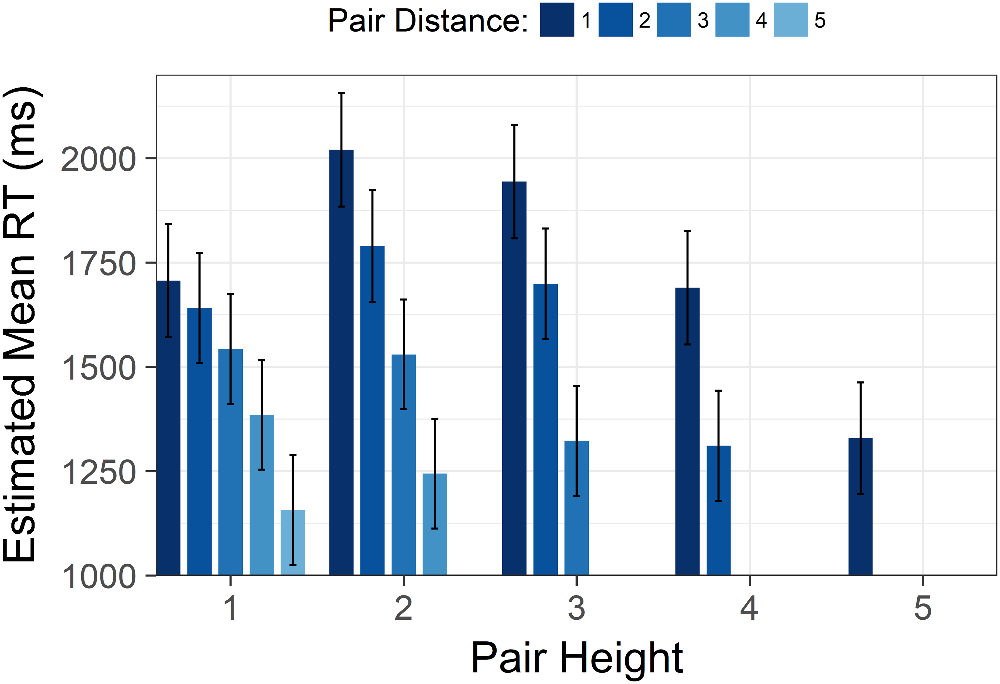

```{r, include=F}
source('_first_chunk.R')
```


# Working with `factor`s

In the previous session we saw how to recode categorical data stored as text variables.
Sometimes, however, categorical data is stored as numbers, code letters,  or True/False values without text labels. 

In these cases we often want to convert the data to a factor, and provide descriptive labels so that plots and tables are easier to read.

For example, in the `funimagery` gender is stored as either `"f"` or `"m"`.


```{r}
funimagery %>%  select(gender) %>% glimpse
```


To convert this to a `factor`, and associate nice labels with each value, we can write:
```{r, echo=F, include=F}
set.seed(123456789)
```

```{r}
funimagery %>%  select(gender) %>% 
  mutate(gender_factor = 
           factor(gender, 
                  levels=c("m", "f"), 
                  labels=c("Male", "Female"))) %>% 
  # sample 4 rows at random to display
  sample_n(4)
```

**Explanation of the code**: We mutate `gender` to a new variable called `gender_factor` using the `factor` function:

- `levels=c("m", "f")`  tells R what values to expect in the data
- `labels=c("Male", "Female")` tells R what labels to use
- `levels` and `labels` need to be provided in the SAME ORDER


:::{.exercise}


The `egger2019` dataset (in `psydata`) includes a variable called `condition` with the values  `2`, `3` and `4` which are respectively the "aerobic", "cognitive", "combination" conditions from [Egger et al 2019](https://www.ncbi.nlm.nih.gov/pmc/articles/PMC6402646/).

- Use `mutate` and `factor` with the `levels` and `labels` arguments to create a new factor column containing assignments to condition.


`r hide("Show answer")`

```{r}
egger2019 %>% 
  # add a new version of condition as a factor
  mutate(condition_fac = factor(condition, 
                                levels=c(2,3,4), 
                                labels = c("aerobic", "cognitive", "combination"))) %>% 
  # show only condition and this new column 
  select(starts_with("condition")) %>% 
  # sample 10 rows at random
  sample_n(10)
```
`r unhide()`


:::


# Alternatives to boxplots

Bar charts are common in psychology, especially to display experimental data with multiple conditions. They often look something like this:

{width=50%}

We _can_ make plots like this in R.  For example here using the `funimagery` data:


```{r, fig.width=3, fig.height=3, echo=F}
funimagery %>%
  pivot_longer(c(kg1, kg2, kg3)) %>% 
  separate(name, into=c(NA, "time"), sep=2) %>% 
  ggplot(aes(intervention, value)) + 
  stat_summary(geom="bar") + 
  stat_summary(geom="errorbar", width=.2, fun.data = mean_cl_normal) +
  labs(y="Weight lost post-intervention (kg)", x="") + facet_grid(~paste("Time", time))
```

However, bar charts are subject to a perceptual biases whereby readers tend to think values _within_ the bar are more likely than those outside (even though this is not the case; e.g. see <https://journals.sagepub.com/doi/full/10.1177/2041669520987254>).


-------------------------


A box plot is often a better alternative, as we have made before.

First we need to make the data long-form:

```{r}
funimagery.long <- funimagery %>%
  pivot_longer(c(kg1, kg2, kg3)) %>% 
  # use sep=2 to break name after the second character
  separate(name, into=c(NA, "time"), sep=2)
```

Then we can plot each timepoint using a facet:

```{r}
funimagery.long %>%
  ggplot(aes(intervention, value)) + 
  geom_boxplot() +
  labs(y="Weight lost post-intervention (kg)", x="") + 
  # use `paste` to add the word 'time' in front of each number
  facet_grid(~paste("Time", time))
```


----------------


However, when we want to show the _average difference_ between groups plotting the full range of data can be
distracting. Sometimes, showing only the mean and standard error _is_ what you want. 

If so, a point-range plot is better. We can generate one using `stat_summary`, which is a bit like `summarise`, except that it applies a new graphic layer to a plot:

```{r, }
funimagery.long %>% 
  ggplot(aes(paste("Time", time), value, color=intervention)) + 
  stat_summary(position=position_dodge(width=.1)) +
  labs(y="Weight lost post-intervention (kg)", x="", color="")
  
```

**Explanation of the code** We replaced `geom_boxplot` with `stat_summary`. In doing so I also set one of the options of `stat_summary`

- I added `position=position_dodge(width=.1)`. This offsets the MI and FIT data very slightly to make the plot more readable (remove it to see for your self the effect it has).


You can improve this plot again by connecting the dots:

```{r, echo=T, include=F}
# re-make the same plot and store it in a variable
previous.pointrange.plot <- funimagery.long %>% 
  ggplot(aes(paste("Time", time), value, color=intervention)) + 
  stat_summary(position=position_dodge(width=.1)) +
  labs(y="Weight lost post-intervention (kg)", x="", color="")
```


```{r}
# add the extra lines to the saved plot
previous.pointrange.plot + 
  stat_summary(geom="line", aes(group=intervention))
```

**Explanation of the code**:

- `previous.pointrange.plot` is a stored copy of the previous ggplot (I stored the plot in this variable)
- I added an *extra* `stat_summary` layer
- In this layer I set `geom="line"` and wrote `aes(group=intervention)`. This adds lines for each intervention group.


:::{.exercise}


- Recreate the boxplot and point-range plots shown above


- Create a new point-range plot using the `grass` dataset with `co2_uptake` on the y axis
- Add colour to that plot


`r hide("Show an example to try and recreate")`

```{r, echo=F}
grass %>% 
  ggplot(aes(strain, co2_uptake, color=temperature)) + 
  stat_summary(fun.data=mean_cl_normal, position=position_dodge(width=.1))
```


`r unhide()`


`r hide("Extension showing how to plot SD rather than SE")`

Here I also add the option `fun.data = mean_cl_normal`. This option determines the *function* applied to the *data* when calculating the error bars. The default is the Standard Error of the mean. It's often more useful to plot the standard deviation though, which is what this option does.


```{r}
funimagery.long %>% 
  ggplot(aes(paste("Time", time), value, color=intervention)) + 
  stat_summary(position=position_dodge(width=.1), fun.data = mean_cl_normal) +
  # connects the dots with lines for each intervention 
  stat_summary(geom="line", aes(group=intervention)) +
  labs(y="Weight lost post-intervention (kg)", x="", color="") 
```
(Notice how the SD is wider than the SE).

`r unhide()`


:::


# Adding lines to a plot

Sometimes it can be helpful to add lines to a plot: for example to show a clinically meaningful
cut-off, or the median of a sample.

For example, let's say we want to make a scatter plot of income in the `earnings` data, but adding a
line showing the median income. First we calculate the median:

```{r}
median_income <-  earnings %>% summarise(median(income)) %>% pull(1)
```

**Explanation**: First, we are defining a new variable to equal the mean income in the sample. We do
this by using `summarise(mean(income))`. The part which reads `pull(1)` says "take the first
column". We need to do this because `summarise()` creates a new table, rather than a single value or
sequence of values (which we need below).


```{r}
earnings %>%
  ggplot(aes(income, y=..scaled..)) +
    geom_density() +
    geom_vline(xintercept = median_income, color="red")
```

**Explanation**: We have regular density plot. This time we have added `geom_vline` which draws a
vertical line. The `xintercept` is the place on the x axis where our line should cross.

:::{.exercise}

- Recreate the plot above
- Change the line to show the `mean` value in the sample


Add a `geom_vline` to a different plot you have already created. This could be either:

-   A calculated value (e.g. `mean(var)`) or
-   A fixed value (e.g. `xintercept = 20`)

:::


You can also add horizontal lines using `geom_hline` and `yintercept=...`. 

For example, this plot shows changes in weight in the funimagery dataset from baseline to end of treatment using `stat_summary` to plot the mean and standard deviation of the change in each group.

```{r}
funimagery %>% 
  ggplot(aes(intervention, kg2-kg1)) + 
  stat_summary(fun.data = mean_cl_normal) +
  geom_hline(yintercept = 0) + 
  labs(y="Change in weight post intervention (kg)")
```


:::{.exercise}

- Recreate the plot above
- Add a *second* line in blue to show the clinically-meaningful threshold of 1kg lost.

As a trickier (extension) exercise, 

- Add a horizontal line in green to indicate a loss of 5% of bodyweight from baseline, on average. (Note that a 5% loss is also considered clinically relevant and would influence NICE decisions to fund a treatment).

:::


# Egger 2019


The `egger2019` dataset in `psydata` is a copy of the SPSS file available at <https://www.ncbi.nlm.nih.gov/pmc/articles/PMC6402646/bin/pone.0212482.s001.sav> 
which reports data from Egger et al, 2019, *Boost your brain, while having a break! The effects of long-term cognitively engaging physical activity breaks on children’s executive functions and academic achievement*.

> Children were allocated to a 20-week exercise program, with either high physical exertion and high cognitive engagement (combo group), high physical exertion and low cognitive engagement (aerobic group), or low physical exertion and high cognitive engagement (cognition group).  

The study outcomes included scores for maths (variables prefixed `hrt`), spelling (`hsp`)  and reading (`sls`) scores were measured at two time points, before and after the intervention. For example, maths at time 1 was `hrt_t_wert_gesamt_1` and reading at time 2 was `sls_lq_2`.

In the dataset, study conditions 2, 3 and 4 in the dataset are respectively "aerobic", "cognitive", "combination".


:::{.exercise}

- Read in the data from the URL above using `import` from the `rio` package
- All the data you need are shown below. Create a new variable containing this subset of the data

```{r, echo=F}
egger.subset <- egger2019 %>% 
  select(id, condition, gender, matches('sls|hrt|hsp')) 
egger.subset %>% glimpse(width=80)
```

:::


In the exercises which follow you will create a figure similar (but not identical) to that shown in Fig. 2 of the paper (see <https://journals.plos.org/plosone/article/figure?id=10.1371/journal.pone.0212482.g002>) and in Table 3 (see <https://journals.plos.org/plosone/article/figure?id=10.1371/journal.pone.0212482.t003>).

First you will need to reformat the data.

## Reformatting the data.


Use tidyverse commands including `pivot_longer`, `separate` and `mutate` to create the tables below. Each table is an *intermediate* step on the way to a data-format you can use to make the plot.

:::{.exercise}

### Step 1

```{r, echo=F}
step1 <- egger.subset %>% 
  set_names(c("id", "condition", "gender", "maths_1", "maths_2", "spelling_1", "spelling_2", "reading_1", "reading_2")) %>% 
  pivot_longer(c(-id, -condition)) 
step1 %>% head(12)
```

`r hide("Which functions do I need to use?")`

You will need:

- `select`
- `rename`
- `pivot_longer`

`r unhide()`

:::


:::{.exercise}

### Step 2

```{r, echo=F}
step2 <- step1 %>% 
  mutate(condition=factor(condition, levels=2:4, labels=c("aerobic", 'cognitive', 'combination'))) %>% 
  separate(name, into=c("variable", "time")) 
step2 %>%  head(12)
```


`r hide("Which functions do I need to use?")`

You will need:

- `mutate` and `factor`
- `separate`

`r unhide()`


:::


:::{.exercise}

### Step 3

To produce this table you will need to use these functions: `group_by`, `summarise`, and `diff`.

Note: we haven't used `diff` before, but like other functions like `mean` it accepts the name of a column to act on. It returns the *difference* between values in adjacent rows.

```{r, echo=F, message=F, warning=F}
step3 <- step2 %>% 
  group_by(id, condition, variable) %>% 
  arrange(id, time) %>% 
  summarise(pre_post_difference = diff(value))

step3 %>%
  head(6)
```


`r hide("I'm stuck, show me how to do this step")`


Assuming you have data as expected from step 2:

```{r, eval=F, echo=T, message=F, warning=F}
step3 <- step2 %>% 
  group_by(id, condition, variable) %>% 
  summarise(pre_post_difference = diff(value))
```


`r unhide()`

:::


## Making the plot


:::{.exercise}

Once you have the data from step 3 above, you should be able to make a plot like the one below:

```{r, echo=F}
step3 %>% 
  ggplot(aes(condition, pre_post_difference)) + geom_boxplot() + facet_wrap(~variable, scales = "free") +
  labs(x="", y="Change from pre to post score")
```


`r hide("Which R functions do I need to use?")`

You will need:

- `ggplot`
- `aes`
- `geom_boxplot`
- `facet_grid` or `facet_wrap`
- `labs`


`r unhide()`


:::


## Alternative plots

In their original paper Egger et al plot the mean and standard deviation of the mean, rather than using 
a box-plot.

However as we saw above we can use point-range plots to plot these same data.

:::{.exercise}

- Use `stat_summary` (as shown above) to plot the mean and standard errors, as shown in Egger Figure 2 (an example is shown below).


`r hide("Show me what that looks like")`

```{r, echo=F}
step3 %>% 
  ggplot(aes(condition, pre_post_difference)) + stat_summary() + facet_wrap(~variable, scales="free") +
  labs(x="", y="Change from pre to post score") + 
  geom_hline(yintercept=0)
```


`r unhide()`


:::


# Knitting RMarkdown


A neat feature of RMarkdown is that you can 'knit' your file to produce an finished HTML or PDF report. This combines:

- Your code
- The output of your code


So, your code becomes self-documenting. You can share both the `rmd` and the finished output.


### How to knit

Simply press the "knit" button in the menu at the top of the page. It looks like this:


You should see some messages whizzing by, and then an finished version of your report will appear.

You will have either an HTML file or PDF in the same directory as your Rmd file. This can be viewed/shared.


### How to fix the (inevitable) errors

Always remember: R is a dumb robot. It will do **exactly** what you say, even if that doesn't make sense.

If you have errors when knitting check that ***your code would work if you ran it in order from top to bottom***.

Especially check:

- You load libraries like tidyverse in the first chunk
- You import or create datasets BEFORE you use them

A good debugging technique is to go to the "Session" menu, and click "Restart R".

Then go to the first chunk in your file and run each chunk in turn, fixing errors as they arise. Once you get to the bottom of the file with all errors fixed your Rmd file should knit.


<!-- Add video showing debugging of this -->


