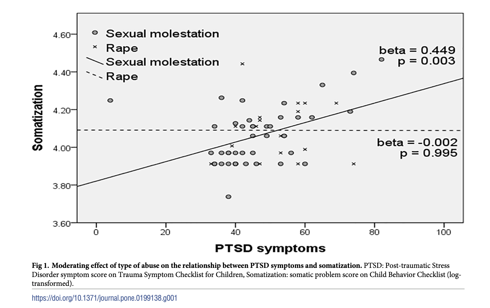

```{r, include=F}
source('_first_chunk.R')
```


](images/Clm_14436_ecliptic_diagram.png)

----------------


<!-- TODD

better explanation of facets
more problems at the end

check your knowledge questions
revision exercises...

-->


<!--

## Learning outcomes

At the end of the session you should be able to:

1. Use graphical tools in R to visualise linear relationships and group
   differences.

2. Explore visualisation strategies for situations where linear relationships
   and group differences occur together in the same dataset (e.g. grouping with
   color).

3. Transform data, creating new columns using logical operators and string
   comparison.
 -->


:::{.exercise}

Before your start, use the files pane to make a new folder on the RStudio server to save your work. Call this `datafluency_2021`. 

Inside this new folder,  make a new RMarkdown file (use the 'file' menu and choose 'new'). When you save the file make sure it has the extension `.rmd`, so call it `datavis.rmd` for example.

Use this new `.rmd` file to save your work during this session.


<iframe width="560" height="315" src="https://www.youtube-nocookie.com/embed/Ek9rFSAq3QU" title="YouTube video player" frameborder="0" allow="accelerometer; autoplay; clipboard-write; encrypted-media; gyroscope; picture-in-picture" allowfullscreen></iframe>

:::


In the session we watched Hans Rosling's "200 countries and 200 years
in 4 minutes", which we (hopefully) agreed is something to aspire to.
Combined with his enthusiastic presentation, the visualisations in this clip support a clear narrative
and help us understand this complex dataset.


<iframe width="640" height="360"
src="https://www.youtube.com/embed/jbkSRLYSojo"
frameborder="0" allow="autoplay; encrypted-media" allowfullscreen></iframe>

The plot he builds plot is interesting because it uses many different visual attributes (aesthetics) to express features in the data:

-   X and Y axes
-   Size of the points
-   Colour
-   Time (in the animation)

These features are carefully selected to highlight important features of the data and support the
narrative he provides. Although we need to have integrity in our plotting (we saw bad examples in the session), this narrative aspect of a plot is important: we always need to consider our audience.


## Multi-dimensional plotting

This sounds fancy, but as we saw it just means linking different visual or perceptual features of a plot to different variables in the data.

<!-- We can determine how complex a plot is by how many **dimensions** it has. -->

<!-- For example, this plot has one dimension representing how revolting particular fruits and vegatables -->
<!-- are: -->


<!-- ``` -->
<!-- Mango    Pear                 Aubergine                         Snozzcumber -->
<!-- |        |                    |                                 | -->
<!-- ————————————————————————————————————————————————————————————————— -->
<!-- ``` -->


<!-- Scatter plots are _more_ complex because they have two dimensions --- that is, they show two -->
<!-- variables at once. The variables are represented by the position of each point on the X and Y axes: -->

<!-- ```{r, echo=F, fig.cap="Life expectancy and GDP per capita in countries around the world in 2002"} -->
<!-- development %>% -->
<!--   filter(year==2002)  %>% -->
<!--   ggplot(aes(gdp_per_capita, life_expectancy)) + geom_point() -->

<!-- ``` -->


And Rosling's plot is appealing/informative because it adds multiple dimensions of colour and size, and uses a
special [**logarithmic** scale](https://blog.datawrapper.de/weeklychart-logscale/) for the x-axis.

```{r, echo=F}
rosling1 <- development %>%
  filter(year==2002)  %>%
  ggplot(aes(gdp_per_capita, life_expectancy, size=population/1000000, color=continent)) + geom_point() +
  scale_x_log10() + scale_size("Population (millions)") + scale_color_discrete("")
rosling1
```


### Defining dimensions/aesthetics in `ggplot` {#dimsinggplot}

As a reminder: `ggplot` uses the term **aesthetics** to refer to different dimensions of
a plot. '_Aesthetics_' refers to 'what things look like', and the `aes()` command in `ggplot`
creates links between variables (columns in the dataset) to visual features of the plot. 
This is called a **mapping**.

There are x visual features (aesthetics) of plots we will use in this session:

-   `x` and `y` axes
-   `colour`
-   `size` (of a point, or thickness of a line)
-   `shape` (of points)
-   `linetype` (i.e. dotted/patterned or solid)


## Recreate the Rosling plot

:::{.exercise}

Rosling's plot looked something like this:

```{r, include=T, echo=F, message=F, error=F}
rosling1 +
  labs(size="Population (millions) ", color="", x="Log GDP Per Capita", y="Life expectancy (years)") +
  ggtitle("World life expectancy and incomes in 2002")
```


To create a (slightly simplified) version of the plot above, the code would look something like
this:

```{r, eval=F, echo=T}
development %>%
  filter(BLANK==BLANK)  %>%
  ggplot(aes(x=BLANK,
             y=BLANK,
             size=BLANK,
             color=BLANK)) +
  geom_point()
```

I have removed some parts of the code. Your job is to edit the parts which say `<BLANK>` and replace
them with the names of variables from the `development` dataset (available in the `psydata` package).

Some hints:

-   Check the title of the figure above to work out which rows of the data you need to plot (and so
    define the filter)
-   All the `BLANK`s represent variable names in the dataset. You can see a list of the column names available by typing `glimpse(development)`
-   Use `mutate` to alter the `population` column to represent *millions*
- If you are confused by the `filter(BLANK==BLANK)` check the title of the plot above. Remember that `filter` selects particular rows from the data, so we can use it to restrict what is shown. What data do we need to select for *this* plot? 


:::


# Using multiple layers

When visualising data, there's always more than one way to do things. As well as plotting different
dimensions, different _types_ of plot can highlight different features of the data. In ggplot,
different types of plots are called **geometries**. Multiple layers can be combined in the same
plot by adding together commands which have the prefix `geom_`.

As we have already seen, we can use `geom_point(...)` to create a scatter plot:

```{r echo=F, fig.cap="Life expectancy and GDP in Asia"}
development %>% filter(continent=="Asia") %>%  ggplot(aes(life_expectancy, gdp_per_capita)) + geom_point()
```

To add additional layers to this plot, we can add extra `geom_<NAME>` functions. For example,
`geom_smooth` overlays a smooth line to any x/y plot:

```{r}
development %>%
  filter(continent=="Asia") %>%
  ggplot(aes(life_expectancy, gdp_per_capita)) +
  geom_point() +
  geom_smooth()
```

**Explanation of the command**: We added `+ geom_smooth()` to our previous plot. This means we now
have two geometries added to the same plot: `geom_point` and `geom_smooth`.

**Explanation of the output**: If you run the command above you will see some warning messages which
say `geom_smooth() using method = 'gam' and formula 'y ~ s(x, bs = "cs")'`. You can ignore this for
the moment. The plot shown is the same as the scatterplot before, but now has a smooth blue line
overlaid. This represents the local-average of GDP, for each level of `lifeExp`. There is also a
grey-shaded area, which represents the standard error of the local average (again there will be
[more on this later](#plotting-intervals)).


:::{.exercise}


### Make a smoothed-line plot

1. Use the `earnings` dataset from `psydata`. Create a scatter plot of any two
   continuous variables.

2. Add a smoothed line to the plot using `geom_smooth()`

3. Add the colour or size aesthetics to the plot above (i.e., using a third column of data)

:::


<!-- ### Summary of this section -->

<!-- -   `ggplot` doesn't restrict you to a single view of the data -->
<!-- -   Plots can have multiple layers, presenting the same data different ways -->
<!-- -   Each layer is called a 'geometry', and the functions to add layers all start with `geom_` -->
<!-- -   Smoothed-line plots show the *local average* -->


# Making a straight-line plot


`geom_smooth()` can use a variety of different methods to calculate where to draw the line through the points.

One useful feature is that we can use a *linear model* to draw a straight line through the points. These straight lines are the same as those calculated by a ***regression model***, which we cover in more detail later in the course.

Adding a straight line is a helpful way to check if the *assumption of linearity* made by correlations (and regression) is valid.

For example, if we add a line to a plot of `power` and `mpg` in the `fuel` dataset, we can see that a straight line *doesn't* fit the data all that well:


```{r}
fuel %>% 
  ggplot(aes(power, mpg)) + 
  geom_point() + 
  geom_smooth(method=lm, se=F)
```


**Explanation of the code**: We used `geom_smooth()` as before, but added `method=lm` to force R to draw a straight line. We also added `se=F` to remove the shaded area representing the *standard error* of the line.

**Explanation of the output**: The plot features a straight line, rather than a  smooth curve. We can see more clearly that the relationship between `power` and `mpg` is NOT linear (so using a correlation would not be appropriate).


:::{.exercise}

1. Draw a plot using the `funimagery` data showing the relationship between `kg1` and `kg2`. Add a straight line to this plot.

2. Do these variables exhibit a linear relationship? `r webex::mcq(c(answer="Yes", "No"))`

`r hide("Show the plot")`

We can see that a straight line describes the relationship quite well. All points are clustered on the line.

```{r, echo=F}
funimagery %>% 
  ggplot(aes(kg2, kg1)) + geom_smooth(method=lm, se=F) + geom_point()
```

`r unhide()`

:::


# Facets

As we add layers our plots become more complex. We run into trade-offs between information density and
clarity.

To give one example, this plot shows life expectancies for each country in the gapminder data,
plotted by year:


```{r}
development %>%
  ggplot(aes(year, life_expectancy, group=country)) +
  geom_smooth(se=FALSE)
```

**Explanation**: This is another x/y plot. However this time we have not added points, but rather
smoothed lines (one for each country).

**Explanation of the code**:We have created an x/y plot as before, but this time we only added
`geom_smooth` (and not `geom_point`), so we can't see the individual datapoints. We have also added
the text `group=country` which means we see one line per-country in the dataset. Finally, we also
added `se=FALSE` which hides the shaded area that `geom_smooth` adds by default representing the standard error of the line.

**Comment on the result**: It's pretty hard to read!


----------------


To increase the information density, and explore patterns within the data, we might add another
dimension and aesthetic. The next plot colours the lines by continent:

```{r}
development %>%
  ggplot(aes(year, life_expectancy, colour=continent, group=country)) +
  geom_smooth(se=FALSE)
```

However, even with colours added it's still a bit of a mess. We can't see the differences between
continents easily. To clean things up we can use a technique called **facetting**:

```{r fig.height=3}
development %>%
  ggplot(aes(year, life_expectancy, group=country)) +
  geom_smooth(se=FALSE) +
  facet_grid(~continent)
```


**Explanation**: We added the text `+ facet_grid(.~continent)` to our earlier plot, but removed the
part that said `color=continent`. This made `ggplot` create individual _panels_ for each continent.
Splitting the graph this way makes it somewhat easier to compare the differences _between_
continents.


:::{.exercise}


### Use facetting

Use the `iris` dataset which is built into R.


```{r, echo=F}
iris %>%
  ggplot(aes(Sepal.Length, Petal.Length)) +
  geom_point()  +
  geom_smooth() +
  facet_grid(~Species)
```


1. Try to recreate the plot just above, by adapting the code explained previously.

1. Create a new plot which uses colours to distinguish species and does not use Facets

1. In this example, which plot do you prefer? What influences when facets are more useful the just
   using colour?


`r hide("Show answer")`

There's no right answer here, but for this example I prefer the coloured plot to the faceted one.
The reason is that there are only 3 species in this dataset, and the points for each don't overlap
much. This means it is easy to distinguish them, even in the combined plot. But, if there were
_many_ different species it might be helpful to use facets instead.

Our decisions should be driven by what we are trying to communicate with the plot. What was the
research question that motivated us to draw it?

`r unhide()`

1. Try replacing `facet_grid(~continent)` with `facet_grid(continent~.)`. What happens?

1. With the `development` example from above, try replacing `facet_grid` with
   `facet_wrap(~continent)`. What happens?

1. To see more facetting examples, see
   [the `ggplot` cookbook documentation](<http://www.cookbook-r.com/Graphs/Facets_(ggplot2)/>).


:::


# Spit and polish

`ggplot` is great at setting sensible defaults for most things (axes, colours etc). When exploring your data these defaults typically suffice. But for publication you will need to polish your plots, perhaps including:

-   Label your plot axes
-   Add lines or text
-   Change plot colours etc
-   Saving to a pdf or other output format

## Labelling axes

By default, `ggplot` uses variable names and the values in your data to label plots. Sometimes these
are abbreviations, or otherwise need changing.

To relabel axes we simply add the `labs(...)` function to an existing plot:

```{r}
mtcars %>% ggplot(aes(wt, mpg, colour=factor(cyl))) +
  geom_point() +
  labs(x="Weight (1000s of lbs)", 
       y="Fuel economy (miles per gallon)", 
       color="Cylinders")
```

:::{.exercise}

Try adding axis labels to one of your existing plots.

:::


## Adding lines

Sometimes it can be helpful to add lines to a plot: for example to show a clinically meaningful
cutoff, or the mean of a sample.


For example, let's say we want to make a box plot of weight lost in the `funimagery` dataset, but add a line at zero to provide a reference point for readers. We can achieve this like so:


```{r}
funimagery %>% 
  ggplot(aes(intervention, weight_lost_end_trt)) + 
  geom_hline(yintercept = 0, linetype="dotted") + 
  geom_boxplot() 
  
```


**Explanation of the code** This time we have added `geom_hline` which draws a
**h**orizontal line. The `yintercept` is the place on the y axis where our line should cross (i.e. zero). If we had wanted a vertical line (e.g. on a density plot or histogram) we would have used `geom_vline(xintercept=?)` instead of `geom_hline`.


**Explanation of the output**: We now have a boxplot with a horizontal line at zero. This makes it easy for readers to compare positions in the plot with this meaningful value which represents "no change".


## Saving plots to a file

So far we have created plots in the RStudio web interface. This is fine when working interactively,
but sometimes you need to save the plot to a file (e.g. to send to a journal).

The `ggsave` function lets us do this.

The first step is to make a plot, and save it (give it a name, like `myfunkyplot`).

```{r, echo=F, include=F}
set.seed(1234)
```

```{r}
myfunkyplot <- fuel  %>% 
  ggplot(aes(weight, mpg, color=factor(cyl))) + 
  geom_point()
```

**Explanation**: We used the assignment operator `<-` to save our plot to a new name
(`myfunkyplot`). This means that when we run the code RStudio won't generate any output immediately,
so we don't see the plot yet.

---

Next, we use `ggsave` to save the plot to a particular file:

```{r}
ggsave('myfunkyplot.pdf', myfunkyplot, width=8, height=4)
```

You can see the output of the `ggsave` command by downloading the file from the files directory of your RStudio window. It will end up in the same place as your R script.


:::{.exercise}

Try the following with plots you have already made:

1. Add axis labels
2. Add a horizontal line to a scatter plot at a fixed value (e.g. at zero, or some other score).
3. If your plot uses colour, change the label of the color legend
4. Save a copy of this plot to a `png` file, and also to a `pdf` and download these files to your local computer.

:::


# 'Real world' tasks


:::{.exercise}

1. Use the `fuel` data. Make two plots which show the relationship between engine size and power. In the first, use colour to distinguish cars with different numbers of gears. In the second use facets to make the same distinction. 

1. Which do you think is more helpful and why?


:::


:::{.exercise}


1. Is there a relationship between age and weight-lost in the `funimagery` data? Make a plot to explore this.

2. Is the pattern consistent between genders and intervention groups? Which additional plots are most helpful to check this?


```{r, include=F, echo=F}
psydata::fuel %>% 
  ggplot(aes(engine_size, power, color=factor(gear))) + 
  geom_point()
```


:::


:::{.exercise}

@bae2018ptsd reported findings on somatisation and PTSD in children who had been abused. From the abstract:


>Purpose. Somatization is a major post-traumatic symptom in sexually abused children. Thus, the present study aimed to determine the relationship between post-traumatic stress disorder (PTSD) symptoms and somatization, and between intelligence and somatization in child sexual abuse victims and to elucidate whether type of abuse had an effect on the relationship between PTSD symptoms and somatization.

>Methods. This study evaluated the somatizations (Child Behavioral Checklist/6–18 [CBCL]), PTSD symptoms (Trauma Symptom Checklist for Children [TSCC]), and intelligence levels of 63 sexually abused children. Correlation and regression analyses were performed to predict somatization based on PTSD symptoms, intelligence, age, and type of sexual abuse, and to find moderating effect of type of abuse on the effect of PTSD symptom on somatization.

>Results. PTSD symptoms (β = 0.471, p = 0.001) and intelligence (β = 0.327, p = 0.021) were associated with somatization. Type of abuse was not, by itself, correlated with somatization (β = 0.158, p = 0.281), but it did have a moderating effect on the effect of PTSD symptoms on somatization (Type of abuse*PTSD symptoms, β = -0.299, p = 0.047). PTSD symptoms were associated with somatization only among those who experienced the molestation type of abuse.

>Conclusions. Somatization in sexually abused children was influenced by the severity of PTSD symptoms and intelligence, and the effect of the PTSD symptoms on somatization was moderated by type of abuse. Specifically, the rape type of abuse may attenuate the effect of post-traumatic symptoms on somatization.


1. Using the `bae2018` dataset (in `psydata`) reproduce the figure below, but using color instead of different point shapes and line-types to represent the types of abuse. Don't worry about the added text for now.  You will find that the slopes on your plot don't extend all the way across the figure — this doesn't matter either.

2. Use the tips in the *spit and polish* section to label your plot and save a copy as a pdf.





```{r, echo=F, include=F}
bae2018 %>% 
  ggplot(aes(tscc_pts, cbcl_som, color=type_of_abuse)) + 
  geom_point(position = position_jitter()) + geom_smooth(method="lm", se=F)
```


:::


# Extension exercises


## Adding text 

To learn how to add text to a plot, see this brief guide:

<http://www.sthda.com/english/wiki/ggplot2-texts-add-text-annotations-to-a-graph-in-r-software>

:::{.exercise}


1. Try adding text to your new version of Bae et al. Figure 1 which includes the text from the original (note that the original Figure itself is a little misguided in providing two separate *p* values — but we will deal with that in a later workshop).

:::


## Publication-ready plots

Some journals have specific requirements for submitting journals; common ones include submitting in
particular formats (e.g. pdf or tiff), using particular fonts etc.

There are also some common types of plots which ggplot almost, but not quite, makes out of the box.

When trying to go the last mile and polish plots for publication several additional packages may be
useful. 

:::{.exercise}

If you have time, you could work through some of the examples on this page

-   ggpubr:
    http://www.sthda.com/english/articles/24-ggpubr-publication-ready-plots/78-perfect-scatter-plots-with-correlation-and-marginal-histograms/


Try applying the same techniques to some of the built-in datasets, or any other data you have.

:::


## Tufte-style plots

As mentioned in the session, Edward Tufte's books have been influential in the field of data
visualisation. His book 'The display of quantitative information' [@tufte2001visual] is a great
resource and guide.

:::{.exercise}

http://motioninsocial.com/tufte/ shows how to implement many of Tufte's ideas in ggplot. It
would be a nice exercise to work through this, and attempt to plot some of `psydata` or your own data in this
style.

:::


<!-- For the PPT Slides -->


```{r, echo=F, include=F}
# for slides

development %>% sample_n(10)

development %>% 
  ggplot(aes(year, life_expectancy)) + 
  geom_point()


development %>% 
  ggplot(aes(year, life_expectancy)) + 
  geom_point(alpha=.2)


development %>% 
  ggplot(aes(year, life_expectancy)) + 
  geom_point(position=position_jitter()) 


development %>% 
  ggplot(aes(year, life_expectancy)) + 
  geom_point(position=position_jitter()) + 
  geom_smooth()


# adding layers
development %>% 
  ggplot(aes(year, life_expectancy, color=continent)) + 
  geom_point() + 
  geom_smooth()


development %>% 
  ggplot(aes(year, life_expectancy, color=continent)) + 
  geom_point(position=position_jitter()) + 
  geom_smooth()

development %>% 
  ggplot(aes(year, life_expectancy)) + 
  geom_point(position=position_jitter(), alpha=.5) + 
  geom_smooth()

development %>% 
  ggplot(aes(year, life_expectancy, color=continent)) + 
  geom_point(position=position_jitter(), alpha=.6, ) +  
  geom_smooth(se=F) + theme_minimal() + scale_color_discrete("")


# rosling worked example

development %>%
  ggplot(aes(gdp_per_capita, life_expectancy)) + geom_point() 


development %>%
  filter(year==2002) %>% 
  ggplot(aes(gdp_per_capita, life_expectancy)) + geom_point() 


development %>%
  filter(year==2002) %>% 
  ggplot(aes(gdp_per_capita, life_expectancy, size=population/1000000)) + geom_point() 

development %>%
  filter(year==2002) %>% 
  ggplot(aes(gdp_per_capita/1000, life_expectancy, color=continent, size=population/1000000)) + geom_point() +
  scale_x_log10() 


development %>%
  filter(year==2007|year==1952)  %>%
  ggplot(aes(gdp_per_capita/1000, life_expectancy, size=population/1000000, color=continent)) + geom_point() +
  scale_x_log10() + scale_size("Population (millions)") + scale_color_discrete("") +
  facet_wrap(~year) + labs(x="GDP Per Capita (thousands)", y='Life expectancy')


```


# References