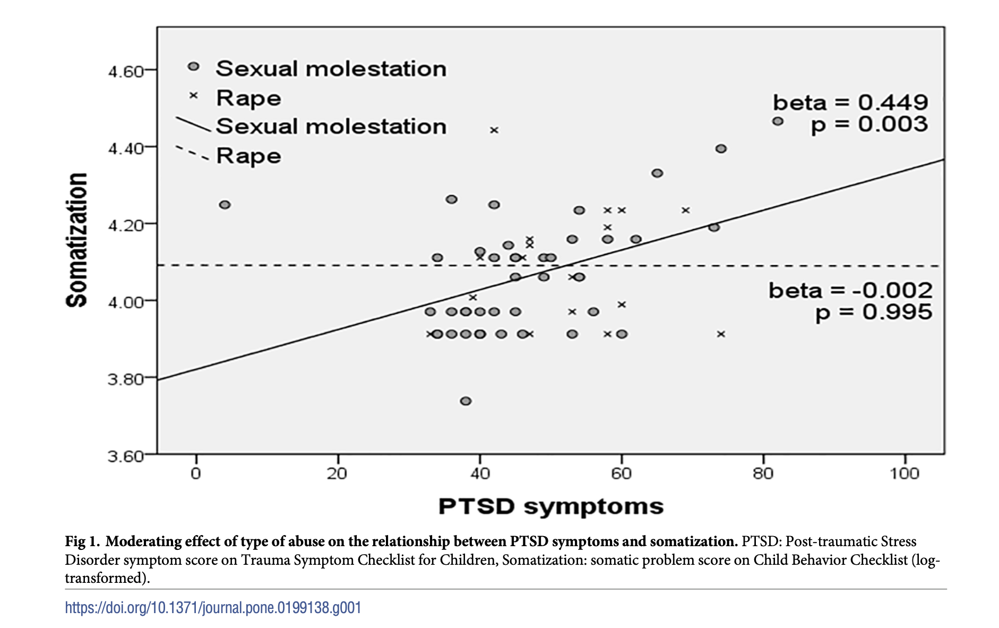

```{r, include=F, echo=F, message=F}
source('_first_chunk.R')
```


](images/Clm_14436_ecliptic_diagram.png)

----------------


3. Using the `kang2018` dataset (in `psydata`) reproduce the figure below (don't worry about the added text for now).




```{r}
kang2018 %>% 
  ggplot(aes(tscc_pts, cbcl_som, color=type_of_abuse)) + 
  geom_point(position = position_jitter()) + geom_smooth(method="lm", se=F)
```


```{r}

bmi %>% 
  filter(eq5d<1) %>% 
  ggplot(aes(bmi, eq5d)) + geom_smooth(method=lm) + 
  # geom_point(alpha=.05, position=position_jitter()) +
   facet_grid(~cut(age,8))

```


# Comparing categories

In the examples above we have been plotting continuous variables (and adding colours etc). We've
used density, scatter and smoothed line plots to do this.

Another common requirement is to use plots to compare summary statistics for different groups or
categories. For example, the classic plot in a psychology study looks like this:

```{r, echo=F, width=6, height=3}
set.seed(1234)
expdata <- expand.grid(Condition=LETTERS[1:3], stimuli=1:4, p=1:20) %>%
  mutate(RT = -200+rnorm(n(), 25 + 5*as.numeric(Condition=="A") + -4*as.numeric(stimuli==1), 6)^2, stimuli=factor(stimuli, labels=paste0("S", 1:4)))
write_csv(expdata, 'data/expdata.csv')
expdata <- read_csv('data/expdata.csv')
expdata %>%
  ggplot(aes(Condition, RT)) +
  stat_summary(geom='bar', fun.data=mean_se) +
  stat_summary(geom="errorbar", width=.2, fun.data=mean_se) + facet_wrap(~paste("Stimuli", stimuli))

```

However, there is evidence that readers often misinterpret bar plots. Specifically, the problem is
that we perceive values _within_ the bar area as more _likely_ than those just above, even though
this is not in fact the case.

A better choice is (almost always) to use a boxplot:

```{r}
expdata  %>%
  ggplot(aes(x=stimuli, y=RT)) + geom_boxplot()
```

**Explanation**: We used `Condition`, a category, as our x axis, and reaction times as the y axis.
We added `geom_boxplot` to show a boxplot.

:::{.tip}

If you're not familiar with boxplots, there are more details in the help files (type `?geom_boxplot`
into the console) or use the [wikipedia page here](https://en.wikipedia.org/wiki/Box_plot)

:::

:::{.exercise}

Load the (simulated) dataset called `expdata.csv`.

Either download the file and upload to your Rstudio project directory, or read it directly from this url: <https://gist.githubusercontent.com/benwhalley/f94baf447612e2434b181739dbba27df/raw/43df26022fff68f49918c795f27d7352dc0d3425/expdata.csv>

-   Recreate the boxplot above
-   Use a facet to recreate the plot you saw above, combining both `Condition` and `Stimuli`

:::


## Other data summary layers

If you _really_ need to plot the mean and standard error of different categories, ggplot has the
`stat_summary` command:

```{r}
expdata %>%
  ggplot(aes(Condition, RT)) + stat_summary()
```

**Explanation**: We used `Condition` and `RT` as our x and y axes, as before. This time we added
`stat_summary()` instead of `geom_boxplot()`. By default this plots the mean and standard error (a
measure of variability) in each group, using a **point-range plot**. This is better than a bar chart
because it avoids a known bias in how we read them. You can ignore the warning about
`No summary function supplied, defaulting to mean_se()` for now.

:::{.exercise}

As an extension exercise:

-   Adapt your facetted boxplot from above to show the mean and standard error instead
-   Can you combine both boxplot and summary in a single plot?

:::


# Spit and polish

Ggplot is great because it sets sensible defaults for most things (axes, colours etc). When you are
exploring your data these defaults typically suffice. However for publication you will often need to
polish up your plots, perhaps including:

-   Label your plot axes
-   Add lines or text
-   Change plot colours etc
-   Saving to a pdf or other output format

## Labelling axes

By default, ggplot uses variable names and the values in your data to label plots. Sometimes these
are abbreviations, or otherwise need changing.

To relabel axes we simply add `+ xlab("TEXT")` or `+ ylab("TEXT")` to an existing plot:

```{r}
mtcars %>% ggplot(aes(wt, mpg)) +
  geom_point() +
  xlab("Weight (1000s of lbs)") +
  ylab("Fuel economy (miles per gallon)")
```

:::{.exercise}

Try adding axis labels to one of your existing plots.

:::

## Changing the label of color/shape guidelines

:::{.tip}

If you are short of time you can treat the rest of this section like an extension exercise. It might
be useful for your own work, but won't form part of the assessment.

:::

When adding the colour aesthetic, ggplot uses the variable name to label the plot legend. For
example:

```{r fig.width=3, fig.height=2}
mtcars %>%
  ggplot(aes(wt, mpg, colour=factor(cyl))) +
  geom_point()
```

The generated legend label sometimes looks ugly (like above) but this is easy to fix:

```{r fig.width=3, fig.height=2}
mtcars %>%
  ggplot(aes(wt, mpg, colour=factor(cyl))) +
  geom_point() +
  labs(color="Cylinders")
```

**Explanation**: We added `labs(color="Cylinders")` to the plot to change the legend label.

:::{.exercise}

Try relabelling the colour legend of one of your existing plots.

:::


## Adding lines

Sometimes it can be helpful to add lines to a plot: for example to show a clinically meaningful
cutoff, or the mean of a sample.

For example, let's say we want to make a scatter plot of income in the `cps2` data, but adding a
line showing the median income. First we calculate the median:

```{r}
library(psydata)
median_income <-  earnings %>% summarise(median(income)) %>% pull(1)
```

**Explanation**: First, we are defining a new variable to equal the mean income in the sample. We do
this by using `summarise(mean(income))`. The part which reads `pull(1)` says "take the first
column". We need to do this because `summarise()` creates a new table, rather than a single value or
sequence of values (which we need below).

```{r}
earnings %>%
  filter(income < 150000) %>%
  ggplot(aes(income, y=..scaled..)) +
    geom_density() +
    geom_vline(xintercept = median_income, color="red")
```

**Explanation**: We have regular density plot. This time we have added `geom_vline` which draws a
vertical line. The `xintercept` is the place on the x axis where our line should cross.

:::{.exercise}

Add a `geom_vline` to a plot you have already created. This could be either:

-   A calculated value (e.g. `mean(var)`) or
-   A fixed value (e.g. `xintercept = 20`)

:::


## Saving plots to a file

So far we have created plots in the RStudio web interface. This is fine when working interactively,
but sometimes you will need to send a high-quality plot to someone (perhaps a journal).

The `ggsave` function lets us do this.

The first step is to make a plot, and save it (give it a name).

```{r}
myfunkyplot <- fuel  %>% ggplot(aes(weight, mpg, color=factor(cyl))) + geom_point()
```

**Explanation**: We used the assignment operator `<-` to save our plot to a new name
(`myfunkyplot`). This means that when we run the code RStudio won't geneate any output immediately,
so we don't see the plot yet.

---

Next, we use `ggsave` to save the plot to a particular file:

```{r}
ggsave('myfunkyplot.pdf', myfunkyplot, width=8, height=4)
```

You can see the output of the `ggsave` command by downloading the file from the files directory of your RStudio window. It should end up in the same place as your R Script, provided you have created  a project (and you should always create a project).


------------

All content on this site is distributed under a [Creative Commons](https://creativecommons.org/)
licence. CC-BY-SA 4.0.
