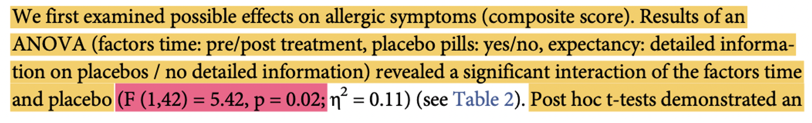
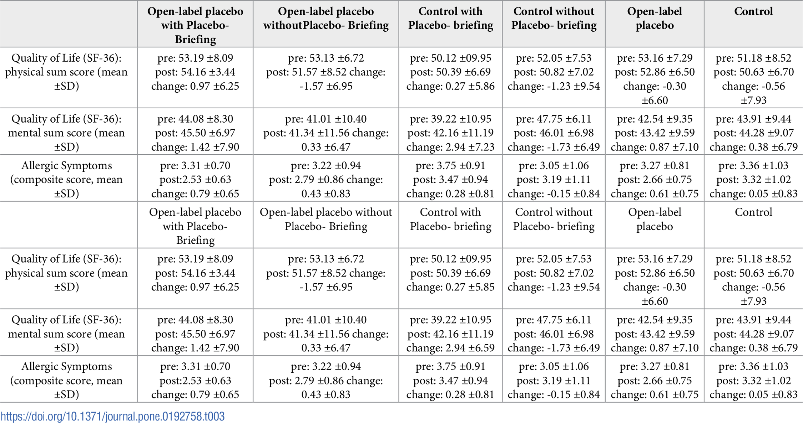

```{r, echo=F, include=F}
knitr::opts_chunk$set(echo = TRUE, collapse=TRUE, cache=TRUE, comment=">", message=FALSE)
library(tidyverse)
library(webex)
library(pander)
theme_set(theme_minimal())
```


> Reproducing a published analysis of data that authors have shared is an important 
> part of open science. Published reports are often quite sparse, and journals don't 
> provide enough space for exploratory analyses, alternative formulations models, or for sensitivity analyses.

> Replicating a published analysis is important in it's own right (because it gives us)
> more confidence in the results. But it can also be useful in developing new research
> or making new discoveries based on existing data. Researchers conducing systematic
> reviews may also want to replicate analyses to obtain additional information — e.g.
> data on effect sizes or variability — to use in meta analyses.

> Replicating published analyses can often be surprisingly tricky. Authors often don't provide full
> information about their data processing or model specification, so it can take some guesswork.
> It's also quite common to find errors in published analyses, which can be confusing.

> The final coursework assignment for this module is to try and replicate a published analyses. 
> Our intention is that this experience will give you a realistic experience of working with real data,
> and also an heightended awareness of the value of adopopting good practices for open and replicable science.


<!---

Example code for the tables exercise

wing_preproc <- read_csv('picture-naming-preproc.csv')
wing_preproc %>% head() %>% pander(split.table = Inf)

task_by_subj <- wing_preproc %>%
  pivot_longer(cols = c(nc, np, pc, pp),
               names_to = 'task',
               values_to = 'correct') %>%
  select(subj, gender, cards, task, correct)

task_by_subj %>% head(5) %>% pander()


descript <- task_by_subj %>%
  group_by(task, gender) %>%
  summarise(mean = mean(correct, na.rm = TRUE), 
            sd = sd(correct, na.rm = TRUE))


# our task names don't look so good
descript

descript.nicer <- descript %>%
  mutate(task = recode(task, 
                       nc = 'Noun Comprehension',
                       np = 'Noun Production',
                       pc = 'Predicate Comprehension',
                       pp = 'Predicate Production'  ))

descript.nicer


# apa tables are wide
descript_table <- descript.nicer %>%
  pivot_wider(names_from = gender, values_from = c(mean, sd)) 

# reorder columns
descript_table <- descript_table %>% select(task, mean_female, sd_female, mean_male, sd_male) 

# set_names is a quick way of renaming many columns
descript_table %>% set_names( c("Task", "Female (M)", "Female (SD)", "Male (M)", "Male (SD)") )

# pander is for rmarkdown output
descript_table %>% pander()


-->


# Before you start


:::{.exercise}

1. Before you start make sure you are familiar with the material we have already covered on this module. In particular we will be using:

  - ggplot, including scatter plots and boxplots (see the [visualisation session](/datafluency/02-plotting.html))
  - `anovaBF` from the Bayes Factor package (see the [repeated measures session](/datafluency/workshop-repeated-measures.html))

1. Make a new R project for this activity (it will span multiple weeks). Give the project a descriptive name (e.g. `"psyc753-real-world-analysis"`)

1. Create a new .Rmd file inside the project. The first code chunk should load the tidyverse and BayesFactor packages.

:::


# Workshop tasks


Tasks in these 3 linked workshops are based on Schaefer 2018. Data are available from:
[the original article here](https://journals.plos.org/plosone/article?id=10.1371/journal.pone.0192758) (look in the supplementary information section).

Our tasks mirror those in the final assessment, namely to:

- Create updated figures
- Re-analyse one of the main findings and calculate a Bayes Factor
- Recreate Table 3.


# Making a new figure

:::{.exercise}

In pairs:

- Using `ggplot`, make *two* different plots that best-illustrate the findings of the study.  One of the plots might be similar to a figure from the paper, as a starting point, but you should employ techniques
learnt in the course to increase the information density or provide some other enhancement.
  
Work together in a pair to make both plots.  When you have finished:

-  Compare and contrast the plots you have made. Think of at least 2 strengths of each, and 2 weaknesses, relative to the other. Discuss the design decisions you had to make: what features of the data were you trying to highlight, and how? Are there any features of both that you would like the change, or things you don't yet know how to do.

- Discuss your plots  with Paul or I. Please do highlight anything about your plots you would like to change but don't yet know how. If we are not immediately available feel free to move on to the next task before we get to you.


`r hide("Show hints on how to get started")`

Some good first steps:

- Read in the data 
- Rename variables to be shorter/more manageable
- Use `pivot_longer` to make the data long form (2 rows per person)
- Think about which plotting technique you'd like to use (e.g. `stat_summary`, `geom_boxplot`)
- Think about how to introduce additional variables to a plot (e.g. color or facets)

`r unhide()`


:::


# Bayesian re-analysis

:::{.exercise}

Find this section of the Schaeffer paper:



Working pairs again,

- Agree, and write down a description, of the _type_ of analysis that is going on here. In particular it will help to think about the meaning of the *F* test highlighted in pink. Can you agree what this *F* test is telling us?

- Assuming we had variables in our model for `time`, the `placebo` group, and the `expectancy` group a partipant was in, write down a model formula that could be used to test an interaction in R. 
The [multiple regression](https://benwhalley.github.io/datafluency/05-multiple-regression-contin-by-categ.html) workshop first introduced the idea of interactions and we extended this in the session on [repeated measures or within subject Anova](https://benwhalley.github.io/datafluency/workshop-repeated-measures.html#interactions).

- If we want to run this model, what format would the data need to be in? Do the data shared by the authors match this? How can we process the data in the Excel file to match the format we need (try and do this now; feel free to check your results with Paul or I).

- Run a model which allows you to calculate the Bayesian equivalent of the *F* test highlighted in the paragraph above.


`r hide("Show me some hints about the data")`

- You need to make the data into long-form, with 2 rows per participant
- Your model will need to have 3 predictors, plus a variable which identifies the participant.

`r unhide()`


`r hide("Show me some hints about the model")`

- You will need to use the `anovaBF` function
- Remember to convert all categorical variables (including subject) to be a `factor`
- You need to set `whichRandom` to be the variable which identifies participants
- You will need to allow for interactions between all of the predictor variables (use the `*`)

`r unhide()`


`r hide("Finding the comparison we want")`

We previously [tested an interaction using `anovaBF`](/datafluency/workshop-repeated-measures.html). 

To do this we ran a model which included a `"*"` between each of our predictors. When we use a `"*"`, e.g. `outcome ~ var1 * var2` then R adds **three** terms to our model:

  - `var1`
  - `var2`
  - `var1:var2`
  
This last term is the **interaction**  between `var1` and `var2`. To test whether we have evidence for an interaction we can look at the Bayes Factor output. We need to find:

- A model which includes the interaction we are interested in (call this `full`)
- Another model which includes everything _except_ that interaction (call this `partial`)

To calculate the BF~10~ for the interaction itself we just divide the BF for the `full` model by the BF for the `partial` model.

In this simplified example we would find the BFs for the following models:

- `partial`:  `var1 + var2`
- `full`:  `var1 + var2 + var1:var2`

We'd then divide `full/partial` to get the BF for the interaction of `var1:var2`.

Check back to the within-subject Anova notes for a real example.

`r unhide()`


- Does your interpretation of the Bayesian analysis agree with the findings in the original paper?


```{r, include=F, eval=F}

library(readxl)
library(BayesFactor)

schaeffer <- read_xls('data/pone.0192758.s002.xls') 

schaeffer.long <- schaeffer %>% 
  rename(symptoms_pre = `pre symptoms (compositve score)`, symptoms_post=`post symptoms (compositve score)`) %>% 
  pivot_longer(cols = c(symptoms_pre, symptoms_post)) %>% 
  mutate(placebo=factor(`placebo (yes = 1)`), time=factor(name), expectancy=factor(`expectancy (yes = 1)`),
         subj = factor(patients))
  
schaeffer.bf <- anovaBF(value ~ time * placebo * expectancy + subj,
                        whichRandom = "subj", data=schaeffer.long)
schaeffer.bf 


# [8] placebo + time + expectancy 
# vs
# [9] placebo + time + placebo:time + expectancy
# this is the equivalent term to the F(1,42) = 5.42
schaeffer.bf[9]/schaeffer.bf[8]

# BF ~ 3.1, which means we have some evidence for the interaction — so the results agree.
```


:::


# A better table

In their paper, Schaeffer et al report this table:




:::{.exercise}

- What are some of the strengths and weaknesses of this table?

- Sketch out (on paper, or in a Word document) how you think the numbers in this table _should_ be presented. 

- How would your version improve the communication of these numbers?

:::


## A worked example

We have previously used tidyverse functions to pre-process data. This exercise combines a number of things you have learned before t make a table of descriptive statistics.

--------

(This exercise adapted from [Sharpe et al.](https://ajwills72.github.io/rminr/better-tables.html))

--------

As with graphs, there is often an element of design involved in presenting tabular data in a format most useful for your reader. You often need a table which is customised to present your data in the most useful format. 

We'll demonstrate this process by producing a table of descriptive statistics. The data we'll use comes from an experiment which evaluated children’s language development using the Words in Game (WinG) test. WinG consists of a set of picture cards which are used in four tests: noun comprehension, noun production, predicate comprehension, and predicate production. The Italian and English versions of the WinG cards use different pictures to depict the associated words. The experiment tested whether English-speaking children aged approximately 30 months, produce similar responses for the two sets of cards. We would like to produce a single table, containing descriptive statistics for all four tests.

We start by loading the data from [this url](https://raw.githubusercontent.com/ajwills72/rminr/master/src/going-further/picture-naming-preproc.csv)

```{r, include=F, eval=F}
download.file('https://raw.githubusercontent.com/ajwills72/rminr/master/src/going-further/picture-naming-preproc.csv', 'picture-naming-preproc.csv')
```


```{r excel, message=FALSE}
# Load data
wing_preproc <- read_csv('picture-naming-preproc.csv')
```

The first few rows of `wing_preproc` look like this:

```{r, echo=FALSE}
wing_preproc %>% head() %>% pander(split.table = Inf)
```


### Table of descriptives

These test scores are currently in _wide_ format (lots of columns, few rows), but R generally requires data to be in _long_ format 
(lots of rows, few columns). This means we first have to make the data frame wider, so we can calculate summary statistics.

```{r pivot}
# wide to long
task_by_subj <- wing_preproc %>%
  pivot_longer(cols = c(nc, np, pc, pp),
               names_to = 'task',
               values_to = 'correct') %>%
  select(subj, gender, cards, task, correct)
```

**Explanation of command:**

In the [data wrangling worksheet](https://benwhalley.github.io/datafluency/03-data-wrangling.html#pivoting-reshaping), you learned how to use `pivot_wider()` to widen long data frames and `pivot_longer()`, which does the reverse. Here, the `pivot_longer` function is used to lengthen the wide data frames. The part which says: `cols = c(nc, np, pc, pp)` selects the columns we want to pivot. Each value in these columns is added to a row in a new column called `correct` (`values_to = 'correct'`). In the same row, a new column `task` is set to the name of the column which the value came from (`names_to = 'task'`). All of the values in the other columns are duplicated for each row. We `select` just the columns we want for our table of descriptive statistics.

The first few rows of `task_by_subj` look like this:

```{r echo=FALSE}
task_by_subj %>% head(5) %>% pander()
```


Now we can calculate some summary statistics, using commands that we've already used in previous worksheets:

```{r descriptives-1}
# Table of descriptive statistics

descript <- task_by_subj %>%
  group_by(task, gender) %>%
  summarise(mean = mean(correct, na.rm = TRUE), sd = sd(correct, na.rm = TRUE))
```

**Explanation of commands:**

1. We've come across `group_by` [before in the worksheet called 'exploring data'](https://benwhalley.github.io/datafluency/01-exploring-data.html#grouping-data). Here we use it to group the data by two variables at the same time, `task` and `gender`, giving us eight groups overall. 

2. We've also come across `summarize` before. In this example we also write `na.rm = TRUE`. This tells R to ignore the fact that there are some missing values in the dataset. If we didn't add `na.rm = TRUE` then any calculation involving a missing value would also end up missing, which is not what we want. 


Our data now looks like this:

```{r echo=FALSE}
descript %>% pander()
```

### Meaningful labels {#recode}

The `descript` data frame contains just the numbers we want to include in our report - the means and standard deviations for each of the eight groups. However, the row labels (`np`, etc.) are not particularly clear, so we replace them with something more human readable:


```{r mean-labels}
descript.nicer <- descript %>%
  mutate(task = recode(task, 
                       nc = 'Noun Comprehension',
                       np = 'Noun Production',
                       pc = 'Predicate Comprehension',
                       pp = 'Predicate Production'  ))
```

**Explanation of commands**: We're using the `recode` command to replace the short non-descriptive names of the tasks with longer ones.

1. We mutate the `task` columns of the `descript` dataframe using `recode`. The `recode` requires us to specify the old and new names we want to swap.

2. Inside the `recode` function we specify pairs of old (e.g. `nc`) and new names (e.g. `Noun Comprehension`).

3. We store the updated dataframe in a variable called `descript.nicer`


:::{#recodenumbers .tip}


One caveat here is that when recode a numeric variable you need to escape the numbers using backticks.

For example, let's say we wanted to add text labels to the number of cylinders in the `mtcars` data:

```{r}
# numbers need to be escaped with `backticks` when recoding
mtcars %>% 
  mutate(cylinders = 
           recode(cyl, 
                  `4`="Low", 
                  `6`="Medium", 
                  `8`="High")) %>% 
  select(cyl, cylinders) %>% 
  head(5) %>% 
  pander()
```


:::


Our table now looks like this:

```{r echo=FALSE}
descript.nicer %>% pander()
```


### APA-format tables

Our table is now clear and easy to read. We could include it in a report without much further effort, and the reader would be able to easily see what we wanted to show them. However, it is not quite in the format that psychologists are most familiar with (which is [APA format](https://apastyle.apa.org/style-grammar-guidelines/tables-figures/sample-tables#tests)). 

In APA format, the table would look more like this: 

```{r echo=FALSE}
# Format wider
descript_table <- descript.nicer %>%
  pivot_wider(names_from = gender, values_from = c(mean, sd))

# Order columns
descript_table <- descript_table %>% select(task, mean_female, sd_female, mean_male, sd_male) 

# Column names
colnames(descript_table) <- c("Task", "Female (M)", "Female (SD)", "Male (M)", "Male (SD)")

# Rounding
descript_table[,2:5] <- round(descript_table[,2:5], 2)

#Output
descript_table %>% pander()

# Clear vars
rm(descript_table)
```

In other words, it would be _wider_: more columns and fewer rows. 

We can widen the table, using the `pivot_wider` command we have previously used in the [within-subject differences](anova1.html#pivot) worksheet:

```{r descriptives-2}
# Widen table
descript_table <- descript.nicer %>%
  pivot_wider(names_from = gender, values_from = c(mean, sd)) 
```

Our table now has the same format as an APA table...

```{r echo=FALSE}
descript_table %>% pander()
```

...but the columns are in a different order. APA format dictates that means should be placed next to their associated standard deviations in a table (APA format is weirdly specific). Fortunately, we can rearrange columns using the `select` command that we've come across before:

```{r rearrange}
# Re-order columns
descript_table <- descript_table %>% 
  select(task, mean_female, sd_female, mean_male, sd_male) 
```

```{r echo=FALSE}
descript_table %>% pander()
```

Finally, we can replace the column names with something a bit more human readable, using the `colnames` function:

```{r rename-cols}
# Column names
descript_table <- descript_table %>% 
  set_names( c("Task", "Female (M)", "Female (SD)", "Male (M)", "Male (SD)") )
```

```{r echo=FALSE}
descript_table %>% pander()
```

Note that it would arguably be clearer to write "mean" rather than "M", but it's another quirk of APA style that we write "M" to stand for mean. 


### Showing the results in Rmarkdown

You may have noticed in previous worksheets that I used a function called `pander` to display tables within these web pages worksheets.

The `pander` function is within a library that is also called `pander`, so to use it we can write:

```{r, eval=F}
library(pander)
descript_table %>% 
  pander()
```


We can also add captions to our tables:

```{r}
descript_table %>% 
  pander(caption="Table 1: Descriptive statistics for each task.")
```


:::{.exercise}

Work through the example above and ask questions about anything you don't fully understand. The task below requires that 
you apply these techniques to the Schaeffer dataset.

:::


## Applying what we know

The goal now is to apply the skills from the exercise above (and other workshops during the module) 
to improve the Table 3 from Schaeffer et al 2018. As a reminder, this is what it looks like:

)](images/pone.0192758.t003.PNG_L.png)


:::{.exercise}

- Load the raw data from [this url](https://github.com/benwhalley/datafluency/raw/master/data/pone.0192758.s002.xls)

- Inspect the variables in the dataset. Which columns do we need to create each part of the table above?

- Make a better table of descriptives using a similar process to the exercise above. There is no single correct solution, but you are likely to need to:

  - Load the raw data
  - Rename the variables you will use so that they are easier to work with (names with spaces are fiddly and require escaping with backticks)
  - Calculate the any difference scores while the data are in wide format (this wasn't shown in the exercise above, but use `mutate` to calculate the difference between pre and post scores and save this in a new column)
  - Use `recode` on the `placebo` and `expectancy` variables to give the values nicer labels in the finished table ([explained here](#recode))
  - Pivot the data to long form
  - Use `group_by` and `summarise` to calculate the means and standard deviations
  - Optionally, use `pivot_wider` again to make the table closer to APA format
  - Rename and reorder columns to make the table closer to APA format (see [`set_names`, explained here](#setnames))
  - Round figures to two decimal places (this wasn't shown above, but [see explanation below](#rounding))
  - Output the finished table using `pander`.


- If you get stuck, use the step by step hints below. 

:::


## Step-by-step hints

This exercise above is hard not because any individual part of it is hard, but because it requires that you link together many different steps.

To make things easier, I have broken the process down and show what the data will look like after each step as I create my version of the table.

You might try to recreate each of these intermediate steps as you work on making your own table. At each step I show the current
state of the table. Each step builds on the one before to make the final table.

```{r, echo=F, warning=F, include=F, message=F}
# read in the data
library(readxl)
df <- read_xls('pone.0192758.s002.xls')

# rename variables, and recode placebo and expectancy factors to 
# have better labels
df.renamed <- df %>% 
  rename(
    pre_symptoms=`pre symptoms (compositve score)`,
    post_symptoms=`post symptoms (compositve score)`,
    pre_qol_physical = `pre HRQL (KSK)`,
    post_qol_physical = `post HRQL (KSK)`,
    pre_qol_mental = `pre HRQL (PSK)`,
    post_qol_mental = `post HRQL (PSK)`,
    placebo = `placebo (yes = 1)`,
    expectancy = `expectancy (yes = 1)`
    ) %>% 
  mutate(placebo=recode(placebo, `1`="Placebo", `2`="Control"),
    expectancy=recode(expectancy, `1`="Briefing", `2`="No briefing"))

  # make into long form
  df.long <- df.renamed %>% 
  # compute the pre-post difference for symptoms (you migth also want to do this for the QOL variables)
  mutate(diff_symptoms = pre_symptoms-post_symptoms) %>% 
  # I use starts_with() to select all variable starting with the letters "pre_" or "post_" to pivot
  pivot_longer(c(diff_symptoms, starts_with("pre_"), starts_with("post_")), names_to="variable") %>% 
  # recode the new 'variable' column to have more descriptive names
  mutate(variable = recode(variable, 
                           diff_symptoms="Change in symptoms", 
                           pre_symptoms="Symptoms before", 
                           post_symptoms="Symptoms after",
                           pre_qol_mental="HRQOL pre (mental)",
                           post_qol_mental="HRQOL post (mental)",
                           pre_qol_physical="HRQOL pre (physical)",
                           post_qol_physical="HRQOL post (physical)",
                           ))

# take the long form data, group it, and summarise:
df.summary <- df.long %>% 
  group_by(placebo, expectancy, variable) %>% 
  summarise(Mean=mean(value), SD=sd(value)) 

# make the table wider to enable comparison of Control and Placebo groups
df.wide.summary <- df.summary %>% 
  pivot_wider(names_from=placebo, values_from=c(Mean, SD)) %>%
  select(variable, expectancy, Mean_Control, SD_Control, Mean_Placebo, SD_Placebo) %>% 
  set_names(c( "Variable","Expectancy", "M (Control)", "SD (Control)", "M (Placebo)", "SD (Placebo)")) 
  
# round digits to two decimal places; output using pander
df.finaltable <- df.wide.summary %>% 
  # sort the rows by Variable and Expectancy to make useful comparisons easier
  arrange(Variable, Expectancy) %>% 
  mutate_if(is.numeric, round, digits=2) 
```


#### Step 1: read in the raw data. This is what the first few rows look like:

```{r, echo=F}
df %>% head() %>% pander(split.tables=Inf)
```


#### Step 2: rename things and recode the placebo and expectancy variables. Again, this is just the first few rows:

```{r, echo=F}
df.renamed %>% head() %>% pander(split.tables=Inf)
```


:::{.tip}

As mentioned above, when you recode numeric variables (e.g. the expectancy and placebo columns) you need to escape the numbers with backticks. [See the example above](#recodenumbers).

:::


#### Step 3: make the variables we want in our table into long form.

```{r, echo=F}
df.long %>% head(10) %>% pander(split.tables=Inf)
```


#### Step 4: Group and summarise the data (first 10 rows shown):

```{r, echo=F}
 df.summary %>% head(10) %>% pander(split.tables=Inf)
```

#### Step 5: Make wider again (to be like an APA table; first 10 rows shown)

```{r, echo=F}
df.wide.summary %>% head(10) %>% pander(split.tables=Inf)
```


#### Step 6: Round numbers, sort the rows as we'd like, and output the final table (whole table shown):

```{r, echo=F}
df.finaltable %>% pander(split.tables=Inf)
```


# Reference code 

Below are a collection of examples, based on things we have covered already, which may be useful as you complete the assessment.

These are _not_ a list of things you must work through. They are intended to be useful reminders of material we have covered already. In some places I extend what we have previously seen in ways that might be useful for the assessment task.

Use these snippets as a reference, if that's useful to you.  I will add to this page as questions arise in the course of the workshops.


## Downloading a file from the internet

Sometimes it is convenient to have a self-contained script which first downloads public data from the internet, and then uses this for an analysis; this saves the trouble of downloading the file to your computer, then uploading it to the RStudio server.

To do this use the `download.file` function:


```{r, cache=T}
schaefferurl <- 'https://github.com/benwhalley/datafluency/raw/master/data/pone.0192758.s002.xls'
download.file(url=schaefferurl, destfile = 'pone.0192758.s002.xls')
```

**Explanation**:  `download.file`  does what it says on the tin. Pass the URL of the file to download, and the name you want to save it as in your folder on the RStudio server. If you run it it will save a copy of the remote file into your RStudio folder/project.

Watch out not to edit this saved file directly though. If you ran `download.file` a second time any changes made to `destfile` would be lost/overwritten. Use R to read in the file once and work with that imported data in an Rmd script. If you want to edit the file manually (e.g. in Excel) then make a copy of it first.


## Reading Excel files

The `readxl` library is useful for this:

```{r}
library(readxl)
read_xls('pone.0192758.s002.xls')
```

Some tips on file handling:

- Excel saves files with either either `.xls` (old style) or `.xlsx` (newer) file extensions. If you 
are uploading files to the RStudio server make sure you preserve these.

- If your Excel file has multiple 'sheets' then look at the help files for `read_xlx` and `read_xlsx`: They have options which let you specify which sheet you want, and whether to skip the first few rows or not (sometimes this can be useful)

- Save your own data in CSV format. It's easier and more reliable to work with.


:::{.exercise}

To practice, try loading in a datafile from a paper published with data on the Plos One journal.

Data files are normally saved in the 'supplementary materials' section.

Depending on your browser, you can often 'right click' on a link to get the URL (i.e. to get the URL of the data file to download).


:::


## Rounding numbers {#rounding}

For single numbers:

```{r}
round(3.141593, digits=2)
```

You can use `round` as part of mutate:

```{r}
mtcars %>% select(wt) %>% 
  mutate(wt_integer = round(wt, 0)) %>% 
  head()
```

And with this trick you can round multiple columns at once:

```{r}
mtcars %>% 
  select(drat, wt, qsec) %>% 
  mutate_if(is.numeric, round, digits=1) %>% 
  head()
```

**Explanation**: The `mutate_if` function is allowing us to selectively apply the `round` function to columns which hold numeric data. This is important because we can't round text data. The first part says `is.numeric`, which is used as the test to check which columns to mutate: if the column `is.numeric` then it will be mutated. The second part says `round`, which is the name of the function we want to apply to the columns. The final part says `digits=1`, which is an option that is passed to `round`. It means we will round each column to 1 decimal place. You can set digits to 2 or 3 for APA format tables.


How many digits to use? See http://my.ilstu.edu/~mshesso/apa_stats.htm


-----------------------------

One very small nitpick with rounding numbers is that `"3.10"` rounded to 1 decimal place would end up being displayed as `"3.1"`. That is, without a trailing zero.

Some people get annoyed by this because it sometimes makes tables look weird. If you want to output a fixed number of zeros you can use the `str_interp` function:

**Note this section is totally optional; you will not get marked down for using `round` as described above**. I only include it because I know it bothers some people and I get asked about it alot.


```{r}
mtcars %>% 
  select(wt) %>% 
  rowwise() %>% 
  mutate(wt_fixed_width = str_interp("$[.2f]{wt}"))
```


**Explanation**: There are 3 important parts here. The `rowwise()` function is important, because it tells
R to format each row in turn, rather than attempting to format the whole column in one go. It's quite hard to explain in words, but to understand try running to code without and see what happens. The `str_interp` function is used to *interpolate* columns into a string (a column containing letters and numbers). The part which says `"$[.2f]{wt}"` can be broken into 3. The `$` says 'this is a variable', i.e. a column from the dataframe. The `{wt}` part tells R it is the `wt` column we want to use. The `[.2f]` tells R we want to use a fixed width (`f`) format, with 2 decimal places.

What's nice about `str_interp` is that it can also be used to make columns which contain a mix of numbers and text. 
Although this makes your data hard to process further, it can be useful for some table displays seen in journals.

```{r}
mtcars %>% 
  pivot_longer(everything(), names_to="Variable") %>% 
  group_by(Variable) %>% 
  summarise(Mean=mean(value), SD=sd(value)) %>% 
  rowwise() %>% 
  mutate(
    `Mean (SD)` =  str_interp("$[.2f]{Mean} ($[.2f]{SD})" )) %>% 
  pander()
```

**Explanation**: The only new part here is the format we used for `str_interp`: `"$[.2f]{Mean} ($[.2f]{SD})"`. This now has two `"$"` signs, and includes both the Mean and SD columns in a single column.

Don't do this if you expect to use your data for further analysis. It can be useful for making tables however.


## Pivoting

When you want to make a table that compares groups you can use a combination of:

- pivot_longer
- summarise
- pivot_wider

Sometimes you have to use multiple pivots to get the effect you want:

```{r}
diamonds %>% select(carat, depth, price, cut) %>% 
  pivot_longer(-cut) %>% 
  group_by(cut, name) %>% 
  summarise(mean = mean(value), sd = sd(value)) %>% 
  pivot_longer(c(mean, sd), names_to="variable") %>% 
  pivot_wider(names_from = cut) %>% 
  pander()
```


:::{.exercise}

- Try running the code above step by step to check you understand what each part is doing
- Re-write the last line of code so that `carat`, `depth` and `price` appear in the column headings, as in the table below:


```{r, echo=F, message=F, warning=F}
diamonds %>% select(carat, depth, price, cut) %>% 
  pivot_longer(-cut) %>% 
  group_by(cut, name) %>% 
  summarise(mean = mean(value), sd = sd(value)) %>% 
  pivot_longer(mean:sd, names_to="variable") %>% 
  pivot_wider(names_from = name) %>% 
  pander()
```


:::


## Renaming columns {#setnames}

If you just want to rename individual columns you can use `rename`:

```{r}
mtcars %>% 
  select(mpg, wt) %>% 
  rename(MPG = mpg, Weight=wt) %>% 
  head()
```


If you want to include spaces in your new column names, use backticks:

```{r}
mtcars %>% 
  select(mpg, wt) %>% 
  rename(`Miles per gallon` = mpg, `Weight in lbs`=wt) %>% 
  head()
```


Note - don't include spaces in column names if you plan on using the dataset for anything other than making a table.


If you have lots of columns to rename at once you can use `set_names()`. This is especially helpful when renaming all the columns at once to produce a Table:

```{r}
mtcars %>% 
  select(mpg, wt, cyl, disp) %>% 
  set_names("Miles per gallon", "Weight", "No. Cylinders", "Displacement") %>% 
  head() %>% 
  pander()
```


## Working with text data


Sometimes you want to make things start with a capital letter, to make tables tidy:

```{r}
tibble(fruit = c("Apple", "orange", "banana")) %>% 
  mutate(fruit = tools::toTitleCase(fruit))
```


Another technique is to use `str_replace`. This function accepts a `string` (your variable containing letters and numbers) and a `pattern` and `replacement`. R searches through the string replacing all the text which matches the pattern with the replacement, as you can see below:

```{r}
tibble(timepoint = c("time_1", "time_2", "time_3")) %>% 
  mutate(time_number = str_replace(string = timepoint, 
                                   pattern = "time_", 
                                   replacement = ""))
```

There are some special characters you can use in the `pattern` variable to match more than one character at a time. This is a
pretty advanced technique, but can be very useful to know when working with text data. If you'd like to know more see [this](https://www.reddit.com/r/explainlikeimfive/comments/3yqvit/eli5_regex_regular_expressions/) for a very basic explanation, and [this](https://stackoverflow.com/questions/4736/learning-regular-expressions) for a bit more detail and pointers to other resources.


## Make tables with `pander`


So far we have used the Pander package to make tables in Rmarkdown:

```{r}
mtcars %>% 
  select(mpg, wt, cyl) %>% 
  head(3) %>% 
  pander()
```


You can add captions to tables like this:

```{r}
diamonds %>% 
  select(cut, clarity, carat) %>% 
  head(3) %>% 
  pander(caption="Some data about diamonds")
```


Sometimes you may find that pander splits a table in two parts if it thinks the table will be too wide to display:


```{r}
mtcars %>% head(3) %>% pander()
```


To prevent this you can write:

```{r}
mtcars %>% head(3) %>% pander(split.tables=100)
```

The `split.tables=100` means, "only split the table if it's wider than 100 characters". You can set a larger number than 100 if you like, but that is pretty wide; if you make it much wider the results may not look that pretty.


## Rotate your axis labels


Sometimes axis labels don't fit neatly:

```{r}
europe <- gapminder::gapminder %>% 
  filter(continent=="Europe") %>% 
  ggplot(aes(country, gdpPercap)) + geom_boxplot() + xlab("") 

europe
```

There are two ways of fixing the plot. 

Sometimes `coord_flip` is helpful; it swaps the x and y axes so makes the labels easy to read:


```{r}
europe + coord_flip()
```

You can also just rotate the labels themselves:

```{r}
europe + theme(axis.text.x = element_text(angle = 90, vjust = 0.5, hjust=1)) 
```


**Explanation**: The `theme` function can be added to a ggplot to change aspects of the visual display. In this case we change the `axis.text.x` option. The `element_text` part tells R we can to define the text style. The `angle=90` part rotates the text. The `vjust` and `hjust` options (short for *h*orizontal/*v*ertical *just*ification) make sure the labels are aligned vertically and horizontally with the correct spot on the axis.


## Sorting the values on an axis {#sortingfactor}

To continue the example above, sometimes we might want to see quickly which are the richest and poorest countries.

To do this you need to mutate the `country` variable using the `fct_recode` variable:

```{r}
gapminder::gapminder %>% 
  mutate(country = fct_reorder(country, gdpPercap)) %>% 
  filter(continent=="Europe") %>% 
  ggplot(aes(country, gdpPercap)) + geom_boxplot() + xlab("") + 
  coord_flip() 
```

**Explanation**: `fct_recode` takes the names of two columns as options: First, fhe factor you want to reorder (here it's `country`), and second the column containing the values the you want to reorder _by_ (here it's GDP).
The function makes a new version of the factor, making sure the different levels  of `country` are sorted in order of their `gdpPercap`.


## Changing axis markers

Sometimes you might want to change the axis labels in a plot. To do this you can 
use the `scale_x_discrete` function from ggplot. Let's say we have a plot like this:

```{r}
mtcars %>% 
  ggplot(aes(factor(am), mpg)) + 
  geom_boxplot()
  
```

We could add x axis labels like so:

```{r}
mtcars %>% 
  ggplot(aes(factor(am), mpg)) + geom_boxplot() +
  scale_x_discrete(labels=c("Manual", "Automatic")) + 
  xlab("Transmission")
```


Note that this _doesn't_ allow you to reorder the labels. If you put labels in a different order
to the one displayed your plot will simply be mislabelled!

If you want to change the order in which Manual and Automatic appeared you can either use the [sorting technique just above](#sortingfactor), or set the levels and labels of the factor when you create it. Here' an example:


```{r}
mtcars %>% 
  mutate(Transmission = factor(am, 
                               labels=c("Automatic", "Manual"), 
                               levels=c(1, 0))) %>% 
  ggplot(aes(Transmission, mpg)) + 
  geom_boxplot() 
```

**Explanation**: In the `mutate` part we use `factor` to create a new variable. We set the `levels` option to be a list of all the different values that `am` could take on, which is either zero or one. We use the `labels` option to tell R the meaningful labels we want to give to each level. The order in which you define the `levels` determines the order of the x axis in the plot (try doing it in reverse to check). Be careful that the values you use in `levels` match ***exactly*** what is in the data. If these don't match you will end up with some unlabelled data.


